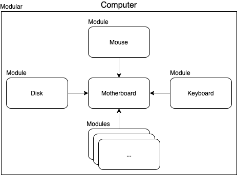
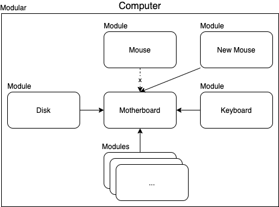

# JavaScript 的模組化之路

> 本文講述 JavaScript 模組化的發展，以及這樣的發展讓現代 JavaScript 開發遭遇了什麼樣的困難。

> 本文的範例程式放在 [peterhpchen/webpack-quest](https://github.com/peterhpchen/webpack-quest/tree/master/posts/02-history-of-js-module/demos) 中，每個程式碼區塊的第一行都會標注檔案的位置，請搭配文章作參考。

我有一隻愛用的滑鼠，那是個無線滑鼠，在電腦上插上接收器就可以使用了，非常的方便。因為在家裡用習慣了，因此我去上班時都會帶著它，到公司後只要插上接收器就可以直接上工，讓我的工作效率大幅的提升...。

大家有沒有想過一個問題: 為什麼我們可以在電腦上接上不同的滑鼠，而不需要把整台電腦換掉呢？這是因為電腦是以**模組化**的概念所設計的。那所謂的模組化又是什麼呢？

## 模組化

模組化(modular)是個將一個大功能拆分成各個獨立小功能的概念，而每個小功能就叫做模組(module)。

模組擁有介面，介面會有輸入及輸出的資源定義，因此擁有相同介面的模組是可以互相做抽換的。

以電腦來說，滑鼠、鍵盤、硬碟、記憶體...等都是模組，他們都以固定的介面接入主機板中，以此發揮他們的功用。



因為介面相同的關係，所以就算換成不同廠牌的滑鼠、鍵盤，電腦依然可以正常運作。



## 模組化編程

因為模組化的概念可以使編程變得更有結構，因此大多數的語言都支援模組化的語意。

將電腦的例子寫成代碼，會像下面這樣:

```js
// computer
import Mouse from "mouse";
import Keyboard from "keyboard";

Mouse.addEventListener("move", () => {
  /* Move mouse */
});
Keyboard.addEventListener("click", () => {
  /* Enter word */
});
```

電腦引入了滑鼠跟鍵盤這兩個模組，然後監聽他們的訊號，並做相對應的處理。

而模組是可以做抽換的，假設今天我要換支新的滑鼠:

```js
// computer
import mouse from "newMouse"; // Switch to new mouse
import Keyboard from "keyboard";

mouse.addEventListener("move", () => {
  /* Move mouse */
});
Keyboard.addEventListener("click", () => {
  /* Enter word */
});
```

我只要改成引入 `newMouse` 就可以做到了。

這樣的編程方式就叫做[模組化編程](https://zh.wikipedia.org/wiki/%E6%A8%A1%E5%9D%97%E5%8C%96%E7%BC%96%E7%A8%8B)，模組化編程讓開發者可以把程式拆成多個模組，每個模組都負責一部分的功能，將全部的模組依照介面組合起來，就是一個完整的程式。如果寫得好，每個模組都會是高內聚，而對於模組間會是低耦合的。因此模組化編程可以[封裝](<https://zh.wikipedia.org/wiki/%E5%B0%81%E8%A3%9D_(%E7%89%A9%E4%BB%B6%E5%B0%8E%E5%90%91%E7%A8%8B%E5%BC%8F%E8%A8%AD%E8%A8%88)>)模組，讓除錯、測試、使用上更加容易。

有寫過程式的讀者應該都會發現到，自己有使用過模組化編程的的經驗。開發時，我們會借助第三方模組來減輕開發的負擔，或使用內建模組來處理底層的程序，而這樣的動作就代表你在做模組化編程。

雖然模組化編程是這麼的自然，但是 JavaScript 被發明時是沒有模組化的，這使得開發上遇到了許多的問題。而之後為了解決這些問題，第三方的模組化語意被發明，而這些第三方的模組化語意又產生了其他問題。這段時期究竟是發生了什麼事情，導致 JavaScript 的模組化之路如此顛簸呢？接下來就帶大家來了解這段歷史。

## 沒有模組的 JavaScript

在 Webpack 這類的工具出現之前，開發者會直接在 `html` 檔案中藉由 `<script>`, `<link>` 標籤引入 JavaScript 以及 CSS 檔案:

```html
<!-- ./demos/before-webpack/index.html -->
<!DOCTYPE html>
<html>
  <head>
    <title>Webpack Demos: Before Webpack</title>
    <script src="https://cdn.jsdelivr.net/npm/lodash@4.17.20/lodash.min.js"></script>
    <link rel="stylesheet" href="./style.css" />
  </head>
  <body>
    <script src="./index.js"></script>
  </body>
</html>
```

我們甚至不需要引入外部 `js` 及 `css` 檔案，在 `html` 檔案內直接將 JavaScript 寫在 `<script>` 、 CSS 寫在 `<style>` 標籤就好了，一個檔案就可以完成所有的工作。

JavaScript 被發明時，只是要做一些簡單的腳本工作而已，因此這樣做是沒有問題的。

但是隨著時代的變遷，網路成了人們生活的重心，越來越多複雜的服務將目標放到了網頁上，伴隨而來的就是網頁應用的代碼量增加，這使得沒有模組化的 JavaScript 深陷於泥沼中。

### 變數衝突

以前，在寫程式庫的時候，雖然內部變數可以使用 [IIFE](https://developer.mozilla.org/zh-TW/docs/Glossary/IIFE) 避免污染外部變數，但是當要匯出的時候，我們還是需要將變數放到 `window` 這個全域物件裡，使其他的 script 可以使用目標的變數。在 lodash, JQuery 之類的庫中看到這樣的注入方式。

但是這時候如果其他的 `js` 代碼覆蓋了 `window` 中的變數，問題就會發生:

```html
<!-- demos/before-webpack/index.html -->
<!DOCTYPE html>
<html>
  <head>
    <title>Webpack Demos: Before Webpack</title>
    <script src="https://cdn.jsdelivr.net/npm/lodash@4.17.20/lodash.min.js"></script>
    <!-- window._ === lodash library -->
    <script>
      _ = "wrong lodash";
    </script>
    <link rel="stylesheet" href="./style.css" />
  </head>
  <body>
    <script src="./index.js"></script>
  </body>
</html>
```

```bash
Uncaught TypeError: _.join is not a function
```

### 不明確的引入

由於依賴的目標庫是注入到全域物件中，因此在要引用的 `js` 中只能假設目標是存在的:

```js
// demos/before-webpack/index.js
const demoName = "Before Webpack";

function component() {
  const element = document.createElement("div");

  // assume _ is exist
  element.innerHTML = _.join(["Webpack Demo", demoName], ": ");
  element.classList.add("demo");

  return element;
}

document.body.appendChild(component());
```

這樣方式會造成就算工具庫沒有引入，我們只能在執行時才能發現錯誤。

### 引入順序

腳本語言是由上而下執行的， JavaSctipt 也不例外，而由於都只是注入 `window` ，並沒有實際的相依關係，因此依賴的順序只能靠開發者手動調整，只要引入順序有誤，就會造成問題:

```html
<!-- demos/wrong-import/index.html -->
<!DOCTYPE html>
<html>
  <head>
    <title>Webpack Demos: Wrong Import</title>
    <script src="https://code.jquery.com/ui/1.12.1/jquery-ui.js"></script>
    <!-- error -->
    <script src="https://code.jquery.com/jquery-1.12.4.js"></script>
  </head>
  <body></body>
</html>
```

```bash
Uncaught ReferenceError: jQuery is not defined
```

因為 JQuery UI 是相依於 JQuery 的，如果先引入 JQuery UI ，它會因為找不到 JQuery 而報錯。

### 引入不必要的程式碼

有的時候我們會引入外部庫去嘗試它的功能，但發現不符合需求就將檔案中相關的程式刪除，但常常會忘記要去刪除 `<script>` 標籤，這時我們就會引入不必要的程式碼，增加載入的時間。

### 載入多個檔案

大部分的專案都會引入第三方的庫或是框架來減少開發的負擔，但這樣做會增加要引入的檔案，造成請求次數增加，拖慢效能。

## 模組系統

由於專案越趨龐大，沒有模組化的 JavaScript 在開發上遇到了瓶頸，也使開發者發想了許多模組化解決方案。

### Node.js 的 CJS (CommonJS)

Node.js 是 JavaScript 伺服器端的執行環境，它使得 JavaScript 由網頁前端跨至後端的領域，成為一個網頁全端的程式語言。 Node.js 使用 [CommonJS](https://zh.wikipedia.org/wiki/CommonJS) (簡稱 CJS) 規格實作模組系統，作為 JavaScript 語言的模塊化解決方案。

```js
// ./demos/common-js/add.js
function add(a, b) {
  return a + b;
}

module.exports = add;
```

```js
// ./demos/common-js/index.js
const add = require("./add");

console.log(add(1, 2));
// 3
```

- `module.exports` 導出模塊
- `require` 引入模塊
- 採取同步加載的方式
- 使用於後端，前端環境需經過轉譯

在檔案都在本地的後端環境下，同步加載的模組系統是可行的，但是在資源分散的前端環境下，為了增進效能，能擁有異步加載的模組系統是必須的。

### AMD (Asynchronous Module Definition) 與 RequireJS

[RequireJS](https://requirejs.org/) 做為前端模塊的解決方案，它實作了 [Asynchronous Module Definition](https://github.com/amdjs/amdjs-api/wiki/AMD) 規格，使模塊可以異步加載。

```html
<!-- ./demos/require-js/index.html -->
<!DOCTYPE html>
<html>
  <head>
    <title>Webpack Demo: RequireJS</title>
    <script
      data-main="index"
      src="https://unpkg.com/requirejs@2.3.6/bin/r.js"
    ></script>
  </head>
  <body></body>
</html>
```

```js
// ./demos/require-js/add.js
define(function () {
  return function (a, b) {
    return a + b;
  };
});
```

```js
// ./demos/require-js/index.js
requirejs(["add"], function (add) {
  console.log(add(1, 2));
  // 3
});
```

- `define` 定義導出模塊
- `requirejs` 導入模塊，在加載完成後叫用 `callback` 函數，執行程式
- 採用異步加載方式
- 是以前端為目標環境的模組化方式

使用 RequireJS 後，我們終於可以在瀏覽器上以模組開發 JavaScript 。接著最後的一哩路就是原生的模組系統。

### ESM (ES Module)

ESM 是 [ES2015](https://en.wikipedia.org/wiki/ECMAScript#6th_Edition_%E2%80%93_ECMAScript_2015) 中定義的模組化語意所實作的模組系統，各瀏覽器實作了 ES2015 標準後，使得 ESM 成為 JavaScript 在前端的原生模組系統，為 JavaScript 帶來真正模組話語意。

```html
<!-- ./demos/es-module/index.html -->
<!DOCTYPE html>
<html>
  <head>
    <title>Webpack Demo: ES Module</title>
    <script src="index.js" type="module"></script>
    <script src="add.js" type="module"></script>
  </head>
  <body></body>
</html>
```

```js
// ./demos/es-module/add.js
export default function (a, b) {
  return a + b;
}
```

```js
// ./demos/es-module/index.js
import add from "./add.js";

console.log(add(1, 2));
// 3
```

- `export` 導出模塊
- `import` 導入模塊
- 異步加載模塊
- 瀏覽器原生語意

雖然擁有了原生的模塊系統，但是前端環境受制於終端(EX: Chrome、Firefox、Edge...)的實作程度，並不是全部都已經支援 ESM 。而因為歷史的關係， JavaScript 的模組實作方式多樣(CJS, AMD, ESM) ，這也造成模組整合的困難。

## JavaScript 的模組化造成開發困難

由於歷史的原因， JavaScript 的模組化語意有好幾種，由於實作方式及語法都不相同，因此要引用會需要個別處理。如果是自己要開發工具庫讓別人使用的話，也需要分別轉換成不同的模組定義，才能確保使用者不會有引用上的問題發生。

ES Module 這個原生模組語意的出現，確實讓 JavaScript 的模組化問題出現了一道曙光，但是 JavaScript 的執行環境太過複雜，有前端，有後端，有瀏覽器、Electron、React Native...等不同的環境，各個環境對於 ES Module 的支援度都不一樣，造成使用 ES Module 時還是必須要經過轉換。

JavaScript 的模組化之路坎坷，確實使得開發變得複雜困難，但是危機就是轉機， Webpack 的發明就完美的解決了這些問題，使前端工程迎來了全面的模組化時代。

## 參考資料

- [What are CJS, AMD, UMD, and ESM in Javascript?](https://dev.to/iggredible/what-the-heck-are-cjs-amd-umd-and-esm-ikm)
- [前端模块化: AMD、CMD、ES6、CommonJS](https://juejin.im/post/6844903917680066567)
- [Why webpack](https://webpack.js.org/concepts/why-webpack/)
- [How the module system, CommonJS & require works](https://blog.risingstack.com/node-js-at-scale-module-system-commonjs-require/)
- [ECMAScript modules in browsers](https://jakearchibald.com/2017/es-modules-in-browsers/)
