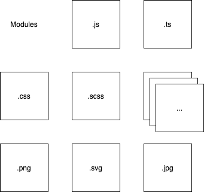
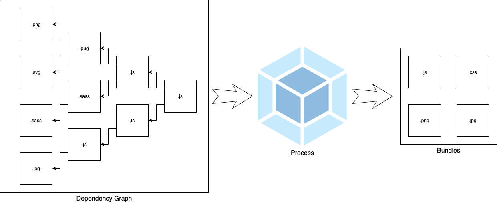
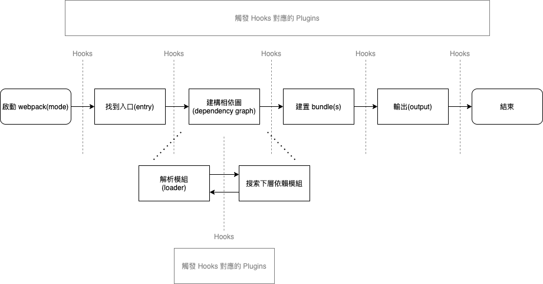
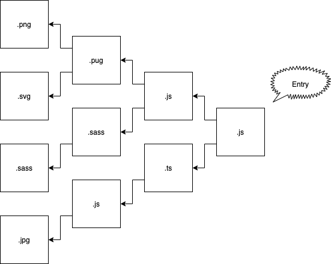
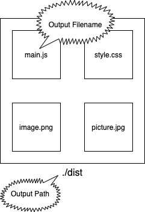
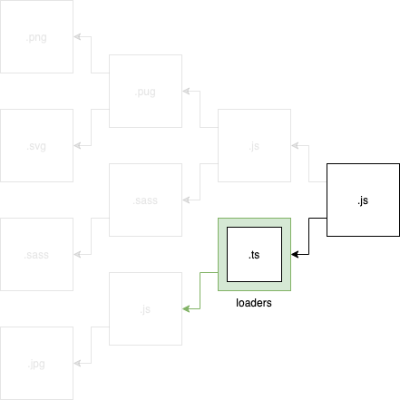
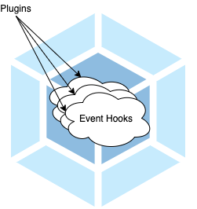

# 介紹 webpack

> 本文介紹 webpack 運作流程、以及說明為什麼使用 webpack 可以解決現代前端工程所遇到的問題。

讀者在看過前面的 [JavaScript 模組化之路](../02-history-of-js-module/README.md)及[新技術崛起](../03-new-tech/README.md)兩篇文章後，應該都會發現現代前端工程急於出現一個可以整合眾多語法及技術的建置工具，因此許多的解決方案，像是 [Browserify](http://browserify.org/) 、 [Grunt](https://gruntjs.com/) 、 [Gulp](https://gulpjs.com/) 、 [Webpack](https://webpack.js.org/) 及 [Rollup](https://rollupjs.org/guide/en/) 等被發明。而其中， webpack 靠著龐大且完整的生態系成為大部分專案所使用的建置工具。

接下來我們就來一窺 webpack 的真面目吧。

## 核心概念 - webpack 中任何東西皆為模組

在 webpack 中，任何的東西都被當作模組，所以 `.js` 、 `.css` 、 `.png` 、 `.svg` ...等各種檔案在 webpack 內都是一個個的模組。

在 [JavaScript 模組化之路](../02-history-of-js-module/README.md)中有介紹到模組化編程的好處是各個模組的細節封裝，只需依靠介面對外擴展。因此在每個資源都被視為模組的 webpack 中，整個建置流程就不需了解資源的內部實作方式，只需要知道模組介面如何輸入、匯出即可，大大的簡化了複雜的建置流程。

將**萬物皆模組**的概念放在心上， webpack 的學習就變得十分簡單了。

接著我們來看看 webpack 是如何建置這些模組的吧。

## 基本介紹

webpack 是 **JavaScript 應用程式的模組打包器**。

它將各模組間的相依關係繪製成[相依圖](https://webpack.js.org/concepts/dependency-graph/)(dependency graph)，依照相依圖解析並處理每一個模組，最後建置成一個或多個 bundle 。

## 運作流程

webpack 的最終目標是將模組打包成 bundle ，其運作流程如下：

- 啟動 webpack ， 執行 Mode 對應的最佳化方案
- 找到起始模組入口(Entry)
- 繪製相依圖(Dependency Graph)
  - 解析模組(Loaders)
  - 搜尋下層依賴模組
    - 找到依賴模組後回上一步解析模組
    - 沒有下層則結束搜尋
- 建置 bundle(s)
- 輸出(Output)

> 在運作流程的每個步驟都有事件鉤子，這些鉤子會觸發並執行對應的 Plugins

webpack 從起始點開始往下找尋相依模組，當所有的模組都被解析完成後就會輸出 bundles 並且輸出在目標資料夾中。

說到這裡，大家可能會對一些 webpack 內像是 Entry, Output, Loaders, Plguins, Mode, Bundle 等的名詞感到困惑，接下來將帶大家來了解這些名詞所代表的意義。

### Entry

開發者要跟 webpack 說明哪個模組是**建置相依圖時的起點**，因此需要配置 `entry` 屬性。

啟動 webpack 時，會先解析起始模組，找出起始模組是否有相依其他的模組，接著再往下一個模組搜尋，一直到找不到相依模組時，如此一來就形成了相依圖。

> `entry` 的預設值為 `./src/index.js` 。

### Output

在 webpack 建立 bundle 時，他會需要知道 **bunlde 要放在哪個路徑**以及**每個 bundle 要取什麼名字**，因此我們需要設定 `output` 屬性。

> `output` 的預設路徑是 `./dist` ，而主要的 bundle 名稱會是 `./dist/main.js` 。

### Loaders

webpack 本身只看得懂 JavaScript 與 Json 檔，對於其他的模組，需要借助 Loaders 幫忙解析。

因此當你引入這些 webpack 不認識的檔案(EX: `.png`, `.css` ...等)時， webpack 就會嘗試去尋找合適的 Loaders 來載入這些資源，而對應的 Loaders 會將其轉譯成 webpack 讀得懂的模組，讓 webpack 可以將此模組加進相依圖內，並且繼續建置的工作。

### Plugins

webpack 在建置的過程中，會依序觸發不同的事件鉤子，藉以完成各個時期的工作 ，而 Plugins 可以**藉著這些事件鉤子執行其所設定的工作**。

Plugins 使得 webpack 有了更強大的能力，小如**建置前清空輸出資料夾**、**注入環境變數**、**產生 html 檔案**，大如**配置最佳化**等，都與 Plugins 有關係。

### Mode

webpack 在建置時會依照 `mode` 設定的不同而進行不同的最佳化設定：

- `production`: 以生產環境為目標，做 Tree Shaking, Minify...等以執行效能為導向的最佳化
- `development`: 以開發環境為目標，做 Source Map 等以開發便利為導向的最佳化

> `mode` 預設為 `production` 。

### Bundle(Chunk)

Bundle 是有相依關係的多個模組經過 webpack 建置後的產物的名稱，它是可以直接跑在目標環境(例如：瀏覽器)上的。

而 Chunk 與 Bundle 其實是一樣的，只是 Chunk 是在 webpack 建置過程中的名稱，當它被輸出後就叫做 Bundle 。

> 在配置中常常會出現 Chunk 這一詞，之後看到時不要慌張，把它當作 Bundle 就好。

## webpack 解決了什麼問題

當你理解了整個 webpack 的運作流程後，就知道 webpack 已經完美的解決前兩篇文章所提到的問題： **JavaScript 的模組化問題**及**新技術載入的問題**。

### 利用打包過程解決模組化問題

webpack 為了可以產生 bundle ，它會**解析模組與模組間的相依關係**，而 [webpack 會將下面語意都視為相依於其他模組](https://webpack.js.org/concepts/modules/#what-is-a-webpack-module)：

- ES2015 的 [`import`](https://developer.mozilla.org/en-US/docs/Web/JavaScript/Reference/Statements/import)
- [CommonJS](http://www.commonjs.org/specs/modules/1.0/) 的 `require()`
- [AMD](https://github.com/amdjs/amdjs-api/blob/master/AMD.md) 的 `define` 與 `require`
- CSS 的 [`@import`](https://developer.mozilla.org/en-US/docs/Web/CSS/@import) 與 [`url(...)`](<https://developer.mozilla.org/en-US/docs/Web/CSS/url()>) (需要 loader)
- HTML 的 [``](https://developer.mozilla.org/en-US/docs/Web/HTML/Element/img) (需要 loader)

可以看到使用 CommonJS, AMD 及 ES Module 的模組在 webpack 中都是合法的，因此只要使用了 webpack ，我們不需要特別處理模組相容的問題， webpack 已經幫我們做完了。

### 利用 Loaders 解決新技術載入問題

新的語言、預處理器或是框架通常都需要轉換成標準的 HTML, CSS 及 JavaScript 才能被瀏覽器執行，而 webpack 的 **Loaders 的作用就是轉換各模組**成為 webpack 能理解的模組，當 bundle 被建置出來時，已經是瀏覽器可以讀懂的檔案了。

因此你只要將新的技術引入 webpack 的建置流程中並且配置對應的 Loaders ，問題就解決了。

## 總結

webpack 的核心目標是**打包 JavaScript 應用程式的模組**，它把所有的資源都視為模組。

從 Entry 模組開始尋找相依模組以建立相依圖，遇到非 JavaScript(JSON) 的檔案就交給 Loaders 幫忙轉換，最後建立 bundle 檔案並輸出在 Output 路徑下，而這個 bundle 是可以直接被瀏覽器載入。

並且可以使用 Plugins 賦予 webpack 除了打包外的其他能力，例如說 bundle 建置最佳化。

webpack 利用了整個打包流程解決了現代前端工程的模組化及新技術的引入問題，並且還可以做代碼的優化、檢查、分割...等等的處理，使得開發的應用程式層級可以向上提升。

## 參考資料

- [Modules](https://webpack.js.org/concepts/modules/)
- [Concepts](https://webpack.js.org/concepts/)
- [Under The Hood](https://webpack.js.org/concepts/under-the-hood/)
