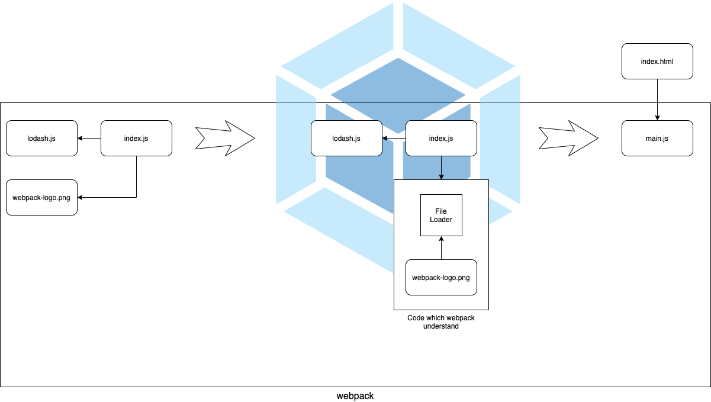

# 第一次使用 webpack 就上手

> 本文以實作的方式展示 webpack 的各項主要功能。

前一篇的[介紹 webpack](../04-introduction/README.md) 一文中介紹了 webpack 各個核心的概念以及整個運作原理，現在終於可以來真的動手寫代碼了。

接著就來寫我們的第一隻 webpack 程式吧。

## 簡單的例子

首先，先用一般的方式寫一隻簡單的程式。

建立專案的目錄及空的 `package.json` ：

```bash
mkdir simple-app
cd simple-app
npm init -y # or `yarn init -y`
```

> 也可以使用 `yarn` 來取代 `npm`

再來建立一個 `public` 目錄來儲存代碼：

```bash
mkdir public
```

再來建立 `index.html` 及 `index.js` ：

```html
<!-- demos/simple-app/public/index.html -->
<!DOCTYPE html>
<html>
  <head>
    <title>Webpack Demo: Simple App</title>
    <script src="https://cdn.jsdelivr.net/npm/lodash@4.17.20/lodash.min.js"></script>
  </head>
  <body>
    <script src="./index.js"></script>
  </body>
</html>
```

```js
// demos/simple-app/public/index.js
const demoName = "Simple App";

function component() {
  const element = document.createElement("div");

  element.innerHTML = _.join(["Webpack Demo", demoName], ": ");

  return element;
}

document.body.appendChild(component());
```

再來先用 `http-server` 讓程式跑起來吧：

```bash
npm install http-server --save-dev
```

在 `package.json` 中的 `scripts` 中加上 `start`：

```js
// demos/simple-app/package.json
{
    "scripts": {
        "start": "http-server"
    }
}
```

接著跑指令：

```bash
npm run start
```

在瀏覽器中開啟 `http://127.0.0.1:8080` 就可以看到成果了：


目前 Simple App 是使用一般 JavaScript 腳本方式執行，並沒有模組化。

全部的資源會被 `index.html` 的標籤引入，因此現在的相依關係如下圖所示：


到目前為止，工作目錄下是這樣子的：

```plaintext
root
|- package.json
|- /public
  |- index.html
  |- index.js
```

到目前為止，我們已經完成應用程式了，但是以傳統的方式開發的應用程式會引發**變數衝突**、**不明確的引入**、**引入順序**、**引入不必要的程式碼**以及**載入多個檔案的問題**(可以參考 [JavaScript 的模組化之路](../02-history-of-js-module/README.md) 一文)。

接下來，我們將利用模組化編程解決這些問題，並且使用 webpack 建置專案。

## 安裝 webpack

使用 `npm` 安裝 `webpack` 。

```bash
npm install webpack webpack-cli --save-dev
```

需要安裝核心庫以及 CLI 以便操作 webpack 的相關指令。

## 配置 webpack 專案

在使用 webpack 時，因為有建置過程，因此專案會分為原始檔案以及建置過的檔案兩個部分，因此我們需要先將檔案放到適當的路徑下。

webpack 預設的起始模組是 `./src/index.js` ，因此需要將原本的 `public` 資料夾名稱改為 `src` ，這個 `src` 就是放原始檔案的目錄。

另外因為 webpack 預設的輸出位置是在 `./dist` ，因此要新建一個 `dist` 的目錄，並把 `index.html` 放到 `dist` 資料夾下，這個 `dist` 是放置靜態資源以及 webpack 建置完成的檔案，也就是 bundle 。

到目前為止，目錄結構會像下面這樣：

```plaintext
root
|- package.json
|- /dist
  |- index.html
|- /src
  |- index.js
```

### 改為模組化編程

原本 Lodash 是用 CDN 載入的，現在改為用 `npm` 安裝，再用 `import` 語法引入：

```js
// demos/zero-config/src/index.js
import _ from "lodash";

const demoName = "Zero Config";

function component() {
  const element = document.createElement("div");

  element.innerHTML = _.join(["Webpack Demo", demoName], ": ");

  return element;
}

document.body.appendChild(component());
```

記得要把 `index.html` 的 `<script>` 刪除：

```html
<!-- demos/zero-config/dist/index.html -->
<!DOCTYPE html>
<html>
  <head>
    <title>Webpack Demo: Zero Config</title>
  </head>
  <body>
    <script src="./index.js"></script>
  </body>
</html>
```

接著終於輪到配置 webpack 了。

## 使用 webpack

先將 `webpack` 指令加到 `package.json` 的 `scripts`：

```js
// demos/zero-config/package.json
{
    "scripts": {
        "build": "webpack"
    }
}
```

webpack 可以**開箱即用(out of the box)**，不需要任何配置(zero config)。

直接執行指令試試看吧：

```bash
npm run build
```

執行後，會出現 webpack 的建置報告：


因為預設的起始模組是 `./src/index.js` ，

建置依照 webpack 的內建值，輸出到了 `./dist` 目錄下， bundle 會是一個名為 `main.js` 的檔案。

> WARNING 是提醒沒有配置 `mode` ，預設會以 `production` 處理。 `mode` 會在之後的章節說明。

由於 JavaScript 檔名變為 `main.js`，因此要去修改 `index.html` ：

```html
<!-- demos/zero-config/dist/index.html -->
<!DOCTYPE html>
<html>
  <head>
    <title>Webpack Demo: Zero Config</title>
  </head>
  <body>
    <script src="./main.js"></script>
  </body>
</html>
```

現在建置後的檔案在 `./dist` 目錄下，因此需要修改 `start` 指令中 `http-server` 的目標目錄：

```js
// demos/zero-config/package.json
{
    "scripts": {
      "start": "http-server ./dist"
    }
}
```

然後就把它跑起來吧。


恭喜你，你寫出了第一隻 webpack 建置的應用程式，現在的架構如下：


經過 webpack 的處理，會在 `./dist` 中產生 `main.js` 並被 `index.html` 引入。

在這個例子中，我們已經配置最基本的 webpack ，預設配置了 `entry` 及 `output` ，使 webpack 可以完成建置。

## 嘗試載入圖片

現在我們來加張圖片吧，把 `webpack-logo.png` 放到 `./src` ，並且在 `index.js` 中寫程式將圖片加到畫面上：

```js
// demos/load-image/src/index.js
import _ from "lodash";

import WebpackLogo from "./webpack-logo.png";

const demoName = "Load Image";

function logo(url) {
  const element = new Image();

  element.src = url;

  return element;
}

function component() {
  const element = document.createElement("div");

  element.innerHTML = _.join(["Webpack Demo", demoName], ": ");

  return element;
}

document.body.appendChild(logo(WebpackLogo));
document.body.appendChild(component());
```

執行 webpack 後，產生下面的錯誤：


由於沒有適當的 loader 載入圖片，因此 webpack 看不懂這個圖片的模組而產生錯誤。

## 使用 loader

要載入圖片，必須要先安裝 `file-loader`:

```bash
npm install file-loader --save-dev
```

然後我們修改一下 `import` 圖片的方式：

```js
import WebpackLogo from "file-loader!./webpack-logo.png";
```

前面加上 `file-loader` 並以 `!` 與原路徑分割，這是個 pipe 的概念，檔案從路徑載入後會經過 `file-loader` 的處理再 `import` 進程式裡。

再重新建立一次，這次成功了！


可以看到 webpack 多了一個 bundle ，名為 `6c80d661b822703023e4531a9ec5267f.png` 圖片，可以看到他的名字已經被 `file-loader` 轉為 hash 值了。

執行起來會發現圖片成功載入了：


現在的建置流程如下：



> 在 `./dist` 中看到的圖片檔是 `file-loader` 處理的，所以你從頭到尾不需要自己去處理這張圖，只是把它視為建置過程中的一個模組而已，因此在流程圖中不畫出來，避免混淆。

## 自動產生 dist 內所有的內容

`index.html` 目前是直接放在 `./dist` 目錄下，但是大部分常規專案的 `./dist` 的內容都是自動產生的，這樣的好處是可以讓自己撰寫的有邏輯的代碼與一般人較難理解的機器產生的代碼做區分，在 `commit` 代碼時也會避免將 `./dist` 的代碼 `push` 到代碼庫中。

為了方便管理，我們建立一個 `./public` 目錄並將 `index.html` 放到這目錄下：

```plaintext
root
|- package.json
|- /public
  |- index.html
|- /src
  |- index.js
```

但這樣一來，每次建置完後都要手動將 `index.html` 複製到 `./dist` 中，非常的麻煩。

這時就要請出 webpack 中最強大的功能 plugin 來幫忙了。

## 使用 plugin

`CopyWebpackPlugin` 可以幫助我們把檔案從 A 地複製到 B 地，它正好可以幫我們把 `index.html` 複製到 `./dist` 資料夾中。

首先做安裝的動作：

```bash
npm install copy-webpack-plugin --save-dev
```

接著因為我們要跟 `webpack` 說要怎麼使用 `CopyWebpackPlugin` ，因此我們需要建置一個 webpack 的配置檔 `webpack.config.js` ：

```js
// ./copy-html/webpack.config.js
const path = require("path");
const CopyPlugin = require("copy-webpack-plugin");

module.exports = {
  plugins: [
    new CopyPlugin({
      patterns: [{ from: path.resolve(__dirname, "public") }],
    }),
  ],
};
```

我們告訴 `CopyWebpackPlugin` 要把 `public` 目錄中的檔案複製到 `dist` 目錄中。

> webpack 會預設尋找 root 目錄下的 `webpack.config.js` 當作配置檔，配置黨的內容會在[配置 webpack](../06-config-webpack/README.md) 一文中講解。

建置結果如下：


我們可以看到 `index.html` 也變成了其中一個 bundle 被輸出了。

目前整個建置的過程如下：


結果雖然與之前的相同，但是整個建置流程變得很通暢。

## 總結

我們剛開始創建一個沒有使用 webpack 的應用程式，接著將 webpack 帶入專案建立建置流程，並且使用 `file-loader` 載入圖片檔，最後使用 `CopyWebpackPlugin` 複製 `index.html` 到 `./dist` 目錄中。

這個範例讓我們了解到， webpack **處理模組**、**使用 loader 引入非 JavaScript 代碼**及**藉由 plugin 處理打包模組外的其他事情**，充分地展示了 webpack 的能力，也讓我們對 webpack 有粗略的了解。

## 參考資料

- [Getting Started](https://webpack.js.org/guides/getting-started/)
- [file-loader](https://webpack.js.org/loaders/file-loader/)
- [CopyWebpackPlugin](https://webpack.js.org/plugins/copy-webpack-plugin/)
