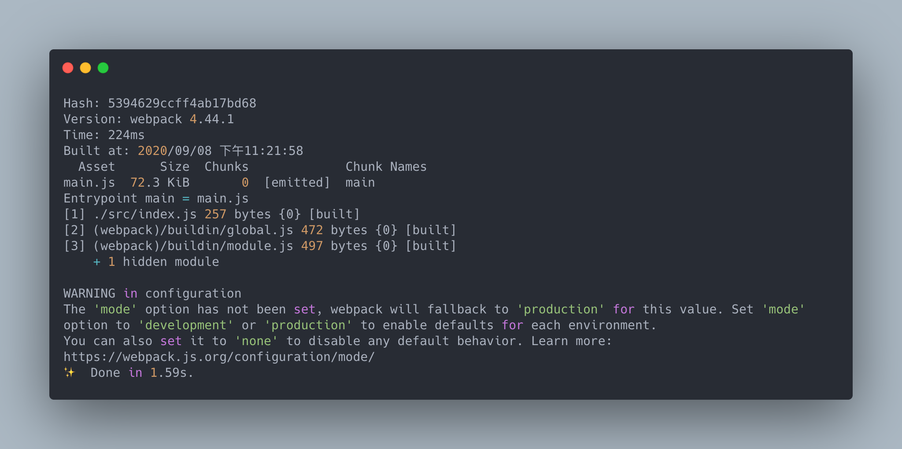

# 第一次使用 webpack 就上手

> 本文以實作的方式展示 webpack 的各項主要功能。

 前一篇的[介紹 webpack](../04-introduction/README.md) 一文中介紹了 webpack 各個核心的概念以及整個運作原理，現在終於可以來真的動手寫代碼了。

接著就來寫我們的第一隻 webpack 程式吧。

## 簡單的例子

首先，先用一般的方式寫一隻簡單的程式。

建立專案的目錄及空的 `package.json` ：

```bash
mkdir simple-app
cd simple-app
npm init -y # or `yarn init -y`
```

> 也可以使用 `yarn` 來取代 `npm`

再來建立一個 `public` 目錄來儲存代碼：

```bash
mkdir public
```

再來建立 `index.html` 及 `index.js` ：

```html
<!-- demos/simple-app/public/index.html -->
<!DOCTYPE html>
<html>
  <head>
    <title>Webpack Demo: Simple App</title>
    <script src="https://cdn.jsdelivr.net/npm/lodash@4.17.20/lodash.min.js"></script>
  </head>
  <body>
    <script src="./index.js"></script>
  </body>
</html>
```

```js
// demos/simple-app/public/index.js
const demoName = "Simple App";

function component() {
  const element = document.createElement("div");

  element.innerHTML = _.join(["Webpack Demo", demoName], ": ");

  return element;
}

document.body.appendChild(component());
```

再來先用 `http-server` 讓程式跑起來吧：

```bash
npm install http-server --save-dev
```

在 `package.json` 中的 `scripts` 中加上 `start`：

```js
// demos/simple-app/package.json
{
    "scripts": {
        "start": "http-server"
    }
}
```

接著跑指令：

```bash
npm run start
```

在瀏覽器中開啟 `http://127.0.0.1:8080` 就可以看到成果了：


目前 Simple App 是使用一般 JavaScript 腳本方式執行，並沒有模組化。

全部的資源會被 `index.html` 的標籤引入，因此現在的相依關係如下圖所示：


到目前為止，工作目錄下是這樣子的：

```plaintext
root
|- package.json
|- /public
  |- index.html
  |- index.js
```

到目前為止，我們已經完成應用程式了，但是以傳統的方式開發的應用程式會引發**變數衝突**、**不明確的引入**、**引入順序**、**引入不必要的程式碼**以及**載入多個檔案的問題**(可以參考 [JavaScript 的模組化之路](../02-history-of-js-module/README.md) 一文)。

接下來，我們將利用模組化編程解決這些問題，並且使用 webpack 建置專案。

## 安裝 webpack

使用 `npm` 安裝 `webpack` 。

```bash
npm install webpack webpack-cli --save-dev
```

需要安裝核心庫以及 CLI 以便操作 webpack 的相關指令。

## 配置 webpack 專案

在使用 webpack 時，因為有建置過程，因此專案會分為原始檔案以及建置過的檔案兩個部分，因此我們需要先將檔案放到適當的路徑下。

webpack 預設的起始模組是 `./src/index.js` ，因此需要將原本的 `public` 資料夾名稱改為 `src` ，這個 `src` 就是放原始檔案的目錄。

另外因為 webpack 預設的輸出位置是在 `./dist` ，因此要新建一個 `dist` 的目錄，並把 `index.html` 放到 `dist` 資料夾下，這個 `dist` 是放置靜態資源以及 webpack 建置完成的檔案，也就是 bundle 。

到目前為止，目錄結構會像下面這樣：

```plaintext
root
|- package.json
|- /dist
  |- index.html
|- /src
  |- index.js
```

## 使用 webpack

 先將 `webpack` 指令加到 `package.json` 的 `scripts`：

```js
// demos/zero-config/package.json
{
    "scripts": {
        "build": "webpack"
    }
}
```

webpack 可以**開箱即用(out of box)**，不需要任何配置(zero config)。

直接執行指令試試看吧：

```bash
npm run build
```

執行後，會出現 webpack 的建置報告：



因為預設的起始模組是 `./src/index.js` ，

建置依照 webpack 的內建值，輸出到了 `./dist` 目錄下， bundle 會是一個名為 `main.js` 的檔案。
