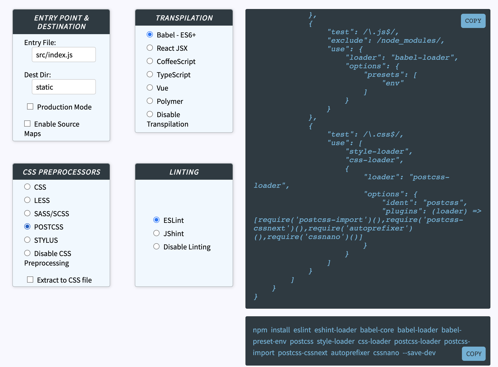
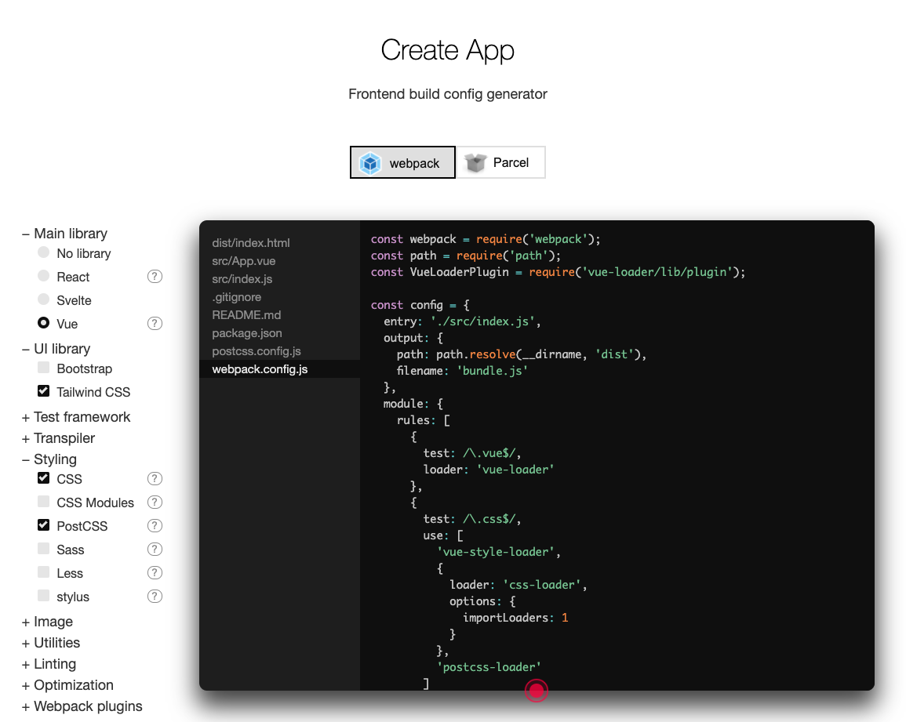
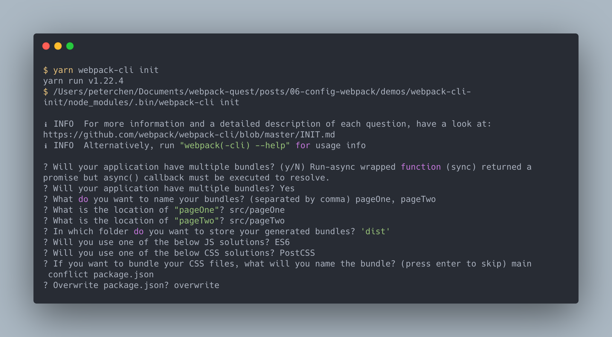

# webpack 的配置

> 本文會講解 webpack 的配置檔。

webpack 開箱即用(out of the box)，不用任何配置就可以使用。只要將起始模組放於 `./src/index.js` ，輸入 `webpack` 指令就可以在 `./dist/main.js` 中產生適用於生產環境( `production` )的 bundle 。

但開箱即用的功能僅占了 webpack 的極小部分，如果想要完全掌握 webpack ，首先最重要的就是學會如何配置它。

## 配置 webpack

webpack 主要的配置方式是利用 CLI 或是 Node.js API 引入配置物件，引入的方式會在下一篇[使用 webpack](../07-use-webpack/README.md) 中詳細說明，本文主要說明配置物件本身的設定方式。

## 配置物件(Configuration Object)

配置物件是個標準的 JavaScript 物件，**使用者可以藉由調整物件中的屬性來做配置**。

下面是個簡單的配置物件：

```js
// ./demos/config-file/webpack.config.js
{
    mode: 'development',
    entry: './src/index2.js',
    output: {
        filename: 'bundle.js',
        path: path.resolve(__dirname, 'build')
    }
}
```

這配置物件配置了 `mode`, `entry` 及 `output` 。

## 使用配置物件

webpack 的 CLI 工具可以引入配置檔 (預設是 `webpack.config.js`) ，讓 webpack 依照配置物件做建置：

```js
// ./demos/config-file/webpack.config.js
const path = require("path");

module.exports = {
  mode: "development",
  entry: "./src/index2.js",
  output: {
    filename: "bundle.js",
    path: path.resolve(__dirname, "build"),
  },
};
```

## 配置物件中的路徑

配置物件中的某些屬性會需要輸入路徑（absolute path），為了避免 [POSIX 與 Windows 路徑不相容](https://nodejs.org/api/path.html#path_windows_vs_posix)的問題，盡量使用 Node.js 內建的 [`path` 模組](https://nodejs.org/api/path.html)與 [`__dirname`](https://nodejs.org/docs/latest/api/globals.html#globals_dirname) 這類 Node.js 的全域變數來處理路徑相關的屬性值。

## 配置物件中的選項

本節概略的介紹配置物件中各個不同的選項，我們會在下一章中詳細講解：

```js
{
  mode: "production", // 模式：依照所選模式做對應的最佳化，預設值為 "production"
  entry: "./app/entry", // 入口： webpack 開始建置作業的起始模組，預設值為 "./src/index.js"
  output: {
      // 輸出：配置如何輸出 webpack
  },
  module: {
      // 模組：處理各個模組（檔案） 如何載入，依照對應的規則設定 loader 配置
  },
  resolve: {
      // 解析：配置如何解析模組，像是路徑、別名等設定
  },
  performance: {
      // (略)效能：提示使用者 bundle 目前的情況，以促使使用者改善 bundle 的效能
  },
  devtool: "source-map", // devtool: 設定是否及如何生成 source map ，source map 可以解決 bundle 在 debug 時造成行數與原檔案 miss mapping 的問題
  context: __dirname, // 內容：根目錄位置，此為絕對路徑，會被 entry, module.rules.loader 等選項使用於路徑的解析上
  target: "web", // 目標： 設定 bundle 的目標環境，它會依照環境會 bundle 做相對應的處理
  externals: ["react", /^@angular/], // 外部擴展：從相依中排除此選項設定的模組
  stats: "errors-only", // (略)stats：控制輸出資訊
  devServer: {
      // webpack-dev-server 中的設定選項
  },
  watch: true, // 是否啟用監聽模式
  watchOptions: {
      // 設定監聽模式的選項
  }
  plugins: [
      // 插件：設定插件的配置
  ],
  optimization: {
      // 最佳化：設定 Code split, Tree Shaking 等優化配置
  }
}
```

> 有些插件的配置會改變配置物件中的選項，如果插件及配置物件中都有設定，則會以插件的配置值為主。

## 產生配置物件

配置物件雖然完整，但需要對自己的環境有高度的了解才能自由地運用及配置，對於一般的初階工程師來說難度比較高，為了解決這個問題，我們可以使用一些工具來幫我們自動產生配置檔。

### Generate Custom Webpack Configuration

[Generate Custom Webpack Configuration](https://generatewebpackconfig.netlify.app/) 是個線上的配置物件產生工具，使用者勾選想要配置的庫， Generate Custom Webpack Configuration 會依照對應的選項產生配置物件，使用者直接複製貼於專案中即可完成設置。



### Create App

[Create App](https://createapp.dev/) 同樣是藉由勾選目標的技術，然後幫你把起始專案創建出來，可以快速的開始開發。



### webpack CLI init

webpack-cli 有個 [init](https://github.com/webpack/webpack-cli/blob/next/packages/init/README.md#webpack-cli-init) 的指令，它可以幫我們產生 webpack 為基底的起始專案 。

要使用 `webpack-cli init` 需要另外安裝 `@webpack-cli/init`：

```bash
npm install webpack webpack-cli @webpack-cli/init@0.2.2
```

> 目前使用 webpack v4 ，[不能使用 `@webpack-cli/init` 最新的 `0.3.0` 版本](https://github.com/webpack/webpack-cli/issues/1127)，必須指定 `0.2` 的版本。

他會以交互問答的方式完成專案的配置：



> `webpack-cli init` 也可以使用[自製的腳手架](https://webpack.js.org/contribute/writing-a-scaffold/)來產生專案。

## 總結

webpack 是由配置物件做為主要的設定方式，配置物件可以由 webpack CLI 或是 Node.js API 所執行以使用配置建置專案。

配置物件內的路徑應使用 Node.js 內建的模組 `path` 或是全域變數 `__dirname` 來處理以避免 POSIX 與 Windows 路徑不同的問題。

接著簡單概述配置物件中的各個屬性的作用，可以看到種類豐富的設定，涵蓋了幾戶整個 webpack 的功能，讓我們可以用配置物件控制 webpack 的建置工作。

最後介紹 **Generate Custom Webpack Configuration** 及 **Create App** 兩個線上工具幫忙建置專案的配置。除了線上的工具， `webpack-cli` 自己也提供了 `init` 指令，使用終端的問答，來建置使用者期望的專案配置。並且 `webpack-cli init` 也讓使用者可以自己建立腳手架，客製自己的 `init` 專案。

## 參考資料

- [Configuration](https://webpack.js.org/configuration/)
- [webpack-cli](https://github.com/webpack/webpack-cli)
- [Scaffolding](https://webpack.js.org/guides/scaffolding/)
