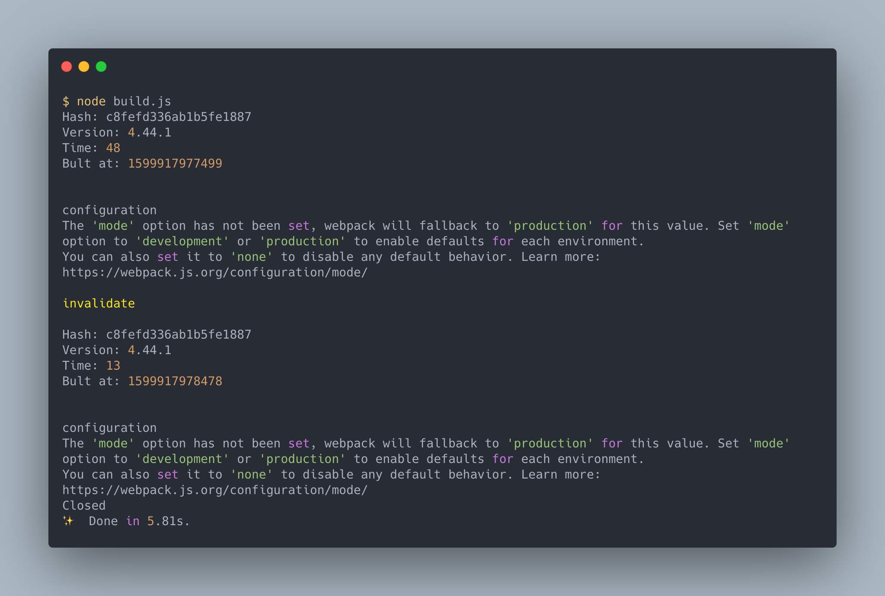

# 使用 webpack

> 本文將會學到如何使用 CLI 以及 Node.js API 來操作 webpack 。

操作 webpack 的方法有兩種，一種是之前有使用到的 CLI ，另一種是直接使用 Node.js API 來控制。

## CLI

CLI 工具是 webpack 提供開發者可以直接使用指令的方式控制 webpack 。 CLI 並不在 webpack 的核心庫中，他被另外放在 `webpack-cli` ，所以需要另外安裝：

```bash
npm install webpack webpack-cli --save-dev
```

要使用 CLI 工具，除了安裝 `webpack-cli` ，也別忘記要安裝 `webpack` 的核心庫。

可以直接使用 `npx` 或是在 `package.json` 中加入 `script` 執行 `webpack` CLI 。

- 使用 `npx`

```bash
npx webpack
```

- 使用 `npm run` 執行 `package.json` 的 `script`

```js
{
    ...
    "scripts": {
        "build": "webpack"
    }
    ...
}
```

```bash
npm run build
```

## 使用 CLI 配置 webpack

CLI 有兩種方式可以配置 webpack ：

- 使用指令參數
- 使用配置檔

### 使用指令參數

webpack CLI 提供很多的選項做配置，可以藉由 `webpack --help` 查詢選項或是看 [webpack-cli 的文件](https://github.com/webpack/webpack-cli/blob/next/packages/webpack-cli/README.md) 以學習如何配置。

下面舉幾個簡單的例子來展示 CLI 的配置。

- 使用 CLI 修改 output

```bash
# ./demos/cli-config
webpack --output ./build/bundle.js
```

輸出從預設的 `./dist/main.js` 改為 `./build/bundle.js` 。

- 使用 CLI 修改 entry

```bash
# ./demos/cli-config
webpack --entry ./src/index2.js --output ./build/bundle.js
```

輸入從預設的 `./src/index.js` 改為 `./src/index2.js` 。

> CLI 如果已經設定了 `entry` 選項，但沒設定 `output` 的話，會造成輸出 bunlde 檔名變為 `null.js` ，因此此例子加上 `output` 設定避免此問題。

- 使用 CLI 設定開發模式

```bash
# ./demos/cli-config
webpack --mode development
```

將模式從預設的 `production` 改為 `development` 。

#### 指令參數的優缺點

指令參數在像是 demo 或 prototype 的專案上，可以較配置檔來的節省配置的時間，加快開發的速度。

但指令參數並不能設定太複雜的  配置，因此某先功能無法再 CLI 中設定(例如： Plugins)，所以在大型專案上，還是使用配置檔會是更好的選擇。

### 使用配置檔

webpack 的配置檔是個 Node.js 的 CommonJS 模組，這個模組會 `export` 出在前一篇[配置 webpack](../06-config-webpack/README.md) 中提到的配置物件( Configuration Object )， webpack 接收到後會使用相對應的配置執行建置。

```js
// ./demos/config-file/webpack.config.js
const path = require("path");

module.exports = {
  mode: "development",
  entry: "./src/index2.js",
  output: {
    filename: "bundle.js",
    path: path.resolve(__dirname, "build"),
  },
};
```

上面就是一個配置檔的例子，用 `module.exports` 匯出配置物件。

webpack CLI 會將 root 目錄下的 `webpack.config.js` 做為預設的配置檔。如果要指定其他配置檔的話，可以下 `--config` 指令：

```bash
webpack --config webpack.config.prod.js
```

#### 配置檔的優缺點

配置檔可以完全控制 webpack ，但如此細部的控制讓 webpack 的配置檔變得十分的複雜，配置時需要耗費大量的精力做研究與設定，因此在小型專案或講求快速開發時，應盡量避免使用配置檔。

## 配置檔在多環境下的配置方式

webpack 的配置會基於建置環境的不同而變化，像是開發環境與生產環境，在配置上就會有很大的差別。

本節帶大家學習要如配置多環境的 webpack 配置檔。

### 使用不同的配置檔

最簡單的方式就是使用不同的配置檔，我們以例子來說明：

```js
// ./demos/diff-config/src/index2.js
console.log("This is index2.js");
```

這是一個 JavaScript 檔 `index2.js` ，我們有兩個環境 `development` 及 `production` 需要配置，於是創建了 `webpack.config.dev.js` 及 `webpack.config.prod.js` 兩個配置檔：

```js
// ./demos/diff-config/webpack.config.dev.js
const path = require("path");

module.exports = {
  entry: "./src/index2.js",
};
```

```js
// ./demos/diff-config/webpack.config.prod.js
const path = require("path");

module.exports = {
  entry: "./src/index2.js",
  output: {
    filename: "bundle.js",
    path: path.resolve(__dirname, "build"),
  },
};
```

我想要將 `production` 所產生的檔案改為 `./build/bundle.js` ，因此在 `webpack.config.prod.js` 中要再加上 `output` 的設定。

我們下指令各別建置不同的環境：

```js
// ./demos/diff-config/package.json
{
    ...
  "scripts": {
    "prod": "webpack --mode production --config webpack.config.prod.js",
    "dev": "webpack --mode development --config webpack.config.dev.js"
  },
  ...
}
```

到這裡就配置完成了，然而雖然在不同環境下，仍然有些配置還是相同的（例如上面例子的 `entry`），為了避免 duplicate code 的問題，讓我們試試其他的辦法吧。

### 配置模組傳回 Function

配置檔是個標準的 Node.js CoomonJS 模組，除了回傳物件外， webpack 還允許配置檔傳回 Function 。

```js
// ./demos/export-function/webpack.config.env.js
const path = require("path");

module.exports = (env, argv) => ({
  mode: env.production ? "production" : "development",
  entry: "./src/index2.js",
  output: env.production
    ? {
        filename: "bundle.js",
        path: path.resolve(__dirname, "build"),
      }
    : {},
});
```

webpack 會傳入兩個參數：

- `env`: 環境變數，在 CLI 中用 [`--env`](https://webpack.js.org/api/cli/#environment-options) 設定
- `argv`: CLI 參數，像是 `--mode` 、 `--config` 等參數

```js
// ./demos/export-function/package.json
{
    ...
  "scripts": {
    "prod:env": "webpack --env.production --config webpack.config.env.js",
    "dev:env": "webpack --env.development --config webpack.config.env.js",
  },
  ...
}
```

使用 `--env` 傳回環境變數，藉由環境變數判斷環境配置。

也可以使用 `argv` 做判斷：

```js
// ./demos/export-function/webpack.config.argv.js
const path = require("path");

module.exports = (env, argv) => ({
  mode: argv.mode,
  entry: "./src/index2.js",
  output:
    argv.mode === "production"
      ? {
          filename: "bundle.js",
          path: path.resolve(__dirname, "build"),
        }
      : {},
});
```

```js
// ./demos/export-function/package.json
{
    ...
  "scripts": {
    "prod:argv": "webpack --mode production",
    "dev:argv": "webpack --mode development"
  },
  ...
}
```

可以將所有的配置放於同個檔案中，並且用 JavaScript 代碼判斷在哪個環境下以此來設定不同的屬性值，達到切換環境的建置目的。

需要注意的是參數中的設定有可能跟配置物件發生衝突，盡量使用環境變數(`env`)、少用參數(`argv`)。

### 配置模組傳回 Promise

在取得配置時有些作業可能會是非同步的，因此 webpack 允許我們傳回 Promise 。

```js
// ./demos/export-promise/webpack.config.js
const path = require("path");

module.exports = (env, argv) => {
  return new Promise((resolve, reject) => {
    setTimeout(() => {
      resolve({
        mode: env.production ? "production" : "development",
        entry: "./src/index2.js",
        output: env.production
          ? {
              filename: "bundle.js",
              path: path.resolve(__dirname, "build"),
            }
          : {},
      });
    }, 5000);
  });
};
```

### 配置模組傳回陣列

有些情況，我們需要同時建置多種環境，這時就可以使用陣列的方式：

```js
// ./demos/export-array/webpack.config.js
const path = require("path");

module.exports = [
  {
    name: "dev",
    mode: "development",
    entry: "./src/index2.js",
  },
  {
    name: "prod",
    mode: "production",
    entry: "./src/index2.js",
    output: {
      filename: "bundle.js",
      path: path.resolve(__dirname, "build"),
    },
  },
];
```

直接下 `webpack` 指令就可以建置 `development` 及 `production` 環境。

如果只想要執行其中一個的話，可以使用 `--config-name` 來對應不同的配置：

```js
// ./demos/export-array/package.json
{
    ...
  "scripts": {
    "prod": "webpack --config-name prod",
    "dev": "webpack --config-name dev"
  },
  ...
}
```

## CLI 小結

大部分的開發者使用 webpack 時都會以 CLI 工具當作操作 webpack 的手段，它提供了快速的參數配置，同時也可以使用配置檔做細部的設定，配置檔也可以依照需求使用 Object、Function、Promise 或是 Array 做設定，給使用者極高的彈性，同時也封裝了大部分的人較少需要配置的輸出資訊或是 Log ，節省了許多的配置時間。

## Node.js API

由於 CLI 會以自己的方式產生輸出資訊與錯誤訊息及 Log ，因此對於有客製建置流程資訊的使用者來說， Node.js API 就是個很好的選擇。

### 安裝

使用 Node.js API 只需要安裝 `webpack` 核心庫即可：

```bash
npm install webpack --save-dev
```

### 使用 `webpack()`

安裝後，我們就可以像是 Node.js 函式一樣使用 `webpack` 模組：

```js
// ./demos/node-interface-callback/build.js
const webpack = require("webpack");

const configurationObject = {
  // Configuration Object
};

const callbackFunction = (err, stats) => {
  // Callback Function
};

webpack(configurationObject, callbackFunction);
```

- 第一個參數 Configuration Object : 配置物件，可以參考[配置 webpack](../06-config-webpack/README.md)
- 第二個參數 Callback Function (Optional) : 在建置完成後所叫用的回呼函式

如果 `webpack()` 有第二個參數 callback function ，那會直接執行編譯，並將結果傳至 callback function 中。

回呼函式會接受兩個參數：

- `err`: 與 webpack 相關的錯誤，例如錯誤的配置物件
- `stats`: 建置過程中的資訊，相關資訊可以參考[Stats Object](https://webpack.js.org/api/node/#stats-object)

利用這兩個函式，可以輸出想要知道的建置過程資訊。

### Compiler

沒有第二個參數時， `webpack()` 會傳回編譯器物件，可以用它操作 webpack 的建置。

此物件有兩個方法：

- `run(callback)`:  執行建置
- `watch(watchOptions, callback)`：執行並監聽檔案，發生變化後重新建置，它會傳回 `watching` 物件，用來操作監聽的動作

#### `run(callback)`

```js
const webpack = require("webpack");
const path = require("path");

const configurationObject = {
  // Configuration Object
};

const callbackFunction = (err, stats) => {
  // Callback Function
};

const compiler = webpack(configurationObject);

compiler.run(callbackFunction);
```

`run()` 會執行建置，當建置完成後會叫用 `callback` 做輸出資訊的作業，這樣的方式等同於 `webpack(configurationObject, callbackFunction)` 。

#### `watch(watchOptions, callback)`

```js
const webpack = require("webpack");
const path = require("path");

const configurationObject = {
  // Configuration Object
};

const callbackFunction = (err, stats) => {
  // Callback Function
};

const watchOptions = {
  // Watch Options
};

const compiler = webpack(configurationObject);
const watching = compiler.watch(watchOptions, callbackFunction);
```

使用 `watch()` 啟動編譯器，會啟動監聽檔案的功能，與 `webpack --watch` 功能相似。

`watchOptions` 是[監聽相關的設定](https://webpack.js.org/configuration/watch/)。

要關閉監聽狀態，可以使用 `close(callback)` 方法：

```js
watching.close(() => {
  console.log("Closed");
});
```

`close()` 的 `callback` 會在結束監聽時叫用。

另外 `watching` 可以用 `invalidate()` 取消掉本次的編譯:

```js
watching.invalidate();
```

下面這裡例子展示了 Compiler 的使用方式：

```js
// ./demos/node-interface-watch
const webpack = require("webpack");
const path = require("path");

// https://webpack.js.org/configuration/#options
const configurationObject = {
  entry: path.resolve(__dirname, "src", "index2.js"),
};

// https://webpack.js.org/api/node/#stats-object
const callbackFunction = (err, stats) => {
  if (err) {
    // webpack 發生錯誤
    console.error(err.stack || err);
    if (err.details) {
      console.error(err.details);
    }
    return;
  }

  // info 是 Stats Data : https://webpack.js.org/api/stats/#root
  const info = stats.toJson();

  console.log(`Hash: ${info.hash}`);
  console.log(`Version: ${info.version}`);
  console.log(`Time: ${info.time}`);
  console.log(`Bult at: ${info.builtAt}`);
  console.log("\n");

  if (stats.hasErrors()) {
    // 編譯過程發生錯誤
    info.errors.forEach((error) => {
      console.error(error);
    });
  }

  if (stats.hasWarnings()) {
    // 編譯過程發生警告
    info.warnings.forEach((warning) => {
      console.warn(warning);
    });
  }
};

// https://webpack.js.org/configuration/watch/#watchoptions
const watchOptions = {
  aggregateTimeout: 2000, // 檔案變動後２秒再重新編譯
};

const compiler = webpack(configurationObject);
const watching = compiler.watch(watchOptions, callbackFunction);

setTimeout(() => {
  console.log("\ninvalidate\n");
  watching.invalidate();
}, 1000);

setTimeout(() => {
  watching.close(() => {
    console.log("Closed");
  });
}, 5000);
```

其結果如下圖：



- `stats.toJson()` 會給予詳細的[編譯資訊](https://raw.githubusercontent.com/webpack/analyse/master/app/pages/upload/example2.json)，可以利用這物件組出想要的輸出。
- 叫用 `invalidate()` 後因為前次編譯被視為無效的，因此又重新編譯了一次。

> `run` 與 `watch` 方法都不能夠多併發，必須要等前一次編譯完成才能在執行。

#### 配置物件為陣列時

`webpack()` 與 CLI 的配置檔一樣只要給予陣列的格式，就可以同時編譯多種配置：

```js
const webpack = require("webpack");
const path = require("path");

const configurationObject = [
  {
    name: "dev",
    mode: "development",
    entry: "./src/index2.js",
  },
  {
    name: "prod",
    mode: "production",
    entry: "./src/index2.js",
    output: {
      filename: "bundle.js",
      path: path.resolve(__dirname, "build"),
    },
  },
];

const callbackFunction = (err, stats) => {
  if (err) {
    console.error(err.stack || err);
    if (err.details) {
      console.error(err.details);
    }
    return;
  }

  const info = stats.toJson();

  console.log(`Hash: ${info.hash}`);
  console.log(`Version: ${info.version}`);

  info.children.forEach((child) => {
    console.log(`Child ${child.name}`);
    console.log(` Hash: ${child.hash}`);
    console.log(` Version: ${child.version}`);
    console.log(` Time: ${child.time}`);
    console.log(` Bult at: ${child.builtAt}`);
    console.log("\n");
  });

  if (stats.hasErrors()) {
    // 編譯過程發生錯誤
    info.errors.forEach((error) => {
      console.error(error);
    });
  }

  if (stats.hasWarnings()) {
    // 編譯過程發生警告
    info.warnings.forEach((warning) => {
      console.warn(warning);
    });
  }
};

const compiler = webpack(configurationObject);
compiler.run(callbackFunction);
```

使用陣列選項的 `webpack()` 傳回的參數相同，但是在使用時，對應的資訊會在 `children` 內。

> 陣列的配置雖然可以同時配置多個不同的設定，但執行時還是一個一個完成，並不會同步執行，如果要同步執行，可以使用 [parallel-webpack](https://github.com/trivago/parallel-webpack) 來做處理。

## 總結

可以用 CLI 以及 Node.js API 兩種方式操作 webpack 。

CLI 可以使用指令參數或是配置檔來做設定，使用指令參數可以達到快速開發的目的，但對於大型專案來說，可以做細部設定的配置檔會是比較好的選擇。

CLI 的配置檔是個 Node.js 的 CommonJS 模組，它可以依照需求的不同傳回物件、函式或是 Promise 。

另一個操作 webpack 的方法是 Node.js API ，對於將 webpack 當作建置工具，同時也想要完全客製輸出資訊的使用者來說是較好的選擇。

Node.js API 可以使用配置物件做配置，並且搭配 `callback` 叫用函式做輸出資訊的控制。

搭配 `run` 以及 `watch` 指令控制 webpack ，使用 `watch` 會監聽檔案的變化做重編譯的動作。

Node.js API 同時也支援陣列的配置物件，可以同時建置多個配置。

## 參考資料

- [Configuration](https://webpack.js.org/concepts/configuration/)
- [Configuration Types](https://webpack.js.org/configuration/configuration-types/)
- [Command Line Interface](https://webpack.js.org/api/cli/)
- [Node Interface](https://webpack.js.org/api/node/)
- [Stats Data](https://webpack.js.org/api/stats/)
- [Watch and WatchOptions](https://webpack.js.org/configuration/watch/)
