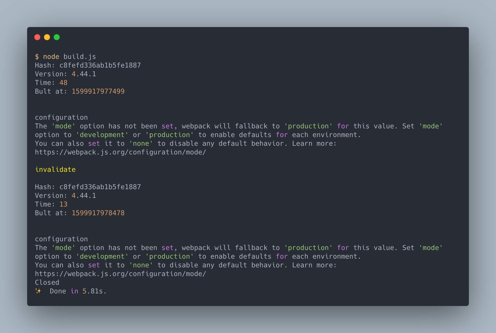

# 使用 Node.js API 操作 webpack

> 本文將會學到如何使用 Node.js API 來操作 webpack 。

Node.js API 是除了 CLI 外另一個操作 webpack 的方法。由於 CLI 會以自己的方式產生輸出資訊與錯誤訊息及 Log ，因此對於有客製建置流程資訊的使用者來說， Node.js API 就是個很好的選擇。

## 安裝

使用 Node.js API 只需要安裝 `webpack` 核心庫即可：

```bash
npm install webpack --save-dev
```

## 使用 `webpack(configObj, callback)` 啟動建置程序

安裝後，我們就可以像是 Node.js 函式一樣使用 `webpack` 模組：

```js
// ./demos/node-interface-callback/build.js
const webpack = require("webpack");

const configurationObject = {
  // Configuration Object
};

const callbackFunction = (err, stats) => {
  // Callback Function
};

webpack(configurationObject, callbackFunction);
```

- 第一個參數 Configuration Object : 配置物件，可以參考[配置 webpack](../06-config-webpack/README.md)
- 第二個參數 Callback Function (Optional) : 在建置完成後所叫用的回呼函式

如果 `webpack()` 有第二個參數 callback function ，那會直接執行編譯，並將結果傳至 callback function 中。

回呼函式會接受兩個參數：

- `err`: 與 webpack 相關的錯誤，例如錯誤的配置物件
- `stats`: 擁有建置結果的資訊物件

利用這兩個函式，可以輸出想要知道的建置過程資訊。

## 使用 `webpack(configObj)` 產生 Compiler 實體

沒有第二個參數時， `webpack()` 會傳回編譯器物件，可以用它操作 webpack 的建置。

此物件有兩個方法：

- `run(callback)`:  執行建置
- `watch(watchOptions, callback)`：執行並監聽檔案，發生變化後重新建置，它會傳回 `watching` 物件，用來操作監聽的動作

### `run(callback)`

```js
const webpack = require("webpack");
const path = require("path");

const configurationObject = {
  // Configuration Object
};

const callbackFunction = (err, stats) => {
  // Callback Function
};

const compiler = webpack(configurationObject);

compiler.run(callbackFunction);
```

`run()` 會執行建置，當建置完成後會叫用 `callback` 做輸出資訊的作業，這樣的方式等同於 `webpack(configurationObject, callbackFunction)` 。

### `watch(watchOptions, callback)`

```js
const webpack = require("webpack");
const path = require("path");

const configurationObject = {
  // Configuration Object
};

const callbackFunction = (err, stats) => {
  // Callback Function
};

const watchOptions = {
  // Watch Options
};

const compiler = webpack(configurationObject);
const watching = compiler.watch(watchOptions, callbackFunction);
```

使用 `watch()` 啟動編譯器，會啟動監聽檔案的功能，與 `webpack --watch` 功能相似。

`watchOptions` 是[監聽相關的設定](https://webpack.js.org/configuration/watch/)。

要關閉監聽狀態，可以使用 `close(callback)` 方法：

```js
watching.close(() => {
  console.log("Closed");
});
```

`close()` 的 `callback` 會在結束監聽時叫用。

另外 `watching` 可以用 `invalidate()` 取消掉本次的編譯:

```js
watching.invalidate();
```

下面這裡例子展示了 Compiler 的使用方式：

```js
// ./demos/node-interface-watch
const webpack = require("webpack");
const path = require("path");

// https://webpack.js.org/configuration/#options
const configurationObject = {
  entry: path.resolve(__dirname, "src", "index2.js"),
};

// https://webpack.js.org/api/node/#stats-object
const callbackFunction = (err, stats) => {
  if (err) {
    // webpack 發生錯誤
    console.error(err.stack || err);
    if (err.details) {
      console.error(err.details);
    }
    return;
  }

  // info 是 Stats Data : https://webpack.js.org/api/stats/#root
  const info = stats.toJson();

  console.log(`Hash: ${info.hash}`);
  console.log(`Version: ${info.version}`);
  console.log(`Time: ${info.time}`);
  console.log(`Bult at: ${info.builtAt}`);
  console.log("\n");

  if (stats.hasErrors()) {
    // 編譯過程發生錯誤
    info.errors.forEach((error) => {
      console.error(error);
    });
  }

  if (stats.hasWarnings()) {
    // 編譯過程發生警告
    info.warnings.forEach((warning) => {
      console.warn(warning);
    });
  }
};

// https://webpack.js.org/configuration/watch/#watchoptions
const watchOptions = {
  aggregateTimeout: 2000, // 檔案變動後２秒再重新編譯
};

const compiler = webpack(configurationObject);
const watching = compiler.watch(watchOptions, callbackFunction);

setTimeout(() => {
  console.log("\ninvalidate\n");
  watching.invalidate();
}, 1000);

setTimeout(() => {
  watching.close(() => {
    console.log("Closed");
  });
}, 5000);
```

其結果如下圖：



- `stats.toJson()` 會給予詳細的[編譯資訊](https://raw.githubusercontent.com/webpack/analyse/master/app/pages/upload/example2.json)，可以利用這物件組出想要的輸出。
- 叫用 `invalidate()` 後因為前次編譯被視為無效的，因此又重新編譯了一次。

> `run` 與 `watch` 方法都不能夠多併發，必須要等前一次編譯完成才能在執行。

#### 配置物件為陣列時

`webpack()` 與 CLI 的配置檔一樣只要給予陣列的格式，就可以同時編譯多種配置：

```js
const webpack = require("webpack");
const path = require("path");

const configurationObject = [
  {
    name: "dev",
    mode: "development",
    entry: "./src/index2.js",
  },
  {
    name: "prod",
    mode: "production",
    entry: "./src/index2.js",
    output: {
      filename: "bundle.js",
      path: path.resolve(__dirname, "build"),
    },
  },
];

const callbackFunction = (err, stats) => {
  if (err) {
    console.error(err.stack || err);
    if (err.details) {
      console.error(err.details);
    }
    return;
  }

  const info = stats.toJson();

  console.log(`Hash: ${info.hash}`);
  console.log(`Version: ${info.version}`);

  info.children.forEach((child) => {
    console.log(`Child ${child.name}`);
    console.log(` Hash: ${child.hash}`);
    console.log(` Version: ${child.version}`);
    console.log(` Time: ${child.time}`);
    console.log(` Bult at: ${child.builtAt}`);
    console.log("\n");
  });

  if (stats.hasErrors()) {
    // 編譯過程發生錯誤
    info.errors.forEach((error) => {
      console.error(error);
    });
  }

  if (stats.hasWarnings()) {
    // 編譯過程發生警告
    info.warnings.forEach((warning) => {
      console.warn(warning);
    });
  }
};

const compiler = webpack(configurationObject);
compiler.run(callbackFunction);
```

使用陣列選項的 `webpack()` 傳回的也是傳回 `stats` 物件，但是在 `toJson()` 後，每個建置的資訊會在 `children` 內。

> 陣列的配置雖然可以同時配置多個不同的設定，但執行時還是一個一個完成，並不會同步執行，如果要同步執行，可以使用 [parallel-webpack](https://github.com/trivago/parallel-webpack) 來做處理。

## Stats 物件

Node.js API 在建置完成後會對 `callback` 傳入 `err` 及 `stats` 參數，其中的 `stats` 是個擁有建置結果資訊的 Stats 物件，在前面的例子我們有使用 `stats` 取得對應的資訊並做輸出， `stats` 有下面這些資訊：

- 基本資訊：版本、 hash 、執行時間...等
- 模組資訊
- Chunks 資訊
- Bundle 資訊

webpack CLI 內部就是使用 `stats` 中的資訊輸出訊息的。

### Stats 的方法

Stats 物件提供了幾個方法：

- `stats.hasErrors()`: 如果建置有錯誤時為 `true` 否則為 `false`
- `stats.hasWarnings()`: 如果建置有警告時為 `true` 否則為 `false`
- `stats.toJson(statsOptions?)`: 回傳建置資訊， `option` 可以[控制資訊如何輸出](https://webpack.js.org/configuration/stats/)
- `stats.toString(statsOptions?)`: 回傳預設的輸出資訊，與 CLI 輸出的資訊類似

### 擁有的資訊

在使用 `toJson()` 後，會取回 [Stats 資料](https://webpack.js.org/api/stats/) ，這個資料物件會像下面這樣：

```js
{
  'version': '5.0.0-alpha.6', // 此編譯使用的 webpack 版本
  'hash': '11593e3b3ac85436984a', // 此編譯的 hash 值
  'time': 2469, // 此次編譯使用的時間(ms)
  'filteredModules': 0, // 此資訊所忽略的模組數量
  'outputPath': ''/'', // 此次編譯的輸出路徑
  'assetsByChunkName': {
    // 此次編譯 chunk 對應的 bundle(asset) 名稱
  },
  'assets': [
    // bundle 的清單
  ],
  'chunks': [
    // chunk 的清單
  ],
  'modules': [
    // 模組的清單
  ],
  'errors': [
    // 錯誤資訊清單
  ],
  'warnings': [
    // 警告資訊清單
  ],
  'children' : [
      // 當多個建置設定時（配置物件為陣列）的各個建置資訊
  ]
}
```

`modules`, `chunks` 及 `assets` ，分別是輸入、建立中、完成時的資料都可以取得，以便使用者設置輸出資訊。

> 如果 `webpack()` 中的配置是陣列時，各個建置資訊會在 `children` 裡。

## 總結

Node.js API 對於將 webpack 當作建置工具，同時也想要完全客製輸出資訊的使用者來說是較好的選擇。

Node.js API 可以使用配置物件做配置，並且搭配 `callback` 叫用函式做輸出資訊的控制。

搭配 `run` 以及 `watch` 指令控制 webpack ，使用 `watch` 會監聽檔案的變化做重編譯的動作。

Node.js API 同時也支援陣列的配置物件，可以同時建置多個配置。

Stats 物件提供不同的方法以便使用者取得想要的資料，而 Stats 資料將輸入、建置中、完成時的資料都提供給使用者，以便用來輸出資訊。

## 參考資料

- [Node Interface](https://webpack.js.org/api/node/)
- [Stats Data](https://webpack.js.org/api/stats/)
- [Watch and WatchOptions](https://webpack.js.org/configuration/watch/)
- [Stats](https://webpack.js.org/configuration/stats/)
