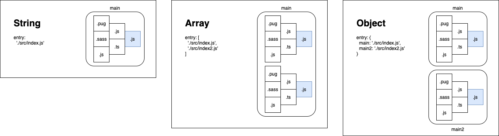
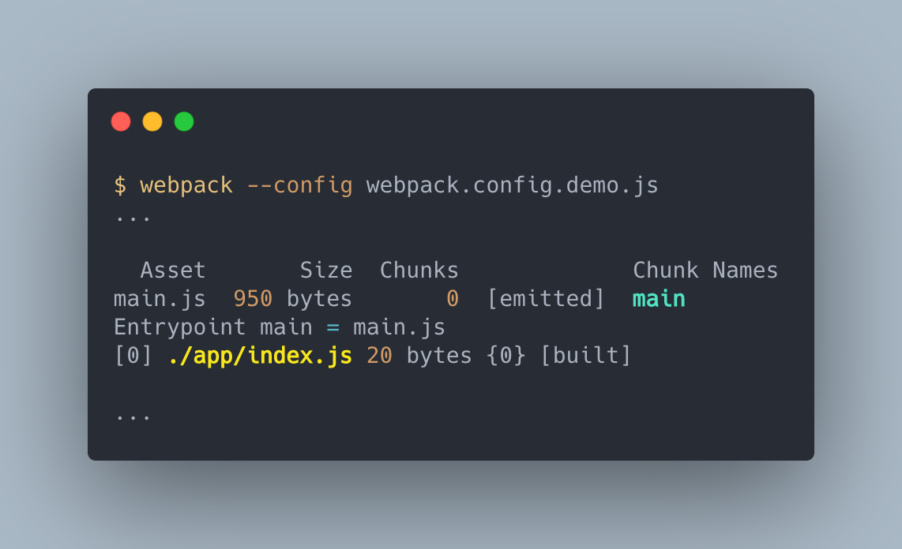
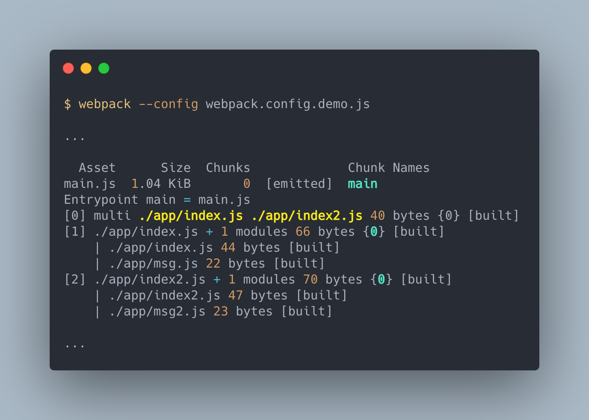
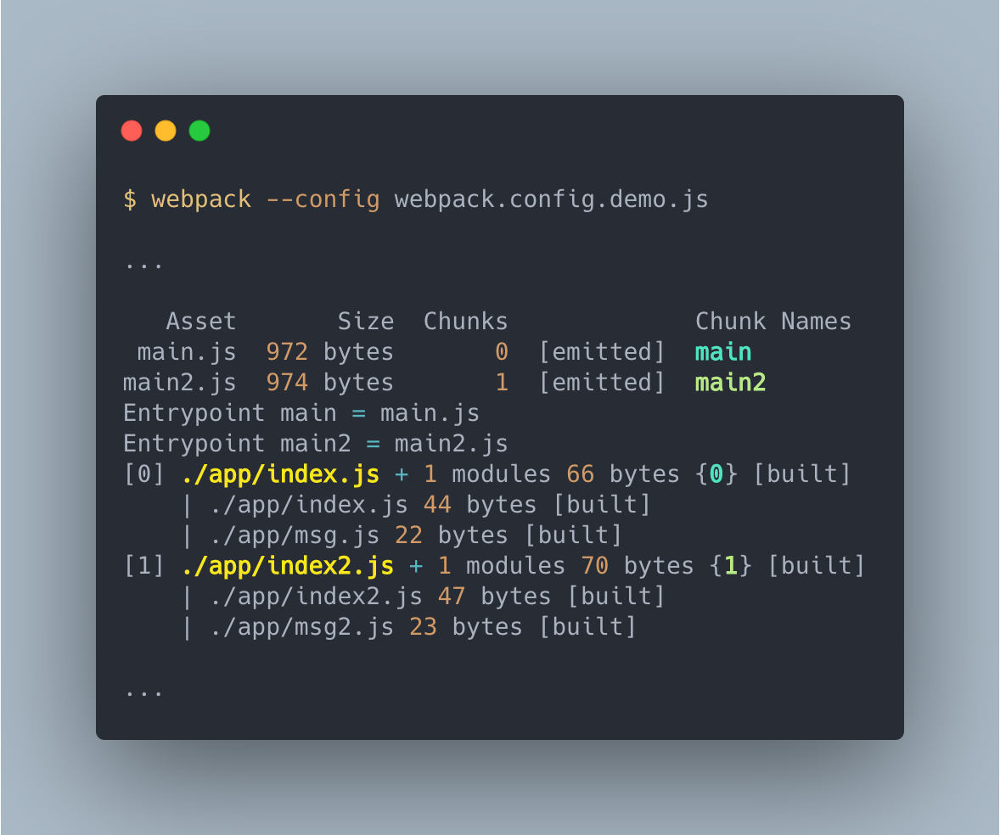
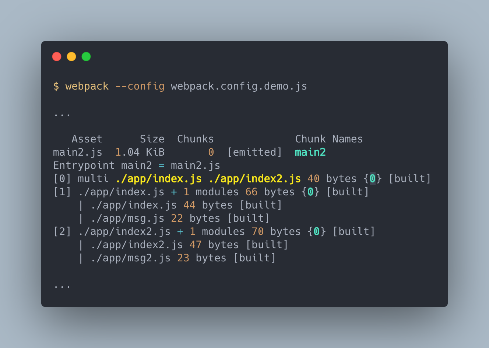
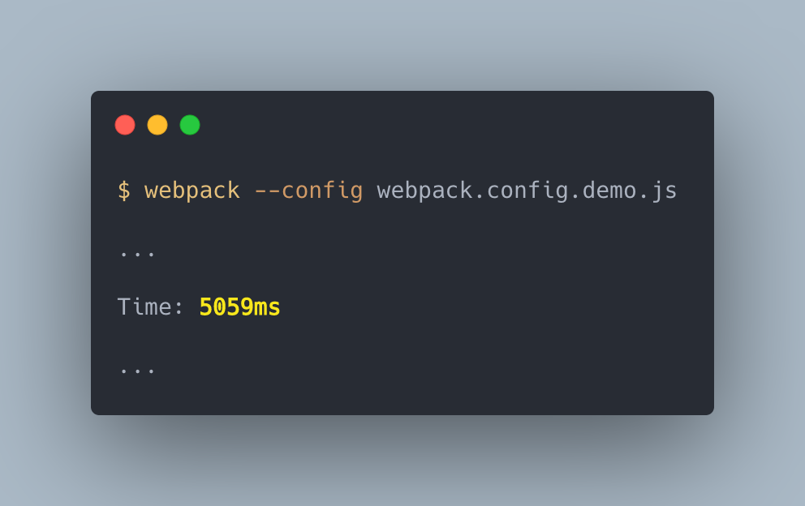

# 入口 Entry

> 本文講解 webpack 配置項 `entry` 的使用方式。

> 本文的範例程式放在 [peterhpchen/webpack-quest](https://github.com/peterhpchen/webpack-quest/tree/master/posts/09-entry/demos) 中，每個程式碼區塊的第一行都會標注檔案的位置，請搭配文章作參考。



`entry` 屬性設定整個 bundle 的起點， webpack 會由 `entry` 開始尋找相依模組來組成相依圖，本文將介紹 `entry` 的各種設定方式。

## 預設值

`entry` 的預設值為 `./src/index.js` :

```js
// ./demos/entry-default
{
  entry: "./src/index.js";
}
```

將起始模組放於 `./src/` 並且將檔名命名為 `index.js` 就可以不用設定 `entry` 屬性，可以直接輸入 `webpack` 指令來執行建置。

## 設定語法

`entry` 的設定語法有四種：

- 字串值
- 陣列
- 物件
- 函式

我們依序講解各個使用方式

## 字串值

對 `entry` 屬性輸入字串值，會將此字串值的檔案設定為 Chunk `main` 的入口。

```js
// ./demos/entry-string/webpack.config.demo.js
module.exports = {
  entry: "./app/index.js",
};
```

建置結果為：



- 入口是 `./app/index.js`
- 建置後產生的 Chunk 名稱是 `main`
- 建置出來的 bundle 名為 `main.js`

> 因為沒有設定 `output` ，所以會在預設的 `dist` 目錄下，並且 `main` chunk 會輸出為 `main.js` ，在[輸出 Output](../10-output/README.md) 一文中會做說明。

字串值的 `entry` 可以直接使用 CLI 設定：

```json
// ./demos/entry-string/package.json
{
  ...
  "scripts": {
    "build:argv": "webpack ./app/index.js",
    "build:argv2": "webpack --entry ./app/index.js --output ./dist/main.js",
    ...
  },
  ...
}
```

`webpack` 指令的預設參數是 `entry` ，可以不需要使用特定的名稱參數。如果明確使用 `--entry` 參數，因為只給予路徑資訊，因此 Chunk 名稱會是 `null` ，為避免錯誤，請與 `--output` 同步使用設定輸出檔案。

> 字串值的設定適合在單一入口配置的快速開發時使用。

## 陣列

以陣列的方式設定 `entry` 會將複數個相依圖設定為 chunk `main` 入口。

```js
// ./demos/entry-array/webpack.config.demo.js
module.exports = {
  entry: ["./app/index.js", "./app/index2.js"],
};
```

建置結果為：



- 入口是包含了 `index.js` 及 `index2.js` 的陣列
- `index.js` 的相依圖中的模組與 `index2.js` 的相依圖中的模組都被打包在同一個 chunk `main` 中。

使用陣列的 `entry` 使 webpack 將不相關的模組打包在同個 Chunk 中，稱為 **multi-main entry** 。

陣列的 `entry` 可以直接用 CLI 設定：

```json
// ./demos/entry-array/package.json
{
  ...
  "scripts": {
    "build:argv": "webpack ./app/index.js ./app/index2.js",
    ...
  },
  ...
}
```

`webpack` 指令的預設參數是 `entry` ，複數個參數就代表使用多個起始模組的單一入口點配置，當執行包有多個入口的 bundle 時，入口模組會依序被執行。

## 物件

`entry` 設定為物件時，物件中的 `key` 為 Chunk 的名稱，因此設定多個 `key` 時會產生多個 Chunk 並產生出個別的 bundle 。

物件中的值有三種：

- 字串值
- 陣列

### 物件值為字串值

使用字串值設定物件值會將字串值所代表的檔案當作名稱為 `key` 的 Chunk 的入口。

```js
// ./demos/entry-object/webpack.config.demo.js
module.exports = {
  entry: {
    main: "./app/index.js",
    main2: "./app/index2.js",
  },
};
```

建置結果為：



- 兩個入口 `main` 與 `main2`
- 產生的 Chunk 名稱與 物件的 `key` 相同，為 `main` 與 `main2`
- 輸出的 bundle 會有兩個， `main.js` 與 `main2.js`

多入口的設定多用於**頁面應用程式**中。

**字串值**的設定其實是物件設定中的 `main` 鍵值設定的縮寫：

```js
module.exports = {
  entry: {
    main: "./app/index.js",
  }, // === entry: './src/index.js'
};
```

物件的字串值設定可以使用 CLI ：

```json
// ./demos/entry-object/package.json
{
  ...
  "scripts": {
    "build:argv": "webpack main=./app/index.js main2=./app/index2.js",
    "build:argv2": "webpack --entry main=./app/index.js --entry main2=./app/index2.js",
    ...
  },
  ...
}
```

使用 `{key}={字串值}` 的方式設定指定 Chunk 名稱的 `entry` ，除了預設參數外，還可以使用 `--entry` 做設定。

> 由於字串值是物件字串值的縮寫，由此可知字串值的 CLI 設定 `webpack ./app/index.js` 是 `webpack --entry main=./app/index.js` 的縮寫。

### 物件值為陣列

將陣列中的所有起始模組的相依圖中的組成合併在名稱為 `key` 的 Chunk 中。

```js
// ./demos/entry-object-array/webpack.config.demo.js
module.exports = {
  entry: {
    main2: ["./app/index.js", "./app/index2.js"],
  },
};
```

建置結果為：



- `main2` Chunk 有兩個入口 `index.js` 及 `index2.js` 。
- 將兩個入口中的相依圖解析並包入 `main2` Chunk 中。

**`entry` 陣列**的設定其實就是物件設定中的 `main` 鍵值對應陣列值的縮寫：

```js
module.exports = {
  entry: {
    main: ["./app/index.js", "./app/index2.js"],
  }, // === entry: ['./app/index.js', './app/index2.js']
};
```

物件陣列可以用 CLI 設定：

```json
// ./demos/entry-object-array
{
  ...
  "scripts": {
    "build:argv": "webpack main2=./app/index.js main2=./app/index2.js",
    "build:argv2": "webpack --entry main2=./app/index.js --entry main2=./app/index2.js",
    ...
  },
  ...
}
```

輸入多個同名的 `entry` ，就可以建立多個起始模組的特定名稱 Chunk 。

> 由於陣列是物件陣列的縮寫，由此可知陣列的 CLI 設定 `webpack ./app/index.js ./app/index2.js` 是 `webpack --entry main=./app/index.js main=./app/index2.js` 的縮寫。

## 函式

如果對 `entry` 設定函式， webpack 會在 Compiler 的 `make` 事件鉤子觸發此函式，取得入口設定值。

函式可以回傳三種資料：

- 字串值
- 陣列
- Promise

### 函式回傳字串值

函式回傳字串值其結果與直接回傳字串值相同，會設定此字串值檔案為 `main` Chunk 的入口。

```js
// ./demos/entry-func/webpack.config.demo.js
module.exports = {
  entry: () => "./app/index.js",
};
```

### 函式回傳陣列

函式回傳陣列其結果與直接回傳陣列相同，會設定此陣列的多個檔案為 `main` Chunk 的入口，並輸出至同個 bundle 中。

```js
// ./demos/entry-func-array/webpack.config.demo.js
module.exports = {
  entry: () => ["./app/index.js", "./app/index2.js"],
};
```

> 函式的回傳與直接回傳不同的是函式設定會在 Compiler `make` 事件觸發時才叫用函式取得入口。

### 函式回傳 Promise

回傳 Promise 會使 webpack 等待 `resolve` 被叫用並傳回 `entry` 後才會繼續執行建置。

```js
module.exports = {
  entry: () =>
    new Promise((resolve, reject) => {
      setTimeout(() => {
        resolve("./app/index.js");
      }, 5000);
    }),
};
```

執行結果為：



將 Timeout 設為 5 秒，可以看到 webpack 等待了 `resolve` 才完成建置。

Promise 可以讓 webpack 的入口設定為需要時間取得的資源，例如遠端伺服器、檔案系統或是資料庫。

## context

`context` 配置是設定基底路徑，預設會是目前專案的**根目錄**。

它必須是一個`絕對路徑` ，在配置 `entry` 時相對路徑會以 `context` 為基底作延伸。

```js
// ./demos/context/webpack.config.demo.js
const path = require("path");

module.exports = {
  context: path.resolve(__dirname, "frontend"),
};
```

範例的目錄如下：

```plaintext
root
|- /frontend
  |- /src
    |- index.js
|- package.json
|- webpack.config.demo.js
```

由於 `context` 已經設為 `frontend` ，因此 `entry` 預設的 `./src/index.js` 會設為 `./frontend/src/index.js` 。

> 路徑相關的設定建議使用 Node.js 內建的 `path` 模組及內建的全域變數(像是 `__dirname`) 來做設定，避免路徑問題(例如 POSIX 與 Windows 路徑不同)。

## 總結

本文講解 `entry` 有三種設定方式，字串值、陣列、物件及函式。

字串值是設定 `main` Chunk 的起始模組，它是物件 `{ main: '{字串值}'}` 的簡寫，在僅有單一入口的建置下可以快速地做設定。

陣列是設定 `main` Chunk 擁有多個起始模組，陣列的 `entry` 會將多個不相關的模組相依圖組成單個 `main` Chunk 。

物件是指定特定名稱 Chunk 的 `entry` ，使用物件的 `key` 當作 Chunk 的名稱，並且 `value` 設定此物件的入口配置， `value` 可以是字串值或是陣列，其定義與 `entry` 設定的定義相同，僅是 Chunk 名稱是 `key` 值。

函式可以讓使用者在 Compiler `make` 事件鉤子時才決定 `entry` ，其也可以傳回 Promise 來取得遠端的資源。

## 參考資料

- [Webpack Documentation: Concepts - Concepts - entry](https://webpack.js.org/concepts/#entry)
- [Webpack Documentation: Concepts - Entry Points](https://webpack.js.org/concepts/entry-points/)
- [Webpack Documentation: Configuration - Entry and Context](https://webpack.js.org/configuration/entry-context/)
- [令人困惑的 webpack 之 entry](https://juejin.im/entry/6844903463818625037)
