# 輸出 Output

> 本文講解 webpack 配置項 `output` 的使用方式。

> 本文的範例程式放在 [peterhpchen/webpack-quest](https://github.com/peterhpchen/webpack-quest/tree/master/posts/10-output/demos) 中，每個程式碼區塊的第一行都會標注檔案的位置，請搭配文章作參考。

`output` 屬性是設定建置完成的 bundle 要放在哪個目錄以及如何命名。

## 預設值

`output` 的預設值如下：

```js
// ./demos/output-default/webpack.config.js
const path = require("path");

module.exports = {
  output: {
    path: path.join(process.cwd(), "dist"),
    filename: "[name].js",
  },
};
```

- `path` 定義了 bundle 輸出的路徑，預設是在執行建置工作目錄下的 `dist` 目錄中。
- `filename` 定義生成的檔名，預設值使用了 template string `[name]` ，這樣可以依照 Chunk 名稱生成對應的檔案。

> 由於 `path` 設定複雜，每個屬性都有各自的預設值，本文只說明了 `path` 及 `filename` 兩個常用的屬性預設值，其他的預設值可以參考 [webpack 代碼](https://github.com/webpack/webpack/blob/master/lib/config/defaults.js#L499)。

## 配置方式

`output` 需要使用者配置一個物件，該物件的屬性像是前面說到的 `path` 及 `filename` ，每個都有自己的功能，使用者可以依照自己的需求做配置。

接著會說明各屬性的用途及使用方式。

> 由於 [`output` 的屬性繁多](https://webpack.js.org/configuration/output/)，為避免讀者混淆，本文只會講解幾個常用的屬性，其他的屬性依照情境會在之後的章節介紹。

## `path`

`path` 屬性設定輸出的目錄，這屬性需要配置**絕對路徑(absolute path)**。

```js
// ./demos/output-path/webpack.config.demo.js
const path = require("path");

module.exports = {
  output: {
    path: path.resolve(__dirname, "build"),
  },
};
```

使用 Node.js 內建的 `path` 模組及 `__dirname` 變數可以解決路徑問題並組成絕對路徑。

`output` 的 `path` 屬性可以用 CLI 設定：

```json
// ./demos/output-path/package.json
{
    ...
  "scripts": {
    "build:argv": "webpack --output-path $PWD/build",
    "build:argv2": "webpack --output-path build"
    ...
  },
  ...
}
```

`--output-path` 可以設定輸出路徑，雖然可以使用相對路徑做設定，但避免問題還是請使用絕對路徑做設置。

> `$PWD` 是存有目前工作目錄的變數，可以用它組出絕對路徑。

`path` 中可以使用 `[hash]` 用 Compilation 的 hash 值設定目錄：

```js
// ./demos/output-path/webpack.config.demo.js
const path = require("path");

module.exports = {
  output: {
    path: path.resolve(__dirname, "[hash]"),
  },
};
```

上面的例子會產生下面的結果：

```plaintext
root
|- 8f2404a0220882490931
|- ...
```

它會產生一個 Compilation 的 hash 值為名稱的目錄。

## `filename`

`filename` 設定 bundle 輸出的檔案名稱，它有兩種設定方式：

- 字串值
- 函式

下面我們依序介紹字串值及函式的設定方式。

函式是個擁有 `chunkData` 的方法，其回傳值必須是合法的 `filename` 字串值。

### 使用字串值設定 `filename`

字串值可以用一般靜態的名稱做設定，也可以用上節提到的 template string 設定不同的名稱來配置輸出。

下面是個使用字串值設定的範例：

```js
// ./demos/output-filename/webpack.config.demo.js
const path = require("path");

module.exports = {
  output: {
    filename: "bundle.js",
  },
};
```

執行結果如下：

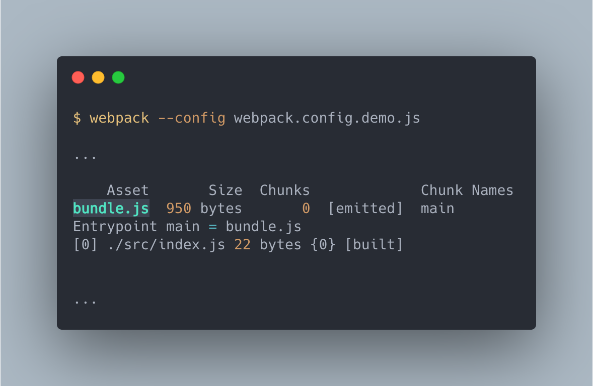

產生的檔名從原本預設的 Chunk 名稱變為配置檔中的 `bundle.js` 。

CLI 也可以配置 `filename` ：

```json
// ./demos/output-filename/package.json
{
  ...
  "scripts": {
    "build:argv": "webpack --output-filename bundle.js"
  },
  ...
}
```

使用 `--output-filename` 設定 `filename` 參數。

`filename` 除了設定檔名外，它還可以是一個相對路徑，以此來建置輸出的目錄結構：

```js
// ./demos/output-filename-path/webpack.config.demo.js
module.exports = {
  output: {
    filename: "js/bundle.js",
  },
};
```

執行結果為：

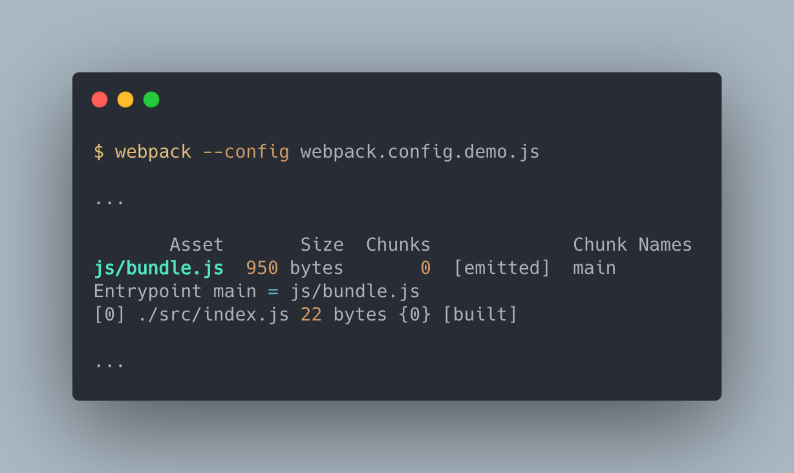

```plaintext
root
|- dist
  |- /js
    |- bundle.js
```

可以看到在 `dist` 目錄下多了 `js` 資料夾，裡面存放 `bundle.js` 。

#### CLI 的 `output` 配置縮寫

由於 `output.path` 及 `output.filename` 常常會一起做配置，因此 CLI 提供合併兩個設定的參數 `--output` ：

```json
{
  ...
  "scripts": {
    "build": "webpack -output ./build/bundle.js",
    "build:short": "webpack -o ./build/bundle.js"
  },
  ...
}
```

直接將輸出的目錄及檔名作為參數傳入即可， `--output` 這個選項可以簡寫為 `-o` 。

#### 多個 Chunk 時配置 `filename` 的方式

配置多個 `entry` 的時候，會產生多個 Chunk ，也意味著會有多個檔案的輸出。

這時如果還是使用靜態的輸出配置，會造成錯誤：

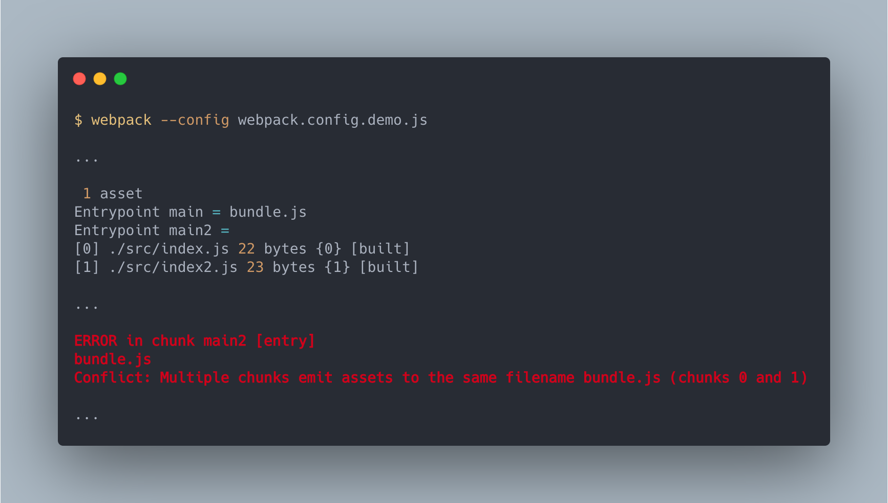

為避免這個問題，可以使用 template string 做設定， webpack 會依照 Chunk 的狀態轉換 template string 變為相符的名稱：

```js
// ./demos/output-filename-multi/webpack.config.demo.js
module.exports = {
  entry: {
    main: "./src/index.js",
    main2: "./src/index2.js",
  },
  output: {
    filename: "bundle.[name].js",
  },
};
```

執行結果如下：

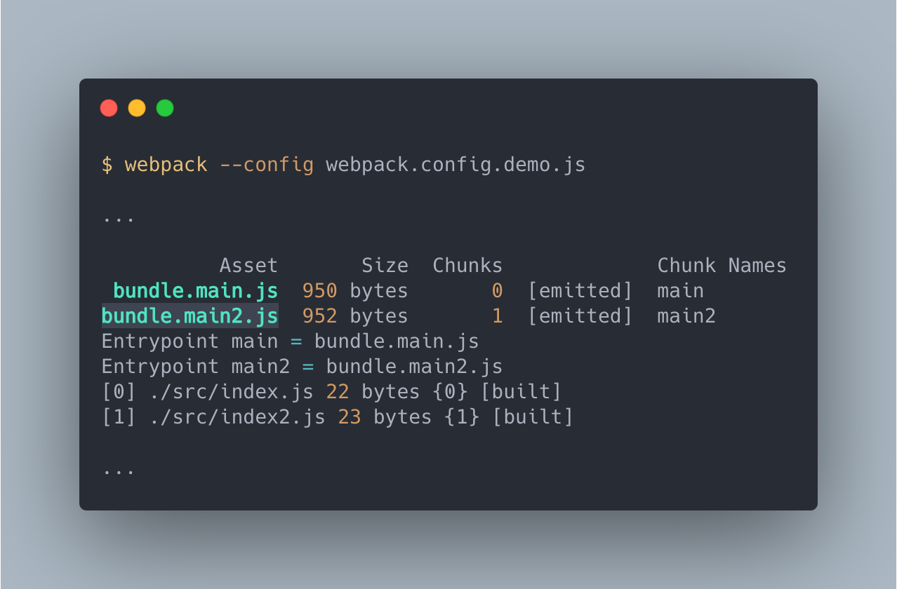

`[name]` 是之前有提到的 template string ，它會被替換為對應的 Chunk 名稱。

利用 template string 可以讓每個 bundle 生成不同名稱的檔案，以解決多 bundle 的問題。

### 使用函式的方式設定 `filename`

```js
// ./demos/output-filename-func/webpack.config.demo.js
module.exports = {
  entry: {
    main: "./src/index.js",
    main2: "./src/index2.js",
  },
  output: {
    filename(chunkData) {
      return chunkData.chunk.name === "main"
        ? "main.js"
        : `bundle.${chunkData.chunk.name}.js`;
    },
  },
};
```

執行結果如下：

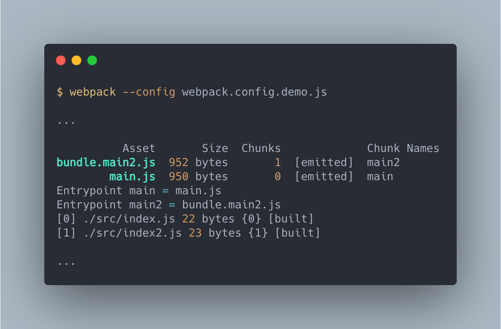

當 `output.filename` 設定為函式時，這個函式會被每個 Chunk 叫用，並且傳入一個 `chunkData` 的參數，這個參數擁有此 Chunk 的資訊，我們可以使用 `chunkData` 判斷改怎麼產生輸出。

## Template String

Template String 可以將 Chunk 的資料帶入字串值中以產生不同名稱的輸出。

Template String 是藉由 Webpack 內建的 [TemplatePathPlugin](https://github.com/webpack/webpack/blob/28bafbec7f5e91dbbeccb82e2c0f6ddfb0e3a51b/lib/TemplatedPathPlugin.js) 驅動的功能，它擁有下面的 template ：

- `[name]` : Chunk 名稱
- `[id]` : Chunk ID
- `[hash]` : Compilation 的 hash 值，只要建置有改變， hash 值就會變化
- `[contenthash]` : 每個 bundle 的 hash 值，只有 bundle 改變時才會變化
- `[chunkhash]` : 每個 chunk 的 hash 值，只有在 chunk 改變時才會變化

接下來會用例子說明各個 template 的定義。

### `[name]`

在上面有多個例子使用了 `[name]` template ，它表示的是對應的 Chunk 名稱：

```js
// ./demos/output-filename-template/webpack.config.name.js
module.exports = {
  entry: {
    main: "./src/index.js",
    main2: "./src/index2.js",
  },
  output: {
    filename: "[name].js",
  },
};
```

執行結果：

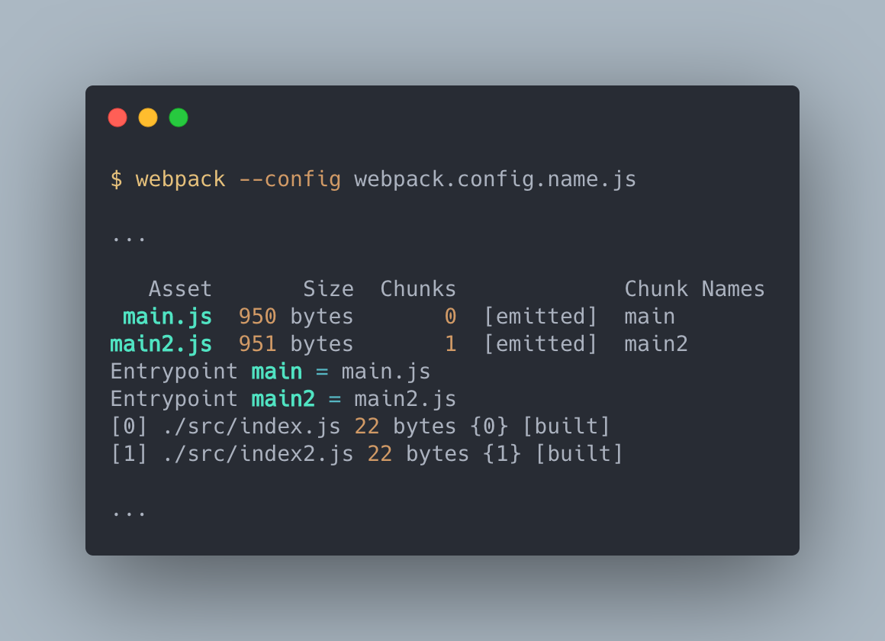

結果下方的 Entrypoint 後面的是 Chunk 名稱，可以看到我們建立的 bundle 依照了 Chunk 名稱的方式被建立出來。

### `[id]`

`[id]` 會對應每個 Chunk 的 ID ：

```js
// ./demos/output-filename-template/webpack.config.id.js
module.exports = {
  entry: {
    main: "./src/index.js",
    main2: "./src/index2.js",
  },
  output: {
    filename: "[id].js",
  },
};
```

執行結果如下：

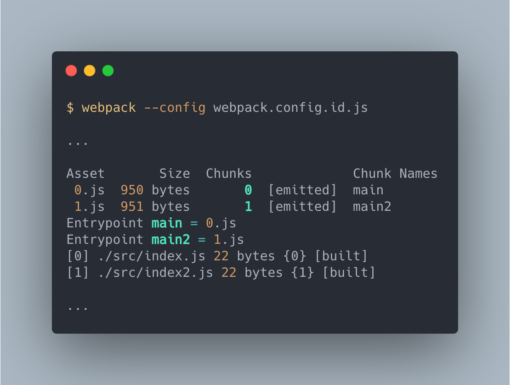

可以看到 Chunk ID 對應輸出成 bundle 的檔名。

### `[hash]`, `[chunkhash]`, `[chunkhash]`

`[hash]`, `[chunkhash]`, `[chunkhash]` 都是輸出 hash 值，但每個都有不同的構成機制，依照情況有些會變動有些可以保持原本的值，大致可以分為下面這樣：

| Actions               | `[hash]` | `[chunkhash]`                  | `[contenthash]`               |
| --------------------- | -------- | ------------------------------ | ----------------------------- |
| modify webpack config | change   | no change                      | no change                     |
| modify program file   | change   | only bundle which file change  | only bundle which file change |
| modify extract file   | change   | bundle and extract file change | only extract file change      |

#### `[hash]`

`[hash]` 比較好理解，在整個建置過程中唯一的一隻 hash 值，因此不管是配置還是程式變化，它的值就會變化。

由於 `[hash]` 是唯一的，因此如果有多個 bundle 時，它們會唯一的檔名而合併。

`[hash]` 的例子可以看 `./demos/output-filename-template/webpack.config.hash.js` ，可以試著改變配置檔或是程式觀察變化。

#### `[chunkhash]`

`[chunkhash]` 是每個 Chunk 的 hash 值，因此當一個 Chunk 中的 module 發生變化時， `[chunkhash]` 會變化，但對於其他的 chunk 來說因為沒有發生變化，所以 hash 值還是原來的樣子。

`[chunkhas]` 可以參考 `./demos/output-filename-template/webpack.config.chunkhash.js` ，嘗試變化程式觀察輸出的檔名。

#### `[contenthash]`

`[contenthash]` 的值是由輸出的 bundle 內容所產生的，我們可以看下面這個例子：

```js
// ./demos/output-filename-hash/src/index.js
import "./style/style.css";

console.log("index");

// ./demos/output-filename-hash/src/index2.js
import "./style/style.css";

console.log("index2");
```

```css
/* ./demos/output-filename-hash/src/style/style.css */
.hello-world {
  color: green;
}
```

然後配置檔如下：

```js
// ./demos/output-filename-hash/webpack.config.js
const MiniCssExtractPlugin = require("mini-css-extract-plugin");

module.exports = {
  entry: {
    main: "./src/index.js",
    main2: "./src/index2.js",
  },
  output: {
    filename: "[contenthash].js",
  },
  plugins: [
    new MiniCssExtractPlugin({
      filename: "[contenthash].css",
    }),
  ],
  module: {
    rules: [
      {
        test: /\.css$/,
        use: [
          {
            loader: MiniCssExtractPlugin.loader,
          },
          "css-loader",
        ],
      },
    ],
  },
};
```

這裡使用 `MiniCssExtractPlugin` 將引入的 `.css` 拉出來另外產生 `.css` 檔案。

建置結果如下：

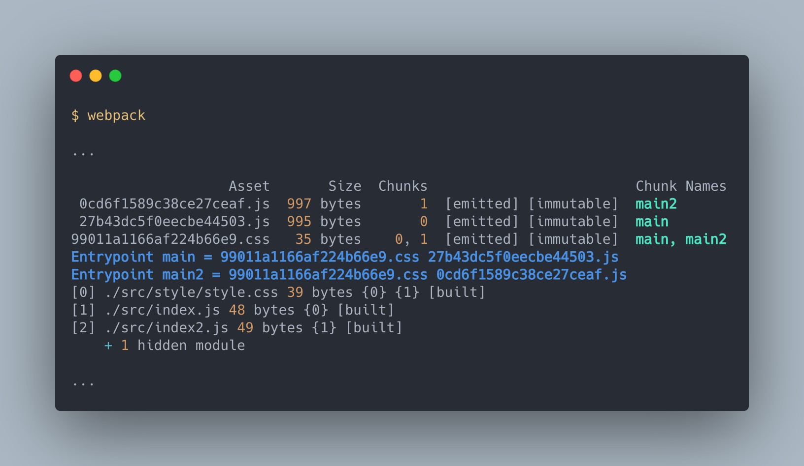

這建置產生了兩個 Chunk : `main` 與 `main2` ，但是 bundle 卻有三個，這是因為本來被 `index.js` 及 `index2.js` 所引用的 `style.css` 被 `MiniCssExtractPlugin` 拉出建立為獨立的檔案。

這時如果我們還是使用 `[chunkhash]` 的話，只要 `.css` 或是 `.js` 其中一方修改，兩個檔案的 hash 都會變化。

> webpack 提供了有這個多樣的 hash 值供使用者選用，其最大的目的就是為了讓瀏覽器快取，增加應用程式的效能，這部分在後面的章節會講解到。

### 跳脫 template string

有時會需要真的輸出 `[id]` 這樣的字串當作檔名，可以使用 `\` 包住中間的值（例如 `id`, `name`），就可以直接當作字串輸出而不會轉換：

```js
// ./demos/output-filename-template/webpack.config.escape.js
module.exports = {
  entry: {
    main: "./src/index.js",
    main2: "./src/index2.js",
  },
  output: {
    filename: "[name].[\\id\\].js",
  },
};
```

在字串中記得再加一個 `\` 讓 `\` 可以傳入。

執行結果如下：

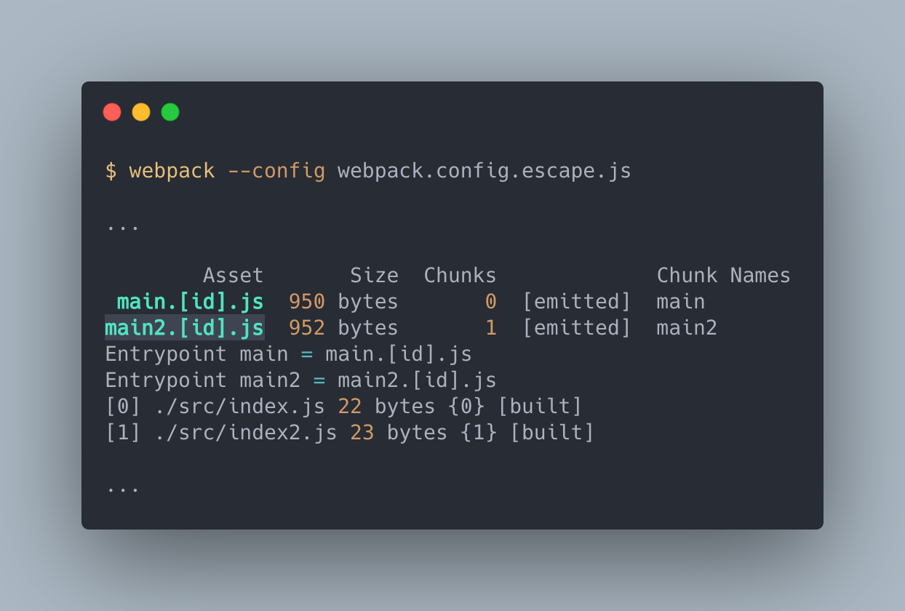

## `publicPath`

`publicPath` 是處理在部署時候，建置檔案在伺服器中的路徑，以此路徑設定 Chunk 在載入時所需要請求的位置。

我們直接來看個例子：

```js
// ./demos/output-publicpath/webpack.config.js
const path = require("path");

module.exports = {
  output: {
    path: path.resolve(__dirname, "build/js"),
  },
};
```

產生出來的目錄如下：

```plaintext
root
|- build
  |- /js
    |- 1.js
    |- main.js
  |- index.html
```

- `index.html` 中使用 `./js/main.js` 引入 `main.js`
- `1.js` 會在 `main.js` 中被延遲載入

將 `build` 目錄傳至伺服器上看結果：

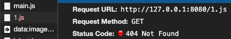

這時在載入 `1.js` 時發生了 404 的錯誤，這是因為載入 `1.js` 的 `index.html` 目錄在 `build` ，而 `1.js` 是在 `build/js` ， 因此對於 `index.html` 來說， `1.js` 的路徑應該要是 `./js/1.js` 才能正確的載入。

這種情況下就必須要使用 `publicPath` :

```js
// ./demos/output-publicpath/webpack.config.js
const path = require("path");

module.exports = {
  output: {
    path: path.resolve(__dirname, "build/js"),
    publicPath: "./js/",
  },
};
```

這樣的設定使得 `index.html` 知道要在 `./js/` 中尋找 `1.js` 資源。

## `chunkFilename`

之前介紹的 `filename` 是設定 `entry` 所產生出來的 bundle ，這類的 Chunk 叫做 `initial` ，而像是上面例子的 `1.js` 這種延遲載入的 Chunk 叫做 `non-initial` ，這類 `non-initial` 的輸出檔名就交給 `chunkFilename` 做設定。

### `chunkFilename` 的設定方式

`chunkFilename` 的預設值為 `[id].js` ：

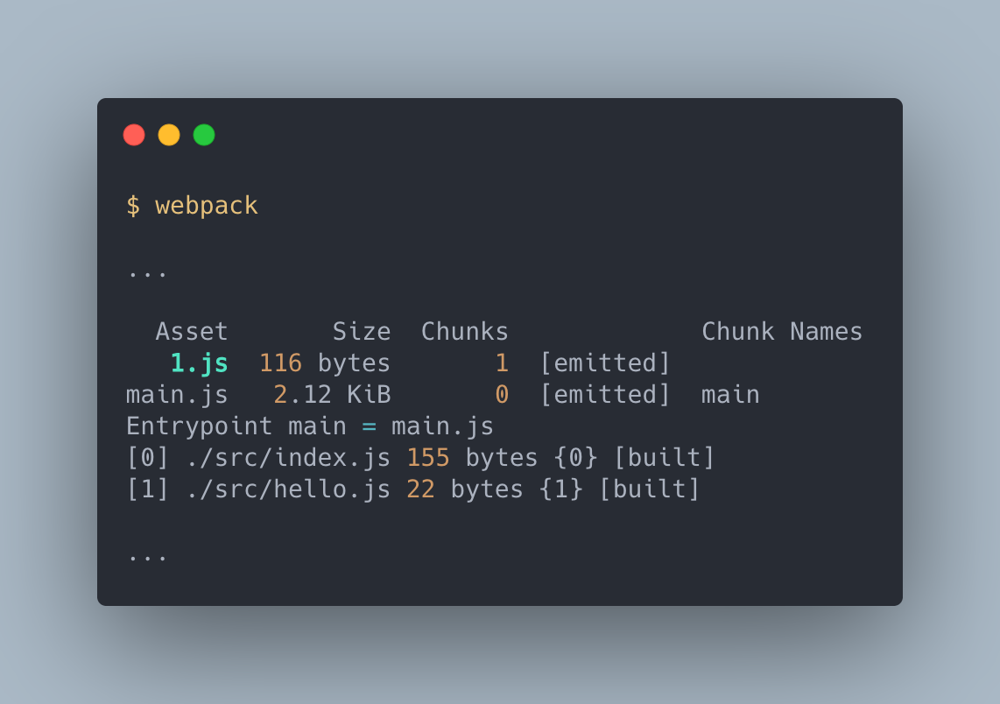

可以看到建置結果檔名為 `1.js` 。

看到這邊大家應該發現了， `chunkFilename` 一樣可以使用 template string 做設置。

## 總結

`output` 擁有許多複雜的配置，本文講了四個比較常用的屬性：`path`, `filename`, `publicPath` 以及 `chunkFilename` 。

這中間也介紹了一個重要的設定方式： Template String 。在 `webpack` 中配置所有的輸出檔案時，不管是用 plugin 建立的或是 loader 創建的還是一般 chunk 輸出的檔案，所有的檔名幾乎都可以使用 Template String 來設定，使用正確的 Template 可以大大地增加快取的效能，加快應用程式的運行。

## 參考資料

- [Concept](https://webpack.js.org/concepts/#output)
- [Concept](https://webpack.js.org/concepts/output/)
- [Output](https://webpack.js.org/configuration/output/)
- [webpack4 系列教程，对比识别 hash/chunkhash/conenthash](https://newsn.net/say/webpack-hash.html)
- [Hash vs chunkhash vs ContentHash](https://medium.com/@sahilkkrazy/hash-vs-chunkhash-vs-contenthash-e94d38a32208)
- [Under The Hood](https://webpack.js.org/concepts/under-the-hood/#chunks)
