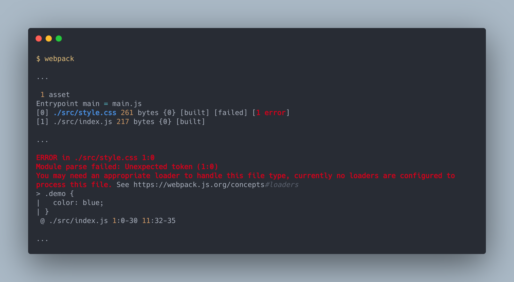
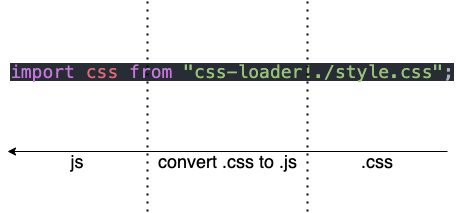
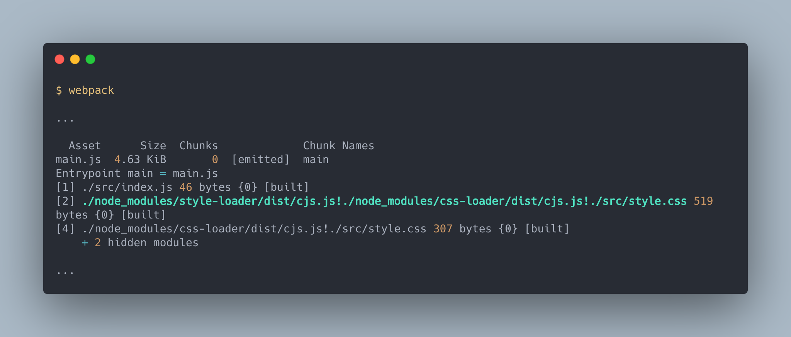
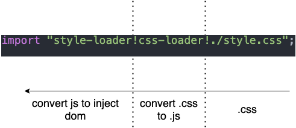

# 載入器(Loaders)

> 本文講解載入器 Loaders 的概念與使用方式。

Webpack 本身只能解析 JavaScript 與 JSON 格式的模組，對於其他的模組像是 CSS 、 Image 等都不知道如何解析。為此 Webpack 需要使用 Loaders 載入器幫助解析其他格式的模組。

## 載入器(Loaders)的用途

Loaders 就像是個翻譯機，將 webpack 不懂的模組翻譯成理解的形式。


由於有許多不同的檔案格式，每個的解析方式都有不同，因此 Loaders 的設定是需要隨檔案格式及需求做變化的。可以參考 [webpack 官方文件介紹 Loaders 的種類](https://v4.webpack.js.org/loaders/)

接著我們直接用例子示範一遍，會更容易理解。

## 使用 webpack 載入 `.css`

假設現在我們想要載入 `.css` 的樣式檔：

```js
// ./demos/loader-css/src/index.js
import css from "./style.css";

function style(cssString) {
  const element = document.createElement("style");

  element.innerHTML = cssString;

  return element;
}

document.head.appendChild(style(css.toString()));
```

這個程式會將 `style.css` 的內容讀進來，並且填到 `<head>` 標籤中，讓 `style.css` 的設定生效。

直接執行 webpack 會看到錯誤訊息：



由於沒有配置適合的 Loaders ，因而產生錯誤。

接著我們嘗試使用 `css-loader` 載入 `style.css` 。

### 安裝 Loaders

絕大多數的 Loaders 都不會內建在 webpack 內，需要自行安裝，因此在使用 `css-loader` 前請安裝它：

```bash
npm install css-loader -D
```

安裝完成後我們需要在引入 `./style.css` 時，跟 webpack 說要使用 `css-loader`：

```js
// ./demos/loader-css-inline/src/index.js
import css from "css-loader!./style.css";

...
```

再建置一次：


藉由 `!` 串接成為一個 pipe ，你可以把它想像成水管，原本的資料 `style.css` 經由 `css-loader` 已經變為 webpack 看得懂的 `css` 物件。



如此一來我們的應用程式就可以載入 `.css` 了：


### 使用 `style-loader` 將內容自動插入 DOM

剛剛我們使用了 `css-loader` 成功將 `style.css` 內容載入至 `index.js` ，但是我們還是必須要自己將內容寫進 DOM 裡，如果每次引入 `.css` 時就要做一次插入 DOM 的處理，會變得十分麻煩。而 `style-loader` 可以幫我們將 CSS 的內容自動插入 DOM 中。

首先也需要先安裝 `style-loader`:

```bash
npm install style-loader -D
```

再來我們將 `index.js` 改為下面這樣：

```js
// ./demos/loader-style-inline/src/index.js
import "style-loader!css-loader!./style.css";
```

建置結果如下：



我們的 pipe 上面多了一個 `style-loader` ，資料傳輸的方向從右開始，所以 `style-loader` 會承接 `css-loader` 的結果在做轉換。



#### 從載入 `.css` 的範例中學到

從這個範例中我們學習到了：

- webpack 載入 JS, JSON 外的格式會發生錯誤
- Loaders 會幫助 webpack 看懂 JS, JSON 外其他格式的模組
- 使用 Loaders 解析目標資源的方法是使用 `!` 串接 Loaders 與資源，形成 pipe
- Pipe 的流向是由右向左
- 同個資源(例如上例的 `style.css`)中可以使用多個 Loaders
- 多個 Loaders 執行的順序同 Pipe 的流向由後往前

現在我們對於 Loaders 已經有初步的概念的，接下來會說明配置 Loaders 的幾種方式。

## 配置 Loaders 的方式

Loaders 的配置除了上面說明的 Inline 方式外，還有 CLI 及配置檔總共三種的設定方式：

- Inline: 在模組路徑上使用 `!` 串接 Loaders 與路徑。
- CLI: 使用 `--module-bind` 參數設定特定檔案的 Loaders 。
- 配置檔: 使用 `module` 屬性設定配置檔。

接著一一介紹不同的設定方式。

### 使用 Inline

Inline 的方式是在程式中的引入語法中加上對應 Loaders 的設定，使得此引入可以被特定 Loaders 處理。

```js
// ./demos/loader-style-inline/src/index.js
import "style-loader!css-loader!./style.css";
```

使用 `!` 串接 Loaders 及模組路徑。

我們也可以使用 `?` 設定 Loaders 的配置：

```js
// ./demos/css-module-inline/src/index.js

import style from "style-loader!css-loader?modules!./style.css"; // query paramter
import style from "style-loader!css-loader?modules=true!./style.css"; // query parameter
import style from 'style-loader!css-loader?{"modules":true}!./style.css'; // JSON object
```

有 query 參數及 JSON 物件兩種設定方式，兩個方式效果都相同，依照的你的需求使用即可。

### 使用 CLI

使用 CLI 配置 `--module-bind` 參數即可設定 Loaders :

```json
// ./demos/loader-style/package.json
{
  ...
  "scripts": {
    "build:argv": "webpack --module-bind css=style-loader!css-loader",
    ...
  },
  ...
}
```

`--module-bind` 設定的 key 是欲處理目標模組的副檔名（`css`）， value 是 Inline 的設定方式，以 `!` 串接 Loaders（`style-loader!css-loader`）。

同樣的 CLI 也可以使用 Inline 設定方式配置參數：

```json
// ./demos/css-module/package.json
{
  ...
  "scripts": {
    "build:argv": "webpack --module-bind css=style-loader!css-loader?modules",
    "build:argv2": "webpack --module-bind css=style-loader!css-loader?modules=true",
    "build:argv3": "webpack --module-bind css=style-loader!css-loader?{\"modules\":true}",
    ...
  },
  ...
}

```

使用 `?` 加在 Loaders 後面，可以設定參數。

### 使用配置檔中的 `module` 屬性

`module` 屬性用於告訴 webpack 模組應該怎麼被解析，因此我們可以使用 `module` 配置各模組對應的 Loaders 讓 webpack 可以讀懂特定的模組。

下面來看個例子：

```js
// ./demos/css-module/webpack.config.demo.js
module.exports = {
  module: {
    rules: [
      {
        test: /\.css$/,
        use: [
          "style-loader",
          { loader: "css-loader", options: { modules: true } },
        ],
      },
    ],
  },
};
```

`module.rules` 屬性中配置如何解析模組，基本的配置有 `test` 及 `use` 兩個屬性：

- `test`: 判斷模組是否適用此規則，以此例來說 `/\.css$/` 是個正則表達式(RegExp)，所有 `.css` 的檔案都會適用此規則。
- `use`: 設定此規則要使用什麼 Loaders 做處理，以此例來說，會使用 `css-loader` 及 `style-loader` 做處理。
- `use.option`: 設定特定 loader 的配置，以此例來說 `css-loader` 開啟了 `modules` 配置，將 css module 的功能開啟。

在 `use` 設定中， Loaders 的引用順序是由後往前：


這樣一來 webpack 就會知道當 `.css` 檔被引入時應該怎麼被處理了。

## 三種設定方式的優劣

下面說明三種方式的優缺點：

| 方式          | 特性               | 優                               | 劣                           |
| ------------- | ------------------ | -------------------------------- | ---------------------------- |
| Inline        | 每個模組個別設定   | 設定方式**簡單**                 | 每個模組都需設定較為**繁瑣** |
| CLI           | 每個副檔名個別設定 | 可設定**同個副檔名的所有模組**   | 精細程度僅到**副檔名**       |
| Configuration | 隨配置可調整精細度 | **自訂度高**，配置範圍隨設定決定 | 較高的**學習成本**           |

由上表可以清楚的明白 Inline 與 CLI 方式雖然有它們的優點，但是要做精細的設定時還是必須靠配置檔的幫忙，下篇我們會介紹 `module.rules` 中的重要屬性的設定方式。

## 總結

本文介紹載入器(Loaders) ，它可以幫助 webpack 解讀除了 JS, JSON 其他格式的模組。

Loaders 可以使用 Inline, CLI 及配置檔的方式設定。

由於單一 Loader 會專注處理一個問題，因此有時會需要使用多個不同的 Loaders 處理同個模組，才能做正確的處理，例如 `css-loader` 只專注在解析 `.css` 內容，要將樣式內容載入 DOM 還需要 `style-loader` 的處理，因此 webpack 讓使用者可以用串接的方式在同一個資源上執行多個不同的 Loaders 。在串接時的執行順序是由後往前執行的，以 `css-loader` 與 `style-loader` 為例， 第一個要放 `style-loader` ，之後才是 `css-loader`。

webpack 的 `module.rules` 屬性提供使用者高度的彈性來配置 Loaders ，配置的方式在下篇會仔細說明。

## 參考資料

- [Webpack Documentation: Concepts - Concepts#loaders](https://v4.webpack.js.org/concepts/#loaders)
- [Webpack Documentation: Concepts - Loaders](https://v4.webpack.js.org/concepts/loaders/)
- [Webpack Documentation: Loaders - Loaders](https://v4.webpack.js.org/loaders/)
- [Webpack Documentation: Guides - Asset Management](https://v4.webpack.js.org/guides/asset-management/)
- [Webpack Docuementation: Configuration - Module](https://v4.webpack.js.org/configuration/module/)
