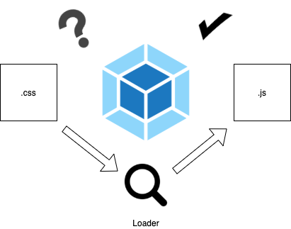
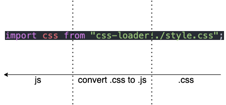

# 載入器(Loaders)與 `module` 設定

> 本文講解 Webpack 中 `module` 屬性的設定方式。

Webpack 本身只能解析 JavaScript 與 JSON 格式的模組，對於其他的模組像是 CSS 、 Image 等都不知道如何解析。為此 Webpack 需要使用 Loaders 載入器幫助解析其他格式的模組。

<!-- `module` 屬性設定 webpack 應該怎麼處理各個不同類型的模組。 -->

## 載入器(Loaders)

Loaders 就像是個翻譯機，將 webpack 不懂的模組翻譯成理解的形式。



接著我們直接用例子示範一遍，會更容易理解。

### 使用 webpack 載入 `.css`

假設現在我們想要載入 `.css` 的樣式檔：

```js
// ./demos/loader-css/src/index.js
import css from "./style.css";

function style(cssString) {
  const element = document.createElement("style");

  element.innerHTML = cssString;

  return element;
}

document.head.appendChild(style(css.toString()));
```

這個程式會將 `style.css` 的內容讀進來，並且填到 `<head>` 標籤中，讓 `style.css` 的設定生效。

直接執行 webpack 會看到錯誤訊息：


由於沒有配置適合的 Loaders ，因而產生錯誤。

接著我們嘗試使用 `css-loader` 載入 `style.css` 。

#### 安裝 Loaders

絕大多數的 Loaders 都不會內建在 webpack 內，需要自行安裝，因此在使用 `css-loader` 前請安裝：

```bash
npm install css-loader -D
```

安裝完成後我們需要在引入 `./style.css` 時，跟 webpack 說要使用 `css-loader`：

```js
// ./demos/loader-css-inline/src/index.js
import css from "css-loader!./style.css";

...
```

再建置一次：


藉由 `!` 串接成為一個 pipe ，你可以把它想像成水管，原本的資料 `style.css` 經由 `css-loader` 已經變為 webpack 看得懂的 `css` 物件。



如此一來我們的應用程式就可以載入 `.css` 了：


