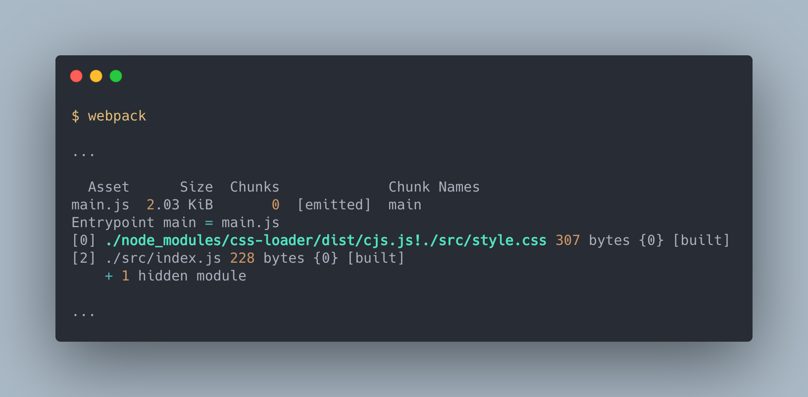

# 載入器(Loaders)與 `module` 設定

> 本文講解 Webpack 中 `module` 屬性的設定方式。

Webpack 本身只能解析 JavaScript 與 JSON 格式的模組，對於其他的模組像是 CSS 、 Image 等都不知道如何解析。為此 Webpack 需要使用 Loaders 載入器幫助解析其他格式的模組。

<!-- `module` 屬性設定 webpack 應該怎麼處理各個不同類型的模組。 -->

## 載入器(Loaders)

Loaders 就像是個翻譯機，將 webpack 不懂的模組翻譯成理解的形式。


接著我們直接用例子示範一遍，會更容易理解。

### 使用 webpack 載入 `.css`

假設現在我們想要載入 `.css` 的樣式檔：

```js
// ./demos/loader-css/src/index.js
import css from "./style.css";

function style(cssString) {
  const element = document.createElement("style");

  element.innerHTML = cssString;

  return element;
}

document.head.appendChild(style(css.toString()));
```

這個程式會將 `style.css` 的內容讀進來，並且填到 `<head>` 標籤中，讓 `style.css` 的設定生效。

直接執行 webpack 會看到錯誤訊息：


由於沒有配置適合的 Loaders ，因而產生錯誤。

接著我們嘗試使用 `css-loader` 載入 `style.css` 。

#### 安裝 Loaders

絕大多數的 Loaders 都不會內建在 webpack 內，需要自行安裝，因此在使用 `css-loader` 前請安裝：

```bash
npm install css-loader -D
```

安裝完成後我們需要在引入 `./style.css` 時，跟 webpack 說要使用 `css-loader`：

```js
// ./demos/loader-css-inline/src/index.js
import css from "css-loader!./style.css";

...
```

再建置一次：



藉由 `!` 串接成為一個 pipe ，你可以把它想像成水管，原本的資料 `style.css` 經由 `css-loader` 已經變為 webpack 看得懂的 `css` 物件。


如此一來我們的應用程式就可以載入 `.css` 了：


#### 使用 `style-loader` 將內容自動插入 DOM

剛剛我們使用了 `css-loader` 成功將 `style.css` 內容載入至 `index.js` ，但是我們還是必須要自己將內容寫進 DOM 裡，如果每次引入 `.css` 時就要做一次插入 DOM 的處理，會變得十分麻煩。而 `style-loader` 可以幫我們將 CSS 的內容自動插入 DOM 中。

首先也需要先安裝 `style-loader`:

```bash
npm install style-loader -D
```

再來我們將 `index.js` 改為下面這樣：

```js
// ./demos/loader-style-inline/src/index.js
import "style-loader!css-loader!./style.css";
```

建置結果如下：


我們的 pipe 上面多了一個 `style-loader` ，資料傳輸的方向從右開始，所以 `style-loader` 會承接 `css-loader` 的結果在做轉換。


#### 從載入 `.css` 的範例中學到

從這個範例中我們學習到了：

- webpack 載入 JS, JSON 外的格式會發生錯誤
- Loaders 會幫助 webpack 看懂 JS, JSON 外其他格式的模組
- 使用 Loaders 解析目標資源的方法是使用 `!` 串接 Loaders 與資源，形成 pipe
- Pipe 的流向是由右向左
- 同個資源(例如上例的 `style.css`)中可以使用多個 Loaders
- 多個 Loaders 執行的順序同 Pipe 的流向由右向左

現在我們對於 Loaders 已經有初步的概念的，接下來會說明配置 Loaders 的幾種方式。

## 配置 Loaders 的方式
