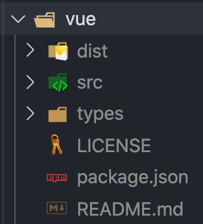

# 解析 Resolve

> 本文講解 webpack 是如何知道引入的模組位置，以及 `resolve` 屬性的意義及設定方式。

> 本文的範例程式放在 [peterhpchen/webpack-quest](https://github.com/peterhpchen/webpack-quest/tree/master/posts/11-resolve/demos) 中，每個程式碼區塊的第一行都會標注檔案的位置，請搭配文章作參考。

在開發 webpack 應用程式時，我們很自然地用**相對路徑**引用專案內的模組(`import hello from './hello.js'`)，對於從 npm 安裝的第三方庫直接用名稱引用(`import _ from 'lodash'`)。你有想過為什麼 webpack 知道要去哪裡抓這些你設定的模組嗎？讓我娓娓道來這段可歌可泣的找尋模組之旅。

## webpack 尋找模組的方式

在 webpack 中可以用三種方式引入模組:

- 絕對路徑
- 相對路徑
- 模組路徑

> webpack 使用 [enhance-resolve](https://github.com/webpack/enhanced-resolve) 解析模組的路徑。

### 絕對路徑

```js
// ./demos/absolute/index.js
import helloPOSIX from "/Users/PeterChen/Documents/code/webpack-quest/posts/11-resolve/demos/absolute/src/hello.js";

import helloWINDOWS from "C:\\Users\\PeterChen\\Documents\\codewebpack-quest\\posts\\11-resolve\\demos\\absolute\\src\\hello.js";
```

絕對路徑不需要經過轉換，直接使用就行了。

### 相對路徑

```js
// ./demos/relative/index.js
import "./utils/sayHi.js";
```

`./` 會將請求資源檔案所在的目錄(`./demos/relative`) 與被請求的資源路徑(`utils/sayHi.js`)結合組成絕對路徑，以此找到對應的模組。

```js
// ./demos/relative/utils/sayHi.js
import name from "../name.js";

console.log(`Hello ${name}`);
```

`../` 會將請求資源檔案所在的目錄上層(`./demos/relative`) 與被請求的資源目錄(`name.js`)結合組成絕對路徑，以此找到對應的模組。

### 模組路徑

使用模組時可以直接使用名稱引入:

```js
// ./demos/module/src/index.js
import _ from "lodash";
```

建置結果如下:


在結果中可以看到 `lodash` 被轉成 `node_modules` 中真正的引用路徑了。這是因為 webpack 藉由 `resolve` 配置的幫助，將模組的實際位置找出，因此我們才可以便利的使用名稱引入不同的模組。

> `--display-modules` 可以輸出被隱藏的模組資訊，通常第三方庫都屬於被隱藏的模組，因此要使用此參數讓它們顯示。


接著介紹 webpack 如何使用 `resolve` 屬性找出目標的模組。

## 使用 `resolve` 找出模組

webpack 發現模組引入的語法(ex: `import`, `require`)時，會使用這個引入的字串值確認是否有在 `resolve.alias` 屬性中設定別名，接著如果是模組路徑的話，找尋 `resolve.modules` 中的目錄，發現目標後，視目標為檔案或是目錄會有不同的處理方式:

- 檔案: 確認是否有附檔名，如果沒有則使用 `resolve.extensions` 屬性所設定的副檔名尋找。
- 目錄: 確認是否有 `package.json` ，如果有則使用 `resolve.mainFileds` 找出目標檔案，如果沒有則使用 `resolve.mainFiles` 找出目標檔案，找到目標檔案後，再依照檔案的方式處理。

整個流程圖如下所示:


接著我們會依序講解各個 `resolve` 屬性的使用方式。

## `resolve.alias`

`alias` 屬性是**設定模組路徑的別名**，讓我們在開發時可以更簡單的指定目標的模組。

### 解決相對路徑設定的麻煩

原本在開發時都會使用相對路徑取得專案中的模組:

```js
// ./demos/resolve-alias/src/pages/index.js
import alpha from "../utils/alpha.js";
```

只要資料夾層數變多，或是重構時改變了資料夾的相對路徑，需要逐一的調整，會十分的麻煩。

使用 webpack 時用 `resolve.alias` 設定路徑別名即可解決此問題:

```js
// ./demos/resolve-alias/webpack.config.js
const path = require('path')

module.exports = {
    resolve: {
        alias: {
            '@': path.resolve(__dirname, 'src'),
            ...
        }
    }
}
```

將 `./src` 設定為 `@` ，如此一來在檔案中就可以直接用 `@` 表示 `./src`:

```js
// ./demos/resolve-alias/src/pages/index.js
import alpha from "@/utils/alpha.js";
```

### 使用第三方庫更加方便

有時引入的第三方庫並沒有依照預設的方式設定檔案結構，造成要明確指定才能使用，以 vue.js 為例:

```js
// ./demos/resolve-alias/src/index.js
import 'vue/dist/vue.esm.js'
...
```

為了使用 vue.js template 的功能，我們需要載入包含 compiler 及 runtime 的完成包，可是 vue.js 預設是載入 runtime only 的版本，因此我們需要明確指定版本(`vue.esm.js`)，這使得在引用時十分麻煩。

這時我們可以使用 `resolve.alias` 簡化引用:

```js
// ./demos/resolve-alias/webpack.config.js
const path = require('path')

module.exports = {
    resolve: {
        alias: {
            ...
            'vue$': 'vue/dist/vue.esm.js'
        }
    }
}
```

`alias` 尾端加上`$` ，表示此別名須完全一致才會生效，以上例來說，如果設定 `import 'vue/wrong'` 這樣就不適用此別名。

## `resolve.modules`

`resolve.modules` 屬性告訴 webpack **該去哪個目錄下找模組**。

由於 `resolve.modules` 的預設值為 `['node_modules']` ，這也是為什麼前面的例子在引入 `lodash` 時， webpack 會知道要從 `node_modules` 底下尋找目標。

我們可以自己調整成自己的目錄:

```js
// ./demos/module/webpack.config.js
const path = require("path");

module.exports = {
  resolve: {
    modules: [path.resolve(__dirname, "src"), "node_modules"],
  },
};
```

建置結果為:


可以看到原本使用 `node_modules` 下的 `lodash` ，現在已經改引用 `./src` 下的 `lodash.js` 。

這例子可以知道下面幾點:

- 設定越前面的會越先尋找，只要找到就停止查找。
- 設定可以為**絕對路徑**或是**相對路徑**

> 相對路徑的設定會與 Node 搜尋的方式相同，找尋路徑的目錄及其上層(`./node_modules`, `../node_modules`...)。

## `resolve.mainFields`

找到模組目錄後， webpack 會需要知道要使用哪個檔案，以 `vue.js` 為例，你在 `node_modules` 看到如下的結構:



雖然找到了 vue.js 的目錄，但這麼多的檔案 webpack 怎麼知道要用哪一個呢？這時就要請出 `resolve.mainFields` 了。

`resolve.mainFields` 會依照 webpack 的 [`target` 屬性](https://v4.webpack.js.org/configuration/target/#target)知道要部署的環境。而 `package.json` 中會設定不同環境所要使用的檔案，我們來看 vue.js 的 `package.json`:

```json
// vue/package.json
{
    ...

  "main": "dist/vue.runtime.common.js",
  "module": "dist/vue.runtime.esm.js",

  ...
}
```

vue.js 設定了兩個入口: `main` 與 `module`:

- `main`: 預設的入口
- `module`: ESM 的入口

在預設的情況下， `target` 是 `web` ，這時 `resolve.mainFields` 是:

```js
module.exports = {
  //...
  resolve: {
    mainFields: ["browser", "module", "main"],
  },
};
```

優先級由前往後遞減，以 vue.js 來說，因為沒有設定 `browser` ，因此使用了第二順位的 `module`，所以 webpack 會將 `import 'vue'` 轉換為 `import './node_modules/vue/dist/vue.runtime.esm.js'` 。

| `target`                   | `resolve.mainFields`            |
| -------------------------- | ------------------------------- |
| `web`(default),`webworker` | `['browser', 'module', 'main']` |
| Others                     | `['module','main']`             |

## `resolve.mainFiles`

當使用者只有指定目錄時， webpack 會依照 `resolve.mainFiles` 設定依序尋找正確的檔案，它的預設值是 `['index']`。

有一個例子目錄結構如下:

```plaintext
root
|- /src
  |- /alpha
    |- index.js
    |- main.js
  |- index.js
```

我們可以這樣引入 `./utils/index.js`:

```js
// ./demos/mainfiles/src/index.js
import "./utils/alpha";
```

執行結果如下:


省略的 `index.js` 會因為 `resolve.mainFiles` 所設定的 `['index']` 而被視為目標檔案，從而取得模組資源。

我們也可以設定 `main` 作為優先尋找的檔案:

```js
// ./demos/mainfiles/webpack.config.js
module.exports = {
  resolve: {
    mainFiles: ["main", "index"],
  },
};
```

這樣就會找到 `main.js` 。

## `resolve.extensions`

`resolve.extensions` 是處理省略副檔名的檔案，它的預設值是 `['.wasm', '.mjs', '.js', '.json']` 。

```js
// ./demos/extensions/src/index.js
import "./utils/alpha/index";
```

與 `mainFiles` 一樣的功能，但 `extensions` 是負責副檔名，而 `mainFiles` 是負責檔名。

## 總結

webpack 的模組路徑有三種類型: 絕對路徑、相對路徑與模組路徑。

路徑的解析仰賴 `resolve` 屬性的設定。當遇到不同路徑時， `resolve` 會依照對應的配置解析，最終得以找到模組，讓使用者引入正確的資源。

## 參考資料

- [Webpack Documentation: Concepts - Module Resolution](https://webpack.js.org/concepts/module-resolution/)
- [Webpack Documentation: Configuration - Resolve](https://v4.webpack.js.org/configuration/resolve/)
- [main vs browser vs jsnext:main vs module](https://juejin.im/entry/6844903459515269134)
- [Webpack Documentation: Concepts - Targets](https://v4.webpack.js.org/concepts/targets/)
- [Webpack Documentation: Configuration - Targets](https://v4.webpack.js.org/configuration/target/)
