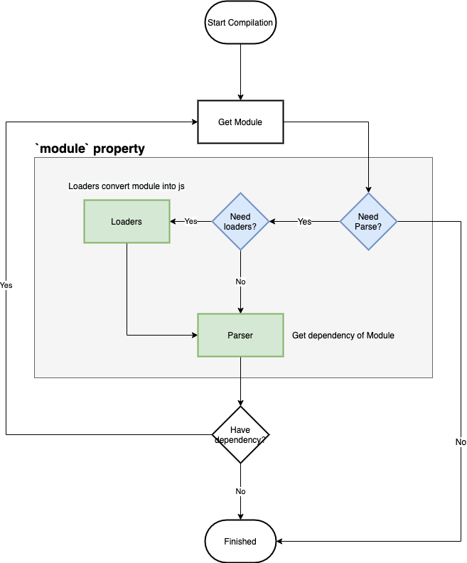
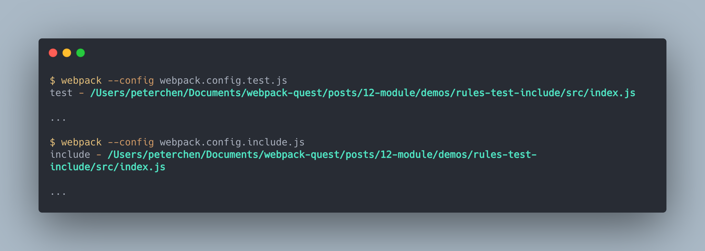
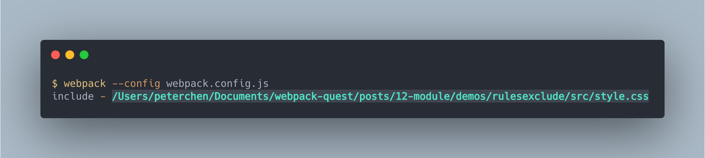
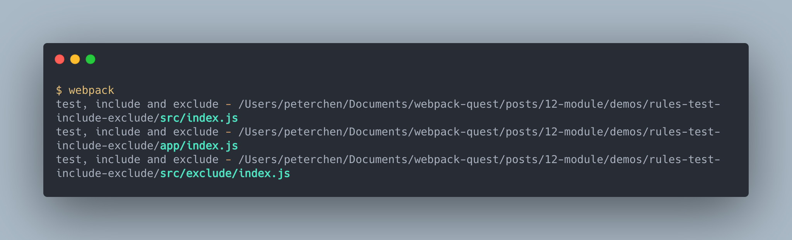

# 模組 Module

> 本文講解 Webpack 中 `module` 屬性的設定方式。

`module` 屬性告訴 webpack 應該如何處理各個模組。

## 模組的解析

webpack 從 `entry` 開始依序掃描各個模組，在掃描的過程中會用 Loaders 處理非 JS, JSON 的模組，轉為 JS 檔案後交給 Parser 解析，解析時如果有相依模組，則重複掃描步驟。



圖中提到了兩個 `module` 屬性(藍色粗體)， `rules` 及 `noParse`：

- `rules`:  設定模組要使用何種的 Loaders 及要啟用或停用哪些解析器(ex: AMD, CJS or ES2015)。
- `noParse`: 哪些模組不做解析的動作。

接下來會依序介紹 `rules` 及 `noParse` 的使用方式。

## 設定一個 `rules`

設定模組的規則時，有兩個點要考慮：

- **哪些模組要使用**: 設定此規則好包含哪些模組
- **要做哪些處理**: 這些模組要做什麼處理

記住這兩點後，來看下面這個例子：

```js
// ./demos/css-module/webpack.config.demo.js
module.exports = {
  module: {
    rules: [
      {
        test: /\.css$/,
        use: [
          "style-loader",
          { loader: "css-loader", options: { modules: true } },
        ],
      },
    ],
  },
};
```

我們將配置中的 `test` 及 `use` 依照上面的兩類做區分：

- **哪些模組要使用**: `test` 判斷哪些模組適用此規則。
- **要做哪些處理**: `use` 設定這些模組要用哪些 Loaders 做處理。

我們將這兩類分別取名為**判斷類**及**使用類**，接下來依序講解這兩類的用法。

## 判斷類

判斷類的屬性有： `test`, `include`, `exclude`...等，雖然有些設定的功能不同，但是條件設定方式都是一樣的，如下所示：

- RegExp: 如果正規表達式判斷為真則條件成立
- 字串值: 如果是以此字串值開頭的路徑則條件成立
- 函式: 叫用函式帶有**目前路徑(path)**的參數，如果此函式回傳為真則條件成立
- 陣列: 每個元素都一個匹配方式(RegExp, 字串值及函式)，只要其中一個為真，此條件成立

> 雖然每個屬性都可以使用上面所有的設定方式，但是依照不同的屬性的定義，開發者在慣例上會頃向特定的設定方式，下面介紹時會做說明。

上述的條件設定會在下面說明各個判斷屬性時以實例做說明。

> 為方便解說，下面的例子會使用自己寫的 Loader log 出使用的條件及輸入的路徑。

### `test` 與 `include`

`test` 與 `include` 屬性的功能都是只要條件為真，此規則就會匹配。

```js
// ./demos/rules-test-include/webpack.test.js
const path = require("path");

module.exports = {
  module: {
    rules: [
      {
        test: /\.js$/,
        use: [
          {
            loader: path.resolve(__dirname, "loader"),
            options: { rule: "test" },
          },
        ],
      },
    ],
  },
};

// ./demos/rules-test-include/webpack.include.js
const path = require("path");

module.exports = {
  module: {
    rules: [
      {
        include: /\.js$/,
        use: [
          {
            loader: path.resolve(__dirname, "loader"),
            options: { rule: "include" },
          },
        ],
      },
    ],
  },
};
```

執行結果如下：



這裡使用 RegExp 的方式判斷結尾為 `.js` 的條件是否成立，因此 `/{absolute-path}/index.js` 屬於此規則觸發了 Loader 的執行。

### `exclude`

`exclude` 屬性只要條件為真，此規則就會排除。

```js
// ./demos/rules-exclude/webpack.config.js
const path = require("path");

module.exports = {
  module: {
    rules: [
      {
        exclude: /\.js$/,
        ...
      }
    ],
  },
};
```

執行結果如下：



由於排除了 `.js` 的檔案，因此只有 `/{absolute-path}/style.css` 觸發 Loaders 的執行。

### 多種條件的配合

每個 `rule` 中能使用複數種的條件判斷，當多種條件存在時，檔案的路徑與檔名要**符合全部的條件**才歸為此規則。

以下面的例子來說：

```plaintext
root
|- src
  |- index.js
  |- exclude
    |- index.js
|- app
  |- index.js
  |- exclude
    |- index.js
|- other
  |- index.js
  |- exclude
    |- index.js
```

配置了下面的設定：

```js
// ./demos/rules-test-include-exclude
const path = require("path");

module.exports = {
  entry: {
    main: "./src/index.js",
    app: "./app/index.js",
    other: "./other/index.js",
  },
  module: {
    rules: [
      {
        test: /\.js$/,
        include: [path.resolve(__dirname, "src"), (path) => path.match(/app/)],
        exclude: path.resolve(__dirname, "app", "exclude"),
        use: [
          {
            loader: path.resolve(__dirname, "loader"),
            options: { rule: "test, include and exclude" },
          },
        ],
      },
    ],
  },
};
```

總共設置三種條件：

- `test`: 要是 `.js` 檔
- `include`: 要在 `src` 目錄中 **或** 目錄中有符合 `app` 字串的檔案
- `exclude`: 排除在 `app/exclude` 目錄下的檔案

建置結果為：



只有 `./src/index.js`, `./src/excluded/index.js` 與 `./app/index.js` 觸發了 Loader 。

### 判斷目標

判斷類的屬性是設定此規則是用哪些模組，它的判斷依據有兩類：

- 資源本身(resource)：**被請求的**模組的絕對路徑
- 資源使用者(issuer)：**請求模組的**模組的絕對路徑

以上節的例子來說，在 `./src/index.js` 中使用 `import excludeStr from './exclude/index.js'` 引入 `./exclude/index.js`：

- `resource` 為 `/absolute-path/src/exclue/index.js`
- `issuer` 為 `/absolute-path/src/index.js`

依照判斷依據的不同，分別使用 `resource` 與 `issuer` 設定兩個不同類別。

前面章節所提到的 `test`, `include` 及 `exclude` 其實分別是 `resource.test`, `resource.include` 及 `resource.exclude` 的縮寫，因此我們可以將上面的例子改為：

```js
const path = require("path");

module.exports = {
  entry: {
    main: "./src/index.js",
    app: "./app/index.js",
    other: "./other/index.js",
  },
  module: {
    rules: [
      {
        resource: {
          test: /\.js$/,
          include: [
            path.resolve(__dirname, "src"),
            (path) => path.match(/app/),
          ],
          exclude: path.resolve(__dirname, "app", "exclude"),
        },
        use: [
          {
            loader: path.resolve(__dirname, "loader"),
            options: { rule: "test, include and exclude" },
          },
        ],
      },
    ],
  },
};
```

這樣的執行結果跟之前是完全相同的，由此可知，我們之前都是配置 `resource` ，這也是大部分配置習慣使用的方式，因此 webpack 才加上這些簡寫以利使用者使用。

而 `issuer` 並沒有縮寫的用法，因此請直接使用 `issuer.test`, `issuer.include` 與 `issuer.exclude` 設定。

## `and`, `or` 與 `not`

除了上述的三個判斷(`test`, `include`, `exclude`)外，另外還有 `and`, `or` 與 `not` 三個沒有縮寫的判斷，它們的說明如下：

- `and`: 包含匹配所有規則的模組，須在 `resource`, `issuer` 中使用。
- `or`: 包含匹配任意規則的模組，須在 `resource`, `issuer` 中使用。
- `not`: 排除匹配任一規則的模組，須在 `resource`, `issuer` 屬性中使用。

## 參考資料

- [Webpack Docuementation: Configuration - Module](https://v4.webpack.js.org/configuration/module/)
