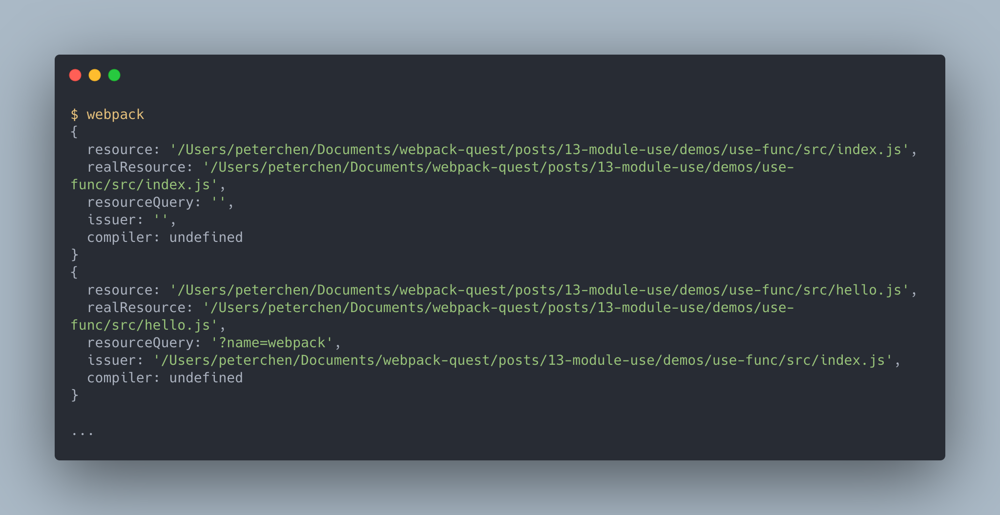
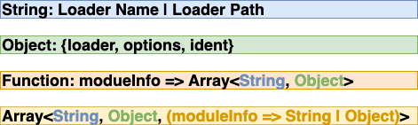
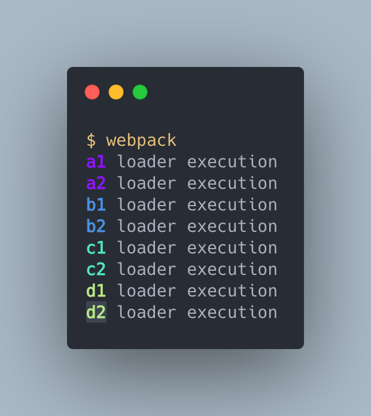
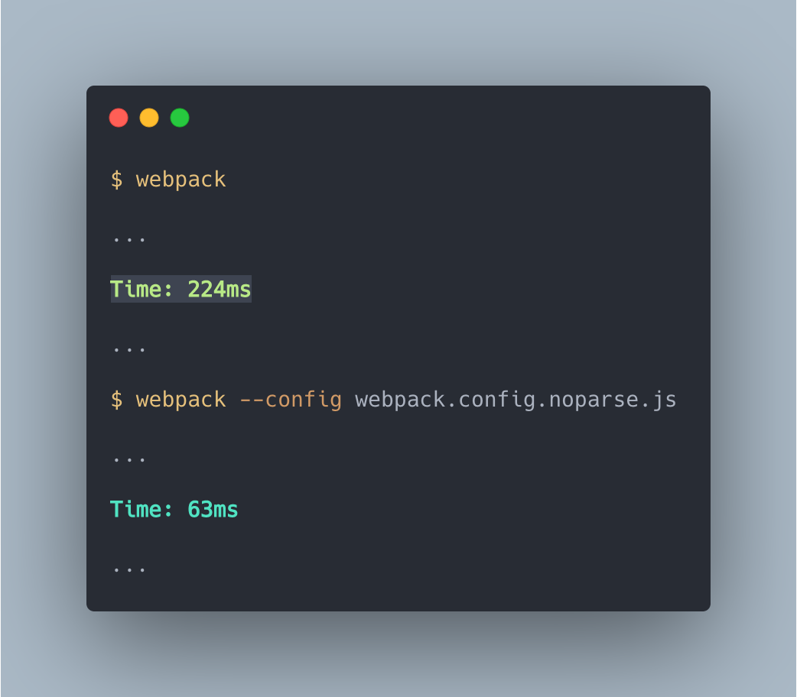

## 模組 Module 的處理

> 本文為 `module` 屬性的設定方式解說的第二篇，講解 `module` 屬性如何設定處理程序。

> 本文的範例程式放在 [peterhpchen/webpack-quest](https://github.com/peterhpchen/webpack-quest/tree/master/posts/13-module-process/demos) 中，每個程式碼區塊的第一行都會標注檔案的位置，請搭配文章作參考。

前一篇說明了 `module` 如何匹配各個規則，本文接著講解如何處理被匹配的模組。

## 模組的處理


在決定要使用的規則後，接著就是要設定如何處理這個模組，就是圖中紅色的 `Loaders` 與 `Parser` 兩個部分。

被匹配的模組在 webpack 中被稱為 [Rule results](https://webpack.js.org/configuration/module/#rule-results)，Rule results 可以有兩種配置：

- 要使用的 Loaders ：設定 Loaders 的陣列，依序處理資源。
- Parser 的設定：設定要處理此模組的 Parser 。

接下來會從如何設定 Loaders 說起，之後再說明 Parser 的設定。

## 使用 Loaders

Loaders 的設定可以使用 `loader`, `options` 與 `use` 三種屬性做設定。

`loader` 與 `options` 都是屬於縮寫，因此我們從擁有完整功能的 `use` 開始講起吧。

### `use`

`use` 可以使用字串值及物件設定單一 Loader 或是使用陣列與函式配置多組 Loaders 設定：

- 字串值： `String`
- 物件： `RuleSetUseItem`
- 函式： `(info: ModuleInfo) => Array<String | RuleSetUseItem>`
- 陣列： `Array<String | RuleSetUseItem | ((info: ModuleInfo) => String | RuleSetUseItem)>`

> `use` 詳細定義在 [WebpackOptions.d.ts](https://github.com/webpack/webpack/blob/master/declarations/WebpackOptions.d.ts#L296) 中可以找到。

#### 使用字串值設定 `use`

字串值可以直接設定 Loader 的**名稱**或是**路徑**， webpack 會依照 [`context`](../09-entry/README.md#context) 與 [`resolveLoader`]() 屬性找出對應的 Loader 。

```js
// ./demos/use-string/webpack.config.js
const path = require("path");

module.exports = {
  module: {
    rules: [
      {
        test: /\.png$/,
        use: "file-loader",
      },
      {
        test: /\.js$/,
        use: path.resolve(__dirname, "loader"),
      },
    ],
  },
};
```

- 第一個 `rule` 給予 `file-loader` 這個 Loader 的名稱
- 第二個 `rule` 給予 `path.resolve(__dirname, 'loader')` 這個 Loader 的路徑

通常從 `npm` 抓下來的 Loader 會直接使用名稱做設定，而自己開發的 Loader 會使用路徑來配置。

#### 使用物件設定 `use`

物件會是一個 `RuleSetUseItem` ，它設定 Loader 的使用，它有三個屬性：

- `loader`: 設定使用哪一個 Loader ，使用上節所提到的字串值設定。
- `options`: Loader 的選項，每個 Loader 會提供不同的設定選項供使用者選用。
- `ident`: Loader 選項的 ID 。

下面有個例子：

```js
// ./demos/use-obj/webpack.config.js
const path = require("path");

module.exports = {
  module: {
    rules: [
      {
        test: /\.js$/,
        use: {
          loader: path.resolve(__dirname, "loader"),
          options: {
            name: "a",
          },
        },
      },
    ],
  },
};
```

- `loader`: 使用自製的 Loader ，輸入 Loader 的路徑。
- `options`: 設定 `name` 的選項，使 Loader 可以在內部使用。

下面是自製 Loader 的代碼：

```js
// ./demos/use-obj/loader/index.js
const { getOptions } = require("loader-utils");

module.exports = function (source) {
  console.log(`${getOptions(this).name} loader execution`);
  return source;
};
```

我們可以看到設定進去的 `options.name` 被 Loader 所使用。

執行結果如下：


可以看到我們設定的 `options.name` `a` 顯示於 Console 上。

##### `ident` 屬性

webpack 會用全部的 Loaders 包括 `options` 與資源模組建立一組唯一的 ID ， 在轉換時會用 `JSON.stringify` 處理 Loader 的 `options` ，但有時因為錯誤而轉換失敗(例如: [circular JSON](https://developer.mozilla.org/en-US/docs/Web/JavaScript/Reference/Errors/Cyclic_object_value))。

為了解決轉換失敗的問題， webpack 提供了 `ident` 屬性，讓使用者自己定義 `options` 的 ID ，如此一來就可以避免轉換錯誤了。

#### 使用函式設定 `use`

函式的設定要**回傳一個 RuleSetUseItem 的陣列**。它帶有一個模組資訊的參數，這個參數有下面幾個屬性：

- `issuer`: 請求模組的絕對路徑
- `realResource`: 被請求模組的絕對路徑
- `resource`: 被請求模組的絕對路徑，其值會受覆蓋資源名稱的處理而與 `realResource` 不同
- `resourceQuery`: 被請求模組的參數
- `compiler`: 編譯器，可以是 `undefined`

```js
// ./demos/use-func/webpack.config.js
const path = require("path");

module.exports = {
  module: {
    rules: [
      {
        test: /\.js$/,
        use: (info) => console.log(info) || [path.resolve(__dirname, "loader")],
      },
    ],
  },
};
```

```js
// ./demos/use-func/src/index.js
import hello from "./hello.js?name=webpack";

console.log(hello);
```

```js
// ./demos/use-func/src/hello.js
export default "Hello";
```

執行建置結果如下：



由於 `index.js` 與 `hello.js` 都匹配，因此會有兩個 `moduleInfo` 物件被 log ，可以看到各個模組的資訊。

#### 使用陣列設定 `use`

陣列的元素可以是**字串值**、 **RuleSetUseItem** 或是**一個回傳 字串值或是 RuleSetUseItem 的函式**。

以例子說明：

```js
// ./demos/use-array/webpack.config.js
module.exports = {
  module: {
    rules: [
      {
        test: /\.scss$/,
        use: [
          "style-loader", // String
          {
            loader: "css-loader",
          }, // Object
          (info) => console.log(info) || "sass-loader", // Function
        ],
      },
    ],
  },
};
```

這是一個將 `.scss` 檔載入的例子，其中 `style-loader` 使用**字串值**， `css-loader` 使用 **RuleSetUseItem 物件**，而 `sass-loader` 使用函式載入。

使用陣列的 `use` 時， Loaders 的執行順序是由後往前，因此依序執行 `sass-loader`, `css-loader` 再到最後的 `style-loader` 。

陣列的設定與同樣的條件設定多個規則相等，因此上面的配置與下面的有相同的作用：

```js
// ./demos/use-array/webpack.config.multiple-rules.js
module.exports = {
  module: {
    rules: [
      {
        test: /\.scss$/,
        use: "style-loader",
      },
      {
        test: /\.scss$/,
        use: {
          loader: "css-loader",
        },
      },
      {
        test: /\.scss$/,
        use: (info) => console.log(info) || "sass-loader",
      },
    ],
  },
};
```

#### `use` 小結

`use` 配置雖然看起來複雜，但其實每個設定方式都很相似，卻帶給使用者在配置上的靈活性，總結 `use` 的配置如下：



 由圖中顏色的對應可以理解到，其實函式與陣列的設定都是運用前面的字串值、物件與函式的變體而已，這樣就會比較好理解。

### `loader` 與 `options`

`loader` 與 `options` 都是 `use` 的縮寫

- `loader` = `use: [{loader}]`
- `options` = `use: [{options}]`

因此下面使用 `use` 的完整配置：

```js
// ./demos/use-string/webpack.config.js
{
  test: /\.js$/,
  use: [{
    loader: path.resolve(__dirname, "loader"),
    options: {
      name: 'a'
    }
  }],
}
```

會與下面 `loader` 與 `options` 的縮寫配置相同：

```js
// ./demos/use-string/webpack.config.js
{
  test: /\.js$/,
  loader: path.resolve(__dirname, "loader"),
  options: {
    name: 'a'
  }
}
```

到這裡，我們已經了解如何使用 Loader 了，接著會說明如何設定 Loader 的執行順序。

## Loaders 的順序

在[模組 Module 的規則判定](../12-module/README.md)一文中有提到規則執行的順序是由後往前的，但其實執行順序是可以被 `enforce` 屬性更改，或是使用 Inline 的前置符排除特定的 Loaders 執行。

### Loaders 的類型

Loaders 依照類型可以分為 `pre`, `normal`, `inline` 及 `post`:

- `pre`: `enforce` 屬性為 `pre` 時
- `post`: `enforce` 屬性為 `post` 時
- `normal`: 預設值
- `inline`: Inline 設定的 Loaders

`enforce` 可以將 Loaders 的執行順序改變為先執行 `pre` 或是後執行 `post` ，全部的執行順序如下：

```plaintext
pre > normal > inline > post
```

請看下面的例子：

```js
// ./demos/loader-order/webpack.config.js
const path = require("path");

module.exports = {
  module: {
    rules: [
      {
        test: /\.js$/,
        exclude: path.resolve(__dirname, "src", "index.js"),
        rules: [
          {
            enforce: "pre",
            loader: path.resolve(__dirname, "loader"),
            options: {
              name: "a2",
            },
          },
          {
            enforce: "pre",
            loader: path.resolve(__dirname, "loader"),
            options: {
              name: "a1",
            },
          },
          {
            loader: path.resolve(__dirname, "loader"),
            options: {
              name: "b2",
            },
          },
          {
            loader: path.resolve(__dirname, "loader"),
            options: {
              name: "b1",
            },
          },
          {
            enforce: "post",
            loader: path.resolve(__dirname, "loader"),
            options: {
              name: "d2",
            },
          },
          {
            enforce: "post",
            loader: path.resolve(__dirname, "loader"),
            options: {
              name: "d1",
            },
          },
        ],
      },
    ],
  },
};
```

配置檔設定：

- `a2`, `a1` 的 `pre` loader
- `b2`, `b1` 的 `normal` loader
- `d2`, `d1` 的 `post` loader

此例子有設定 Inline 的 Loaders:

```js
// ./demos/loader-order/src/index.js
import "../loader/index.js?name=c2!../loader/index.js?name=c1!./hello.js";
```

`c2` 及 `c1` 的 `inline` loader

執行結果為：



按照 `pre`, `normal`, `inline`, `post` 的順序執行，並且在相同類型的情況下，會保持由後往前執行的機制。

### Disable Loaders

Loaders 的執行可以被 inline 的特定的前置符所取消：

- `!`: 取消 `normal` Loaders 的執行
- `-!`: 取消 `pre`, `normal` Loaders 的執行
- `!!`: 取消 `pre`, `normal`, `post` Loaders 的執行

可以將剛剛的例子加上各個前置符看看輸出來比對結果：

```js
import "../loader/index.js?name=c2!../loader/index.js?name=c1!./hello.js"; // a1 a2 b1 b2 c1 c2 d1 d2
// import '!../loader/index.js?name=c2!../loader/index.js?name=c1!./hello.js' // a1 a2 c1 c2 d1 d2
// import '-!../loader/index.js?name=c2!../loader/index.js?name=c1!./hello.js' // c1 c2 d1 d2
// import '!!../loader/index.js?name=c2!../loader/index.js?name=c1!./hello.js' // c1 c2
```

## Parser 的設定

Parser 是 webpack 用來解析模組的解析器，藉由解析器， webpack 可以了解模組的語意，並且知道是否還有相依的模組，以便 webpack 繼續往相依的模組解析。

預設 webpack 會將所有的模組以及不同模組化（CJS, AMD, ESM）的模組都納入解析的範圍，但有時某些模組或是模組化的庫是我們不想要解析的，這時就要藉由 `noParse` 與 `parser` 的幫助來設置這些設定。

### 使用 `noParse` 避免解析特定模組

通常第三方的庫（Lodash, JQuery）是沒有 `require`, `define`, `import` 等任何引入語法的，因此並不會有相依，也就不需要被 webpack 解析，這時可以設定 `noParse` 來減少建置的時間。

```js
// ./demos/no-parse/webpack.config.js
module.exports = {
  module: {
    noParse: /lodash/,
  },
};
```

我們將預設的建置與加入 `noParse` 的建置時間比對：



第一個指令執行預設的建置，第二個指令執行 `noParse` 設定的建置，可以看到第二個指令較第一個快。

`noParse` 可以用 `RegExp` `[RegExp]` `function(resource)` `string` `[string]`，做設定，使用函式時會傳入 `resource` 的絕對路徑而 `string` 的設定方式需要傳入絕對路徑。

### `parser`

`parser` 屬性可以設定哪些模組話語意要做解析：

```js
module.exports = {
  //...
  module: {
    rules: [
      {
        //...
        parser: {
          amd: false, // disable AMD
          commonjs: false, // disable CommonJS
          system: false, // disable SystemJS
          harmony: false, // disable ES2015 Harmony import/export
          requireInclude: false, // disable require.include
          requireEnsure: false, // disable require.ensure
          requireContext: false, // disable require.context
          browserify: false, // disable special handling of Browserify bundles
          requireJs: false, // disable requirejs.*
          node: false, // disable dirname, filename, module, require.extensions, require.main, etc.
          node: {...} // reconfigure node layer on module level
        }
      }
    ]
  }
}
```

一般都是使用 `true`, `false` 來決定要不要使用特定的語意，但也有像是 [`node` 這種用物件設定](https://webpack.js.org/configuration/node/)的模組語意。

下面這個例子可以清楚地看到 `parser` 的用途：

```js
// ./demos/parser/webpack.config.parser.js
module.exports = {
  mode: "development",
  output: {
    filename: "bundle.js",
  },
  module: {
    rules: [
      {
        test: /\.js/,
        parser: {
          harmony: false,
        },
      },
    ],
  },
};
```

例子中我們將 `harmony` 給設為 `false` ，表示不要解析 ESM 的模組

執行結果如下：

```js
// ./demos/parser/dist/bundle.js
...

eval("import hello from './hello.js'\n\nconsole.log(hello)\n\n//# sourceURL=webpack:///./src/index.js?");

...
```

原本應該被 webpack 轉換的 `index.js` 由於沒有被解析，所以還是原始的代碼。

> 可以使用範例 `parser` 對比解析前後的代碼，看看差別在哪裡。

## 總結

`module` 屬性的配置就介紹到這裡，本文專注講解執行 Loaders 與 Parser 的設定。

Loaders 可以使用 `use` 配置， webpack 提供多樣化的設定方式，讓使用者有很大的彈性做配置，而 `enforce` 可以改變 Loaders 的執行順序，使得配置更加精確。

Parser 可以設定那個模組不要解析以及哪個模組語意不要解析，提高建置的速度。

## 參考資料

- [Webpack Documentation: Configuration - Module](https://v4.webpack.js.org/configuration/module/)
- [Webpack Documentation: Loaders - sass-loader](https://webpack.js.org/loaders/sass-loader/)
- [SURVIVEJS — WEBPACK: Loader Definitions](https://survivejs.com/webpack/loading/loader-definitions/)
- [Webpack Documentation: Concepts - Loaders](https://v4.webpack.js.org/concepts/loaders/)
