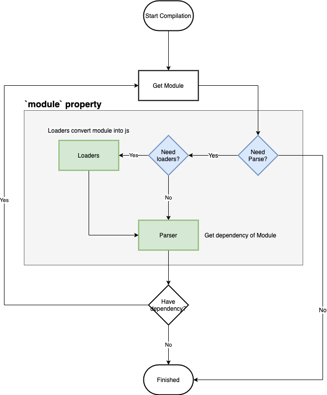
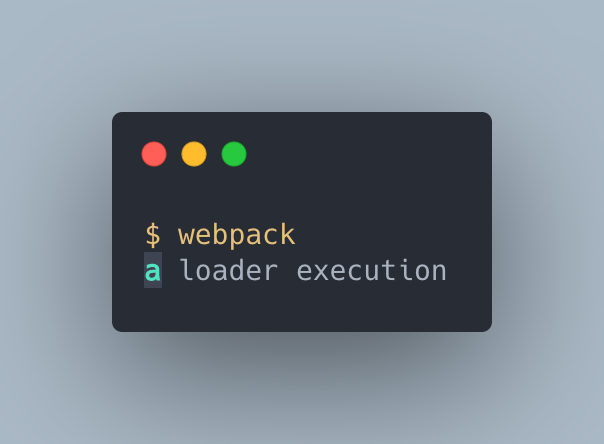

## 模組 Module 的處理

> 本文為 `module` 屬性的設定方式解說的第二篇，講解 `module` 屬性如何設定處理程序。

> 本文的範例程式放在 [peterhpchen/webpack-quest](https://github.com/peterhpchen/webpack-quest/tree/master/posts/13-module-process/demos) 中，每個程式碼區塊的第一行都會標注檔案的位置，請搭配文章作參考。

前一篇說明了 `module` 如何匹配各個規則，本文接著講解如何處理被匹配的模組。

## 模組的處理



在決定要使用的規則後，接著就是要設定如何處理這個模組，就是圖中紅色的 `Loaders` 與 `Parser` 兩個部分。

被匹配的模組在 webpack 中被稱為 [Rule results](https://webpack.js.org/configuration/module/#rule-results)，Rule results 可以有兩種配置：

- 要使用的 Loaders ：設定 Loaders 的陣列，依序處理資源。
- Parser 的設定：設定要處理此模組的 Parser 。

接下來會從如何設定 Loaders 說起，之後再說明 Parser 的設定。

## 使用 Loaders

Loaders 的設定可以使用 `loader`, `options` 與 `use` 三種屬性做設定。

`loader` 與 `options` 都是屬於縮寫，因此我們從擁有完整功能的 `use` 開始講起吧。

### `use`

`use` 可以使用字串值及物件設定單一 Loader 或是使用陣列與函式配置多組 Loaders 設定：

- 字串值： `String`
- 物件： `RuleSetUseItem`
- 陣列： `Array<String | RuleSetUseItem | (info: ModuleInfo) => RuleSetUseItem>`
- 函式： `(info: ModuleInfo) => Array<String | RuleSetUseItem>`

> `use` 詳細定義在 [WebpackOptions.d.ts](https://github.com/webpack/webpack/blob/master/declarations/WebpackOptions.d.ts#L296) 中可以找到。

#### 使用字串值設定 `use`

字串值可以直接設定 Loader 的**名稱**或是**路徑**， webpack 會依照 [`context`](../09-entry/README.md#context) 與 [`resolveLoader`]() 屬性找出對應的 Loader 。

```js
// ./demos/use-string/webpack.config.js
const path = require("path");

module.exports = {
  module: {
    rules: [
      {
        test: /\.png$/,
        use: "file-loader",
      },
      {
        test: /\.js$/,
        use: path.resolve(__dirname, "loader"),
      },
    ],
  },
};
```

- 第一個 `rule` 給予 `file-loader` 這個 Loader 的名稱
- 第二個 `rule` 給予 `path.resolve(__dirname, 'loader')` 這個 Loader 的路徑

通常從 `npm` 抓下來的 Loader 會直接使用名稱做設定，而自己開發的 Loader 會使用路徑來配置。

#### 使用物件設定 `use`

物件會是一個 RuleSetUseItem ，它設定 Loader 的使用，它有三個屬性：

- `loader`: 設定使用哪一個 Loader ，使用上節所提到的字串值設定。
- `options`: Loader 的選項，每個 Loader 會提供不同的設定選項供使用者選用。
- `ident`: Loader 選項的 ID 。

下面有個例子：

```js
// ./demos/use-obj/webpack.config.js
const path = require("path");

module.exports = {
  module: {
    rules: [
      {
        test: /\.js$/,
        use: {
          loader: path.resolve(__dirname, "loader"),
          options: {
            name: "a",
          },
        },
      },
    ],
  },
};
```

- `loader`: 使用自製的 Loader ，輸入 Loader 的路徑。
- `options`: 設定 `name` 的選項，使 Loader 可以在內部使用。

下面是自製 Loader 的代碼：

```js
// ./demos/use-obj/loader/index.js
const { getOptions } = require("loader-utils");

module.exports = function (source) {
  console.log(`${getOptions(this).name} loader execution`);
  return source;
};
```

我們可以看到設定進去的 `options.name` 被 Loader 所使用。

執行結果如下：



可以看到我們設定的 `options.name` `a` 顯示於 Console 上。

##### `ident` 屬性

webpack 會用全部的 Loaders 包括 `options` 與資源模組建立一組唯一的 ID ， 在轉換時會用 `JSON.stringify` 處理 Loader 的 `options` ，但有時因為錯誤而轉換失敗(例如: [circular JSON](https://developer.mozilla.org/en-US/docs/Web/JavaScript/Reference/Errors/Cyclic_object_value))。

為了解決轉換失敗的問題， webpack 提供了 `ident` 屬性，讓使用者自己定義 `options` 的 ID ，如此一來就可以避免轉換錯誤了。

#### 使用陣列設定 `use`

陣列的元素可以是**字串值**、 **LoaderOptions** 或是**一個回傳 LoaderOptions 的函式**。

以例子說明：

#### 使用函式設定 `use`

函式的設定要**回傳一個 LoaderOptions 的陣列**。

## 參考資料

- [Webpack Documentation: Configuration - Module](https://v4.webpack.js.org/configuration/module/)
- [Webpack Documentation: Loaders - sass-loader](https://webpack.js.org/loaders/sass-loader/)
