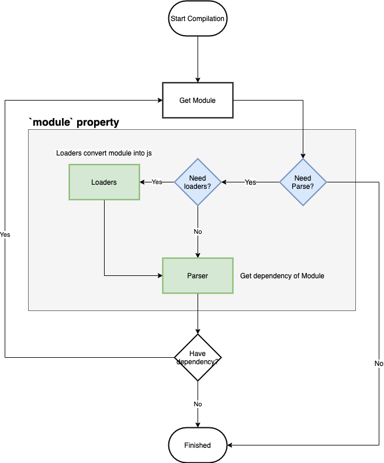
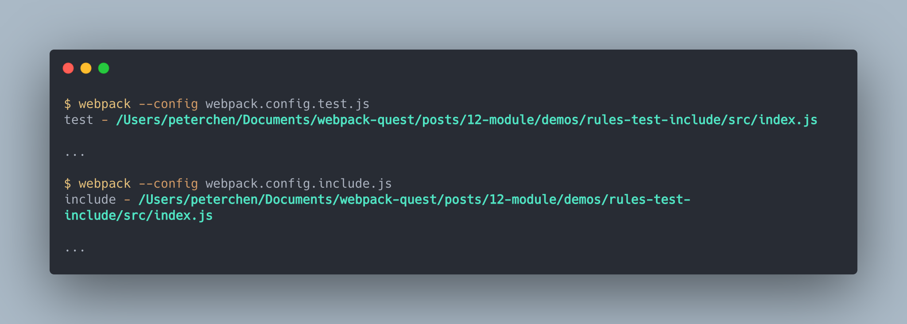
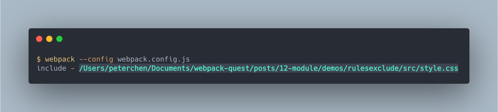
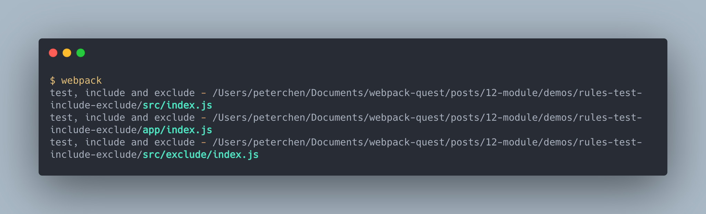
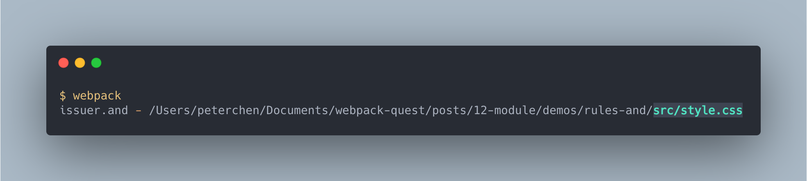
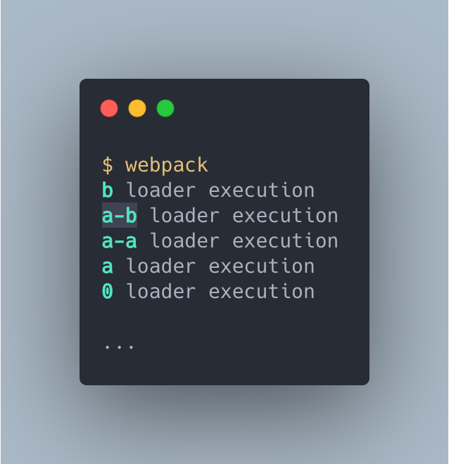
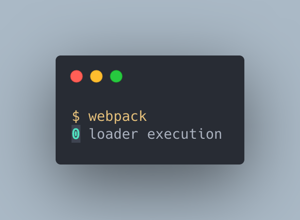
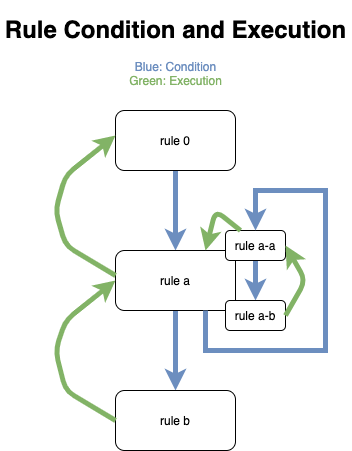

# 模組 Module 的規則判定

> 本文為 `module` 屬性的設定方式解說的第一篇，講解 `module` 屬性中的規則如何匹配。

> 本文的範例程式放在 [peterhpchen/webpack-quest](https://github.com/peterhpchen/webpack-quest/tree/master/posts/13-module/demos) 中，每個程式碼區塊的第一行都會標注檔案的位置，請搭配文章作參考。

`module` 屬性告訴 webpack 應該如何處理各個模組。

## 模組的解析

webpack 從 `entry` 開始依序掃描各個模組，在掃描的過程中會用 Loaders 處理非 JS, JSON 的模組，轉為 JS 檔案後交給 Parser 解析，解析時如果有相依模組，則重複掃描步驟。



本文會講解如何配置 webpack 使特定模組適用指定規則，就是圖中藍色的 `Need Loaders?` 與 `Need Parse?` 這兩個部分。

## 設定一個 `rules`

設定模組的規則時，有兩個點要考慮：

- **哪些模組要使用**: 設定此規則好包含哪些模組
- **要做哪些處理**: 這些模組要做什麼處理

記住這兩點後，來看下面這個例子：

```js
// ./demos/css-module/webpack.config.demo.js
module.exports = {
  module: {
    rules: [
      {
        test: /\.css$/,
        use: [
          "style-loader",
          { loader: "css-loader", options: { modules: true } },
        ],
      },
    ],
  },
};
```

我們將配置中的 `test` 及 `use` 依照上面的兩類做區分：

- **哪些模組要使用**: `test` 判斷哪些模組適用此規則。
- **要做哪些處理**: `use` 設定這些模組要用哪些 Loaders 做處理。

我們將這兩類分別取名為**判斷類**及**使用類**，接下來本文會先講解判斷類的用法，下一篇講解使用類的用法。

## 判斷類

判斷類的屬性有： `test`, `include`, `exclude`...等，雖然有些設定的功能不同，但是條件設定方式都是一樣的，如下所示：

- RegExp: 如果正規表達式判斷為真則條件成立
- 字串值: 如果是以此字串值開頭的路徑則條件成立
- 函式: 叫用函式帶有**目前路徑(`path`)**的參數(`resourceQuery` 是帶 `query`)，如果此函式回傳為真則條件成立
- 陣列: 每個元素都一個匹配方式(RegExp, 字串值及函式)，只要其中一個為真，此條件成立

雖然每個屬性都可以使用上面所有的設定方式，但是依照不同的屬性的定義，開發者在慣例上會頃向特定的設定方式，下面介紹時會做說明。

上述的條件設定會在下面說明各個屬性時以實例做說明。

> 為方便解說，下面的例子會使用自己寫的 Loader 輸出特定的資訊，你可以在每個範例目錄下的 `loader` 資料夾中找到使用的 Loader。

## `test` 與 `include`

`test` 與 `include` 屬性的功能都是只要**條件為真，此規則就會匹配**。

```js
// ./demos/rules-test-include/webpack.test.js
...
module.exports = {
  module: {
    rules: [
      {
        test: /\.js$/,
        ...
      },
    ],
  },
};

// ./demos/rules-test-include/webpack.include.js
...
module.exports = {
  module: {
    rules: [
      {
        include: /\.js$/,
        ...
      },
    ],
  },
};
```

執行結果如下：



這裡使用 RegExp 的方式判斷結尾為 `.js` 的條件是否成立，因此 `/{absolute-path}/index.js` 屬於此規則觸發了 Loader 的執行。

## `exclude`

`exclude` 屬性只要**條件為真，此規則就會排除**。

```js
// ./demos/rules-exclude/webpack.config.js
...
module.exports = {
  module: {
    rules: [
      {
        exclude: /\.js$/,
        ...
      }
    ],
  },
};
```

執行結果如下：



由於排除了 `.js` 的檔案，因此只有 `/{absolute-path}/style.css` 觸發 Loaders 的執行。

## `resourceQuery`

如果 `resourecQuery` 所設定的判斷式**匹配目標資源的 query 時，則條件成立**。

我們將上面的例子改一下：

```js
// ./demos/rules-resource-query/src/index.js
import "./style.css?yoho";
...
```

在引入檔案路徑後面加上 `yoho` 的 query parameter ，再將配置改為 `resourceQuery`:

```js
// ./demos/rules-resource-query/webpack.config.js
...
module.exports = {
  module: {
    rules: [
      {
        resourceQuery: (query) => query.match(/yo/),
        ...
      },
    ],
  },
};
```

`resourceQuery` 使用函式時帶入了 query 的參數，因此 `?yoho` 會被帶入，由於符合判斷，因此 `./style.css` 觸發了 Loaders 。

## 多種條件的配合

每個 `rule` 中能使用複數種的條件判斷，當多種條件存在時，檔案的路徑與檔名要**符合全部的條件**才歸為此規則。

以下面的例子來說：

```plaintext
root
|- src
  |- index.js
  |- exclude
    |- index.js
|- app
  |- index.js
  |- exclude
    |- index.js
|- other
  |- index.js
  |- exclude
    |- index.js
```

配置了下面的設定：

```js
// ./demos/rules-test-include-exclude
const path = require("path");

module.exports = {
  entry: {
    main: "./src/index.js",
    app: "./app/index.js",
    other: "./other/index.js",
  },
  module: {
    rules: [
      {
        test: /\.js$/,
        include: [path.resolve(__dirname, "src"), (path) => path.match(/app/)],
        exclude: path.resolve(__dirname, "app", "exclude"),
        use: [
          {
            loader: path.resolve(__dirname, "loader"),
            options: { rule: "test, include and exclude" },
          },
        ],
      },
    ],
  },
};
```

總共設置三種條件：

- `test`: 要是 `.js` 檔
- `include`: 要在 `src` 目錄中 **或** 目錄中有符合 `app` 字串的檔案
- `exclude`: 排除在 `app/exclude` 目錄下的檔案

建置結果為：



只有 `./src/index.js`, `./src/excluded/index.js` 與 `./app/index.js` 觸發了 Loader 。

## 判斷目標 `resource` 與 `issuer`

判斷類的屬性是設定此規則適用哪些模組，它的判斷依據有兩類：

- 資源本身(resource)：**被請求的**模組的絕對路徑
- 資源使用者(issuer)：**請求模組的**模組的絕對路徑

以上節的例子來說，在 `./src/index.js` 中使用 `import excludeStr from './exclude/index.js'` 引入 `./exclude/index.js`：

- `resource` 為 `/{absolute-path}/src/exclue/index.js`
- `issuer` 為 `/{absolute-path}/src/index.js`

依照判斷依據的不同，分別使用 `resource` 與 `issuer` 設定兩個不同類別。

前面章節所提到的 `test`, `include` 及 `exclude` 其實分別是 `resource.test`, `resource.include` 及 `resource.exclude` 的縮寫，因此我們可以將上面的例子改為：

```js
const path = require("path");

module.exports = {
  entry: {
    main: "./src/index.js",
    app: "./app/index.js",
    other: "./other/index.js",
  },
  module: {
    rules: [
      {
        resource: {
          test: /\.js$/,
          include: [
            path.resolve(__dirname, "src"),
            (path) => path.match(/app/),
          ],
          exclude: path.resolve(__dirname, "app", "exclude"),
        },
        use: [
          {
            loader: path.resolve(__dirname, "loader"),
            options: { rule: "test, include and exclude" },
          },
        ],
      },
    ],
  },
};
```

這樣的執行結果跟之前是完全相同的，由此可知，我們之前都是配置 `resource` ，這也是大部分配置習慣使用的方式，因此 webpack 才加上這些簡寫以利使用者使用。

而 `issuer` 並沒有縮寫的用法，因此請直接使用 `issuer.test`, `issuer.include` 與 `issuer.exclude` 設定。

只要使用了縮寫的 `test`, `include` 與 `exclude` 就不能在使用 `resource` 做設定，反之亦然。

### `and`, `or` 與 `not`

除了上述的三個判斷(`test`, `include`, `exclude`)外，另外還有 `and`, `or` 與 `not` 三個沒有縮寫的判斷，它們的說明如下：

- `and`: 包含匹配所有規則的模組，須在 `resource`, `issuer` 中使用。
- `or`: 包含匹配任意規則的模組，須在 `resource`, `issuer` 中使用。
- `not`: 排除匹配任一規則的模組，須在 `resource`, `issuer` 屬性中使用。

這三個需要明確寫出是在 `resource` 還是 `issuer` 中做設定。

以例子來說明用法，範例的資料結構如下：

```plaintext
root
|- src
  |- index.js
  |- style.css
|- app
  |- index.js
  |- style.css
```

配置如下：

```js
// ./demos/rules-issuer-and/webpack.config.js
...

module.exports = {
  entry: {
    main: './src/index.js',
    app: './app/index.js'
  },
  module: {
    rules: [
      {
        issuer: {
          and: [
            path.resolve(__dirname, 'src'),
            /\.js$/
          ]
        },
        ...
      },
    ],
  },
};
```

執行結果為：



結果中可以看到只有 `./src/style.css` 觸發規則，因為`issuer` 的判斷目標為請求資源的模組 ，而 `and` 判斷需要所有的條件為真，所以此設定的意義是：請求資源的模組路徑要在 `./src` 下，並且要是 `.js` 檔案。

`./app/index.js` 雖然是 `.js` 檔案，但並不在 `./src` 目錄下，因此 `./app/style.css` 並不符合條件。

## 設定習慣

上面介紹下來，讀者應該有個疑問，為什麼許多的屬性的判斷功能是相同的，例如 `test` 與 `inlcude` ？ webpack 提供了極大的彈性配置規則，其目的在於希望使用者可以配置出可讀性高的規則，因此會用下面的方式來配置 `module.rules` ：

- `test`: 篩選目標副檔名
- `inlcude`: 篩選目標目錄
- `exclude`: 排除特定目錄
- `and`, `or`, `not`: 對於上面規則做補充

使用上述的規則做設定，就可以寫出順暢的配置。

## 多規則配置

上面的例子都是單個規則，其實 webpack 是可以讓同個資源使用多個規則做設定。

以下面例子來說：

```js
// ./demos/rules-multiple/webpack.config.js
const path = require("path");

module.exports = {
  module: {
    rules: [
      {
        // 0
        ...
      },
      {
        test: /\.js$/, // a
        rules: [
          {
            include: path.resolve(__dirname, "src"), // a-a
            ...
          },
          {
            include: path.resolve(__dirname, "src"), // a-b
            ...
          },
        ],
        ...
      },
      {
        test: /\.js$/, //b
        ...
      },
    ],
  },
};
```

執行結果如下：



還記得 Loaders 的觸發順序是由後往前嗎？在配置檔中也是如此，因此執行順序為：

- Loader `b` 會先被觸發。
- `a` 因為是巢狀規則，在巢狀結構下，是由內向外觸發，因此依序是 `a-b`, `a-a` 到 `a` 。
- 最後執行的是第一個規則 `0` ，這是一個無條件的規則，代表任何模組都會符合此規則而觸發其設定的規則。

### `oneOf`

一般的設定是只要符合條件就適用規則，而在 `oneOf` 條件下的規則是**只要有一個規則成立，其他規則就會忽略**，是當你只想要讓模組符合其中一個規則時使用的。

我們將剛剛的例子加上 `oneOf`:

```js
const path = require("path");

module.exports = {
  module: {
    rules: [
      {
        oneOf: [
          {
            // 0
          },
          {
            test: /\.js$/, // a
            rules: [
              {
                include: path.resolve(__dirname, "src"), // a-a
              },
              {
                include: path.resolve(__dirname, "src"), // a-b
              },
            ],
          },
          {
            test: /\.js$/, // b
          },
        ],
      },
    ],
  },
};
```

執行結果如下：



可以看到因為第一個規則就已經命中了，所以只有 `0` 觸發了 Loaders ，其他都沒有執行。

從 `oneOf` 的例子可以知道，**判斷是由前往後的，而執行是由後往前的**。

可以用下面的圖來說明判斷及執行的順序：



- 判斷是由前往後，由淺到深
- 執行是由後往前，由深到淺

## 總結

本文講解 rules 的匹配方式，其目標有 `resource` 與 `issuer` 兩種，`resource` 代表請求的資源，而 `issuer` 則是請求資源的模組。

webpack 提供了 `test`, `include`, `exclude`, `and`, `or`, `not` 判斷方式供 `resource` 與 `issuer` 目標使用。其中 `resource.test`, `resource.include` 與 `resource.exclude` 都可以省略 `resource` 這一層。

在多規則的情況下，只要符合條件的模組都會觸發規則，其判斷的順序是由前到後、由外到內，而執行順序是由後到前、由內到外。

多規則情況下，如果只想讓模組只觸發一次規則，可以使用 `oneOf` 做設定。

下篇是 `module` 的第二篇文章，會說明在規則內如何用**使用類**的配置，設定出想要的處理。

## 參考資料

- [Webpack Docuementation: Configuration - Module](https://v4.webpack.js.org/configuration/module/)
- [Webpack Contribute: Writing a Loader](https://v4.webpack.js.org/contribute/writing-a-loader/)
- [Webpack Documentation: API - Loader Interface](https://v4.webpack.js.org/api/loaders/)
- [Webpack - Behind the Scenes](https://medium.com/@imranhsayed/webpack-behind-the-scenes-85333a23c0f6)
