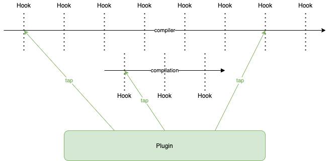
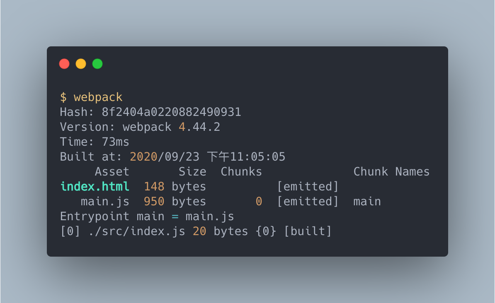

# 插件 Plugins

> 本文講述如何配置 `plugins` 。

> 本文的範例程式放在 [peterhpchen/webpack-quest](https://github.com/peterhpchen/webpack-quest/tree/master/posts/15-plugins/demos) 中，每個程式碼區塊的第一行都會標注檔案的位置，請搭配文章作參考。

webpack 在執行的過程中，會在生命週期的各個步驟對外釋出事件鉤子(Event Hooks)。 使用者可以使用插件(Plugins)叫用各個事件鉤子，做相對應的處理，已改變建置的過程及結果。



Plugins 使用 `tap` 將代碼注入到 [Compiler](https://webpack.js.org/api/compiler-hooks/) 或 [Compilation](https://webpack.js.org/api/compilation-hooks/) 的事件鉤子中，使其影響建置。

而配置中的 `plugins` 屬性是使用者在設定插件(Plugins)的時候所使用的。

## `plugins` 的設定

插件配置的步驟如下:

1. 安裝插件(如果是內建插件則不用安裝)
2. 引入插件
3. 使用 `new` 初始插件
4. 設定至配置檔中

如以下的例子:

```js
// ./demos/use-cli/webpack.config.js
const { CleanWebpackPlugin } = require("clean-webpack-plugin"); // import plugin

module.exports = {
  plugins: [
    // config plugin
    new CleanWebpackPlugin(), // new plugin
  ],
};
```

這是一個引入插件的簡單實例，首先引入插件 `CleanWebpackPlugin` ，接著用 `new` 初始插件，最後加到 `plugins` 配置中。

> `CleanWebpackPlugin` 會清空輸出目錄 `output` 中的檔案，使得建置完成後只留下此次建置的資源，避免殘留過時的檔案。

## 設定多個插件

`plugins` 是個陣列，因此我們可以配置多個不同的插件:

```js
// ./demos/multiple-plugins
const { CleanWebpackPlugin } = require("clean-webpack-plugin");
const CopyWebpackPlugin = require("copy-webpack-plugin");

module.exports = {
  plugins: [
    new CleanWebpackPlugin(),
    new CopyWebpackPlugin({
      patterns: [{ from: "public" }],
    }),
  ],
};
```

建置結果如下:



從建置結果中可以看到輸出中多了一個 `index.html` ，這是因為除了前例中的 `CleanWebpackPlugin` ，我們還多加了 `CopyWebpackPlugin` ，它可以將檔案複製到輸出目錄 `output` 中。

> 這裡我們見識到插件擁有改變輸出的強大能力，也因為插件的靈活， webpack 內部也有許多的功能是透過插件完成的。

## 插件(Plugin)的設定

前例中的 `CopyWebpackPlugin` 在初始時所帶的參數(`patterns.from`)賦予了使用者調整及設定插件的能力，絕大多數的插件都會提供使用者這樣的設定，使其可以因應各種情況做對應的處理。

## 內建插件

前面的例子都是外部的插件，因此需要透過安裝才能引入並作使用，但有部分的插件是[內建在 webpack 中](https://webpack.js.org/plugins/internal-plugins/)的，這些插件可以直接由 `webpack` 模組找到:

```js
// ./demos/internal-plugins/webpack.config.js
const webpack = require("webpack");

module.exports = {
  plugins: [
    new webpack.DefinePlugin({
      "process.env.NODE_ENV": '"production"',
    }),
  ],
};
```

不需要另外安裝，直接使用 `webpack.DefinePlugin` 就可以使用內建插件 `DefinePlugin` 了。

> `DefinePlugin` 可以用來設定環境變數。

## 使用 Node API 配置插件

使用 Node API 配置插件時，可以使用一般配置物件的方式:

```js
// ./demos/use-api/build.js
const webpack = require("webpack");

const configuration = require("./webpack.config.js");
webpack(configuration, () => {});
```

也可以使用 `apply` 函式引入 `compiler` 中:

```js
// ./demos/use-api/build.js
const webpack = require("webpack");

const { CleanWebpackPlugin } = require("clean-webpack-plugin");

const compiler = webpack({});
new CleanWebpackPlugin().apply(compiler);
compiler.run(() => {});
```

在 webpack 內部設定內建插件時也是使用 `apply` 方法，可以參考 webpack 的原始碼 [`lib/WebpackOptionsApply.js`](https://github.com/webpack/webpack/blob/master/lib/WebpackOptionsApply.js)。

## 總結

插件透過掛載 webpack 生命週期鉤子執行對應的代碼，使其改變建置的執行及結果，增強了 webpack 的擴充能力。

`plugins` 屬性本身的設定單純，只需將要使用的插件配置在陣列中，就可以在建置的過程中使用。

插件真正困難的在於使用這必須暸解各個插件的使用及設定方式，每個插件的設定完全不同，有時還需要仰賴相關的背景知識才會配置，在後面的文章中，將以實際的例子帶各位學習實用的插件使用方法。

在 webpack 內部，也使用插件做一些附加的功能，使 webpack 本身可以專注在建置的流程上。

插件機制使得原本已經很強大的 webpack 又再更上一層樓，有的功能 webpack 開發團隊可能並沒有想到，或是有意排除在核心功能外，但藉由插件，第三方可以很容易的將新功能加到 webpack 中，使得原本的功能不斷擴充，使得 webpack 不段的進化。

## 參考資料

- [Webpack Documentation: Configuration - Plugins](https://webpack.js.org/configuration/plugins/)
- [Webpack Documentation: API - Node Interface](https://webpack.js.org/api/node/)
- [Webpack Documentation: Concepts - Plugins](https://webpack.js.org/concepts/plugins/)
- [GitHub: johnagan/clean-webpack-plugin](https://github.com/johnagan/clean-webpack-plugin)
- [Webpack Documentation: Plugins - CopyWebpackPlugin](https://webpack.js.org/plugins/copy-webpack-plugin/)
- [Webpack Documentation: Plugins - Internal webpack plugins](https://webpack.js.org/plugins/internal-plugins/)
- [Webpack Documentation: Plugins - DefinePlugin](https://webpack.js.org/plugins/define-plugin/)
