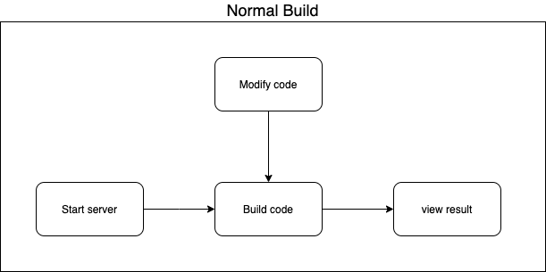
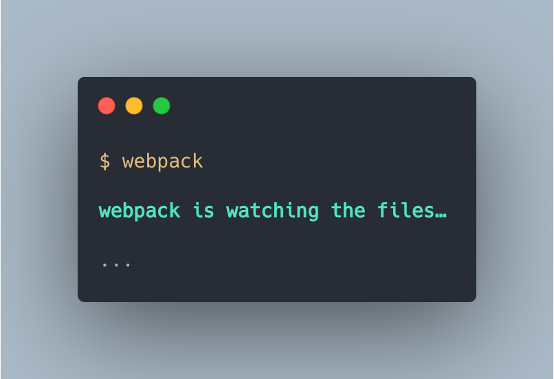
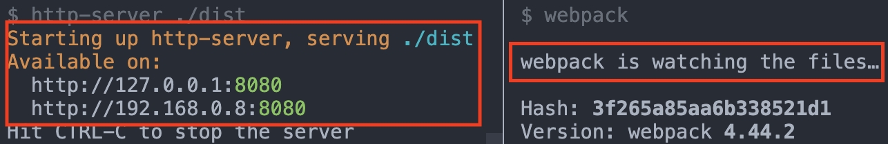
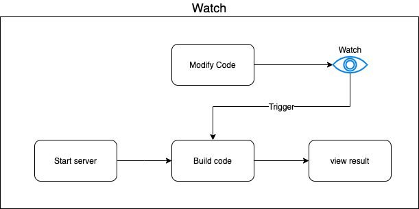
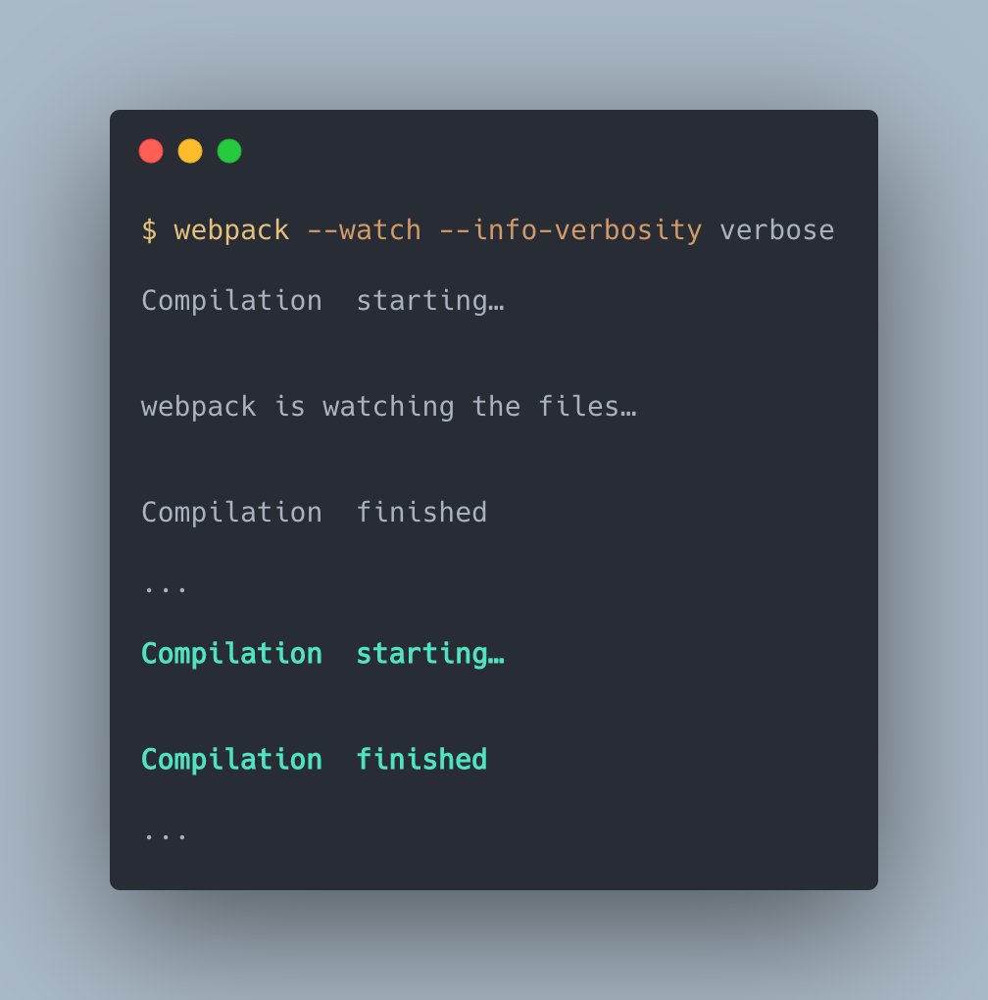
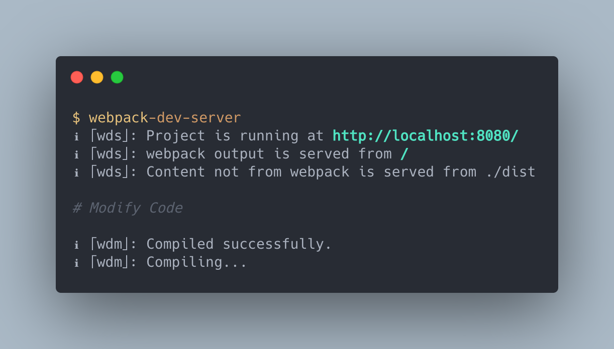
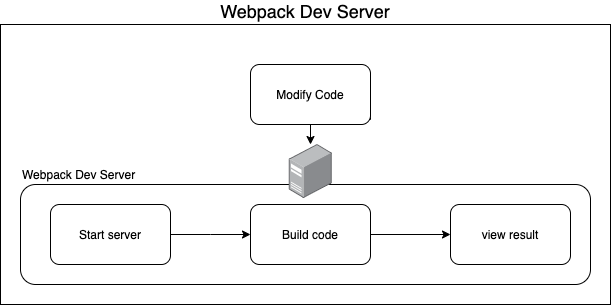

# 監聽 Watch

> 本文講解 webpack 的監聽模式，以及 `watch` 屬性與 `watchOptions` 設定項的設定方式。

> 本文的範例程式放在 [peterhpchen/webpack-quest](https://github.com/peterhpchen/webpack-quest/tree/master/posts/16-watch/demos) 中，每個程式碼區塊的第一行都會標注檔案的位置，請搭配文章作參考。

瀏覽器只看得懂 webpack 建置後的檔案，因此使用者要知道執行結果必須執行 webpack 的建置程序，完成後才能在瀏覽器上看到結果，每次修改了代碼都需要下指令重新建置實在麻煩，所幸 webpack 擁有監聽模式 `watch` ，在此模式下 webpack 可以感知檔案是否變化，只要一變化就會啟動建置，以產生新的輸出，讓開發變得更為迅速、簡單。



## 開啟監聽功能

`watch` 屬性是個布林值，預設是 `false` ，代表關閉監聽模式，而 `true` 的時候就是開啟監聽模式：

```js
// ./demos/simple-watch/webpack.config.js
module.exports = {
  watch: true,
};
```

建置結果如下：



可以看到 webpack 正在監看檔案的訊息，現在我們啟動 `http-server` 將目錄設定在 `./dist` 上:



現在可以嘗試修改代碼並**重新整理頁面**，可以看到修改後的內容出現在瀏覽器上。

使用 CLI 的 `--watch` 參數同樣可以啟動監聽模式：

```json
// ./demos/simple-watch/package.json
{
    ...
  "scripts": {
    "dev:argv": "webpack --watch",
    ...
  },
  ...
}
```



## `--info-verbosity`

預設的監聽模式在修改後不會再輸出 Log ，如果你想要知道是否有重新建置的話，可以設定 `--info-verbosity` 參數為 `verbose` ：



`--info-verbosity` 參數控制輸出生命週期相關的訊息，它的預設值是 `info` ，輸出重要的訊息，另外還有 `none` 及 `verbose` 選項， `none` 就是都不輸出，而 `verbose` 會詳細輸出每個階段了資訊。

## `watchOptions`

開啟監聽模式後，可以使用 `watchOptions` 調整監聽模式下的各樣選項：

```js
module.exports = {
    watch: true,
    watchOptions: {
        ...
}
}
```

接下來我們來看這些選項的功用吧。

## `watchOptions.aggregateTimeout`

`aggregateTimeout` 設置檔案變動後的多少時間要執行建置，在這個時間內的所有修改都會一起被建置，用來減少建置的頻率。

```js
// ./demos/watch-options/webpack.config.aggregate-timeout.js
module.exports = {
...
    watchOptions: {
        aggregateTimeout: 5000
    }
}
```

上例設定 5000 ms 的等待時間，可以使用 `--info-verbosity verbose` 參數啟動建置，修改後觀察觸發建置的時間來做了解。

在等待時間內再作修改的話，等待時間會重計，直到時間內都沒有變化時才會建置。

> `aggregateTimeout` 預設值為 `200`

## `watchOptions.ignored`

`ignored` 設定哪些檔案要排除在監聽的對象外，以此減少重新建置的時間，它可以是個 RegExp:

```js
// ./demos/watch-options/webpack.config.ignored.js
module.exports = {
  watch: true,
  watchOptions: {
    ignored: /ignore/,
  },
};
```

`ignore` 資料夾會被排除在監聽對象外，因此修改 `ignore` 內的檔案內容是不會觸發建置的。

`ignored` 屬性也可以是 [anymatch](https://github.com/micromatch/anymatch)：

```js
// ./demos/watch-options/webpack.config.ignored.js
module.exports = {
...
    watchOptions: {
        ignored: ['./src/**/*.js', 'node_modules/**']
    }
}
```

## `watchOptions.poll`

監聽模式下有時會無法探測檔案的變化，這時可以啟用 `poll` 屬性，以固定時間觸發重新建置：

```js
// ./demos/watch-options/webpack.config.poll.js
module.exports = {
...
    watchOptions: {
        poll: 1000,
    }
}
```

`poll` 的單位為 ms ，上面的設定為每秒檢查一次檔案是否有變化。

## 使用 Webpack Dev Server

開啟了監聽模式讓開發者可以除去修改代碼後建置的步驟，但是還有兩個多餘的動作：

- 開啟 `http-server`
- 需要手動重新整理

在開發工作的一開始，我們要記得開啟測試用的伺服器，並在每次修改代碼後要去按下瀏覽器的重新整理按鈕，才能看到更新的結果，真的是很惱人。

為了廣大懶惰的工程師們， webpack 貼心的開發了 webpack 用的 Dev Server ，並內建伺服器及監聽的功能。

由於 Dev Server 是另一個庫，因此需要先做安裝：

```bash
npm install webpack-dev-server -D
```

然後設定 `devServer` 屬性：

```js
// ./demos/dev-server/webpack.config.js
module.exports = {
  devServer: {
    contentBase: "./dist",
  },
};
```

接著執行 `webpack-dev-server` 指令，其執行結果如下：



可以看到 Dev Server 跑在 `http://localhost:8080/` 上，可以在瀏覽器上觀察結果並作修改，這時頁面會自動重整變為更新後的內容。



## 總結

原本開發時，每次修改代碼都要重新建置一次，造成開發時間延長。為此 webpack 提供了監聽功能，可以監聽專案中的檔案，並在修改代碼時重新建置專案，節省開發的時間，而 Dev Server 還囊括了配置伺服器及重新整理頁面的功能，更提高了開發效率。

本文說到的都只是 webpack 對於開發環境所做的一小部分而已，監聽模式與 Dev Server 的功能不僅僅是這些，在後面的章節會以現實的例子來說明配置 DevServer 。

## 參考資料

- [Webpack Documentations: Configuration - Watch and WatchOptions](https://webpack.js.org/configuration/watch/)
- [Webpack Documentations: Configuration - DevServer](https://webpack.js.org/configuration/dev-server/)
