# Source Map

> 本文講解 Source Map 的功用及原理。

> 本文的範例程式放在 [peterhpchen/webpack-quest](https://github.com/peterhpchen/webpack-quest/tree/master/posts/17-source-map/demos) 中，每個程式碼區塊的第一行都會標注檔案的位置，請搭配文章作參考。

在這個時代中的前端代碼很少在使用直譯的開發方式，通常會用優化工具(ex: [terser](https://github.com/terser/terser))產生生產環境的代碼，也會在開發時使用非原生語法(ex: TypeScript, Babel)或是預處理器(ex: SASS)加速開發，而建置時會使用像是 webpack 等建置工具，這使得當 Bug 發生時，瀏覽器指向的是建置後代碼的錯誤所在位置，而非原本的代碼位置，造成了極大的問題。為了解決此問題， Source Map 技術被發明了，接著我們來了解什麼是 Source Map 吧。

## 除錯時遇到的大麻煩

假設今天你寫了下面的代碼:

```js
// ./demos/without-source-map/src/index.js
import _ from "lodash";

const demoName = "Without Source Map";

function component() {
  const element = document.createElement("div");

  element.innerHTML = _.join(["Webpack Demo", demoName], ": ");

  return element;
}

document.body.appenChild(component());
```

這個簡單的代碼會將 `component` 插入頁面中。寫完後，你興高采烈地用 webpack 建置後，在瀏覽器點開要看結果，發現怎麼一片白啊，無奈的你只好打開 DevTool 準備 Debug ，他看到了錯誤如下:

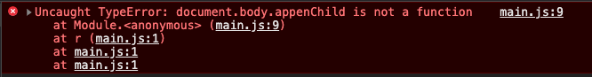

看到當下你傻眼了，心想: 「我明明只有寫 `index.js` 怎麼錯誤是從 `main.js` 來，而且行數也不太對啊」，雖然心裡毛毛的，可是你還是點開了 `main.js:9` 看 source 的內容:

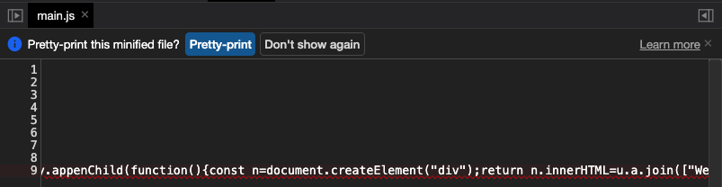

「這天書般的代碼是要怎麼抓蟲啊」，這時所看到的是建置後的代碼，由於 webpack 的處理，代碼已經不是原本彼得撰寫的內容了。

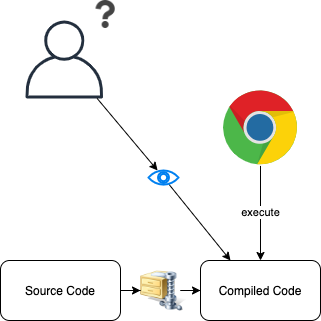

## 使用 Source Map 解決開發問題

所幸 webpack 有提供 Source Map 的功能，我們使用 CLI 將它開啟:

```json
// ./demos/source-map/package.json
{
    ...
  "scripts": {
    "dev": "http-server ./dist & webpack --mode production --watch --devtool source-map"
  },
  ...
}
```

`--devtool` 參數可以選擇不同的 Source Map 方式(在 [Dev Tool](../18-devtool/README.md) 一文會講解)，這裡選 `source-map` ，執行後再來看看瀏覽器的 Dev Tool :

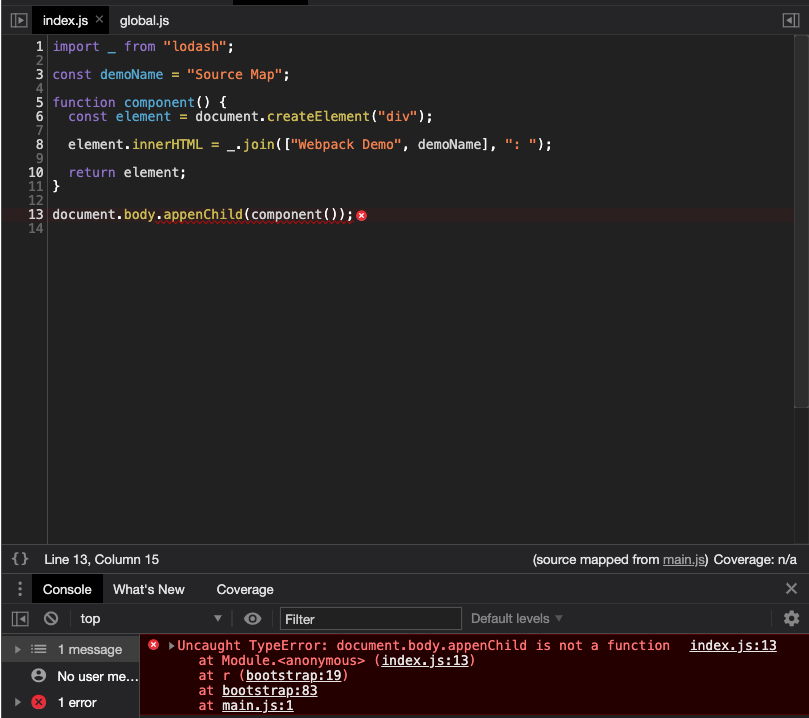

看得到彼得所寫的代碼了，並且明確的指出錯誤的位置。

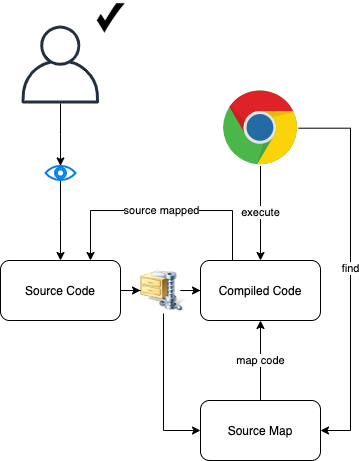

Source Map 會產生一份 map 檔案，用以對應建置後的代碼到來源代碼的位置，瀏覽器看到有 Source Map 的設定就會自動將 Source 轉為 Mapped 後的代碼。

## Source Map 原理

Source Map 會為每個檔案產生一個對應資料的檔案，它的內容會像下面這樣:

```json
{
  "version": 3,
  "sources": ["../src/index.js"],
  "names": ["add", "a", "b"],
  "mappings": ";;AAAA,IAAMA,GAAG,GAAG,SAANA,GAAM,CAACC,CAAD,EAAIC,CAAJ;AAAA,SAAUD,CAAC,GAAGC,CAAd;AAAA,CAAZ",
  "sourceRoot": "/",
  "sourcesContent": ["const add = (a, b) => a + b;\n"],
  "file": "index.js"
}
```

對應檔是個 JSON 格式的資料檔，副檔名為 `.map` ，主要的屬性有:

- `version`: Source Map 的版本，目前是 `3`
- `sources`: 組成此建置檔案的原始檔案位置
- `names`: 原始檔案內代碼的名詞(變數、屬性名...等)表
- `mappings`: 建置與原始檔案的代碼對應資料
- `sourceRoot`: 原始檔案的根目錄
- `sourceContent`: 原始檔案的代碼內容
- `file`: 此對應檔的目標檔案(建置檔案)

有了這個檔案後，我們需要告知瀏覽器要使用此對應檔，因此要在建置後的檔案中加上資訊:

```js
"use strict";

var add = function add(a, b) {
  return a + b;
};
//# sourceMappingURL=index.js.map
```

最後一行的 `//# sourceMappingURL=index.js.map` 告訴瀏覽器此檔案的對應檔為 `index.js.map` 檔。

如此一來，在瀏覽器開啟此檔案時，會發現有對應檔，從而使用 Source Map 對應原始檔案的內容。

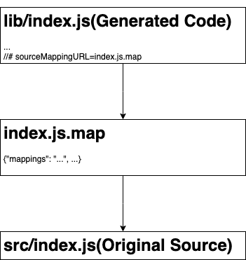

大部分的屬性都很直覺的可以知道使用的方式，除了 `mappings` 外，而這也是對應檔中最重要的資訊，接著我們就來解釋 `mappings` 資訊的使用方式吧。

## `mappings` 的對應方式

`mappings` 內的資料規則如下:

- `;` : 分號用以區隔建置代碼中的每一行。
- `,` : 逗號用以區隔每個代碼段。
- `AAAA` : 代碼段對應資訊的編碼，此編碼包含 1 或 4 或 5 個值，每個值都以 [VLQ 編碼](https://en.wikipedia.org/wiki/Variable-length_quantity)而成。

使用 `;` 對應建置後代碼的行， `,` 分隔行中的各個代碼段，最後使用對應編碼還原代碼段在原始資料中的內容與位置，接著來看要如何看懂對應編碼。

> VLQ 編碼的算法可以參考 [Rich-Harris/vlq](https://github.com/Rich-Harris/vlq/blob/master/src/vlq.ts) 。

## 對應編碼的定義

對應編碼的值都是使用 VLQ 編碼，總共由五個值所組成:

- 第一個值: 此代碼段位於建置後代碼中的第幾欄
- 第二個值: 此代碼段的原始檔案位於 map 檔中 `sources` 陣列的第幾個元素
- 第三個值: 此代碼段位於原始檔案中的第幾行
- 第四個值: 此代碼段位於原始檔案中的第幾欄
- 第五個值: 此代碼段的名稱位於 map 檔中 `names` 陣列的第幾個元素

所有的值都會相依在之前的值之上，因此除去第一個代碼段外，其他的代碼段編碼的正確值都要加在之前編碼值之上。這樣做的好處在於，由於是相對值，因此數值不會太大，節省儲存空間。

## 以例子說明 Source Map 對應方式

這節會以 Babel 代碼轉換的 Source Map 為例子來說明其對應的方法。

原始代碼為:

```js
// ./demos/babel-source-map/src/index.js
const add = (a, b) => a + b;
```

建置代碼為:

```js
// ./demos/babel-source-map/lib/index.js
"use strict";

var add = function add(a, b) {
  return a + b;
};
//# sourceMappingURL=index.js.map
```

`//# sourceMappingURL=index.js.map` 告訴瀏覽器此建置檔案的對應檔位置。

對應檔為:

```json
// ./demos/babel-source-map/lib/index.js.map
{
  "version": 3,
  "sources": ["../src/index.js"],
  "names": ["add", "a", "b"],
  "mappings": ";;AAAA,IAAMA,GAAG,GAAG,SAANA,GAAM,CAACC,CAAD,EAAIC,CAAJ;AAAA,SAAUD,CAAC,GAAGC,CAAd;AAAA,CAAZ",
  "sourceRoot": "/",
  "sourcesContent": ["const add = (a, b) => a + b;\n"],
  "file": "index.js"
}
```

> 上面所有代碼的第一行，路徑的註解，都沒有在真正的代碼中，所以分析時，請無視這行。

檔案都介紹完了，接著我們試著使用 `mapping` 對應原始的檔案內容吧。

首先我們看到 `;;` ，代表兩行的空白行，對照 `./lin/index.js` ，第二行的確是空行，而第一行雖然有 `use strict` ，但這不在對應的範圍內，因此沒有對應編碼的資料，所以一開始是以 `;;` 開頭。

接著來看第一個代碼段，是在第三行的 `AAAA` ，由 VLQ 轉為數字為 `0,0,0,0` ，這值代表:

- 在建置後代碼的第 1 欄
- 原始代碼位於 `sources` 的第一個元素 `../src/index.js` 中
- 在原始代碼的第 1 行
- 在原始代碼的第 1 欄

因此對應如下:

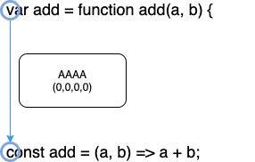

由此可知第一段代碼段對應到原始代碼中的 `const` 。

第二個代碼段為 `IAAMA` ，由 VLQ 轉為數字 `4,0,0,6,0` ，這值代表:

- 在建置後代碼的第 4 欄(要由基底值往上加)
- 原始代碼位於 `sources` 的第 1 個(要由基底值往上加)元素 `../src/index.js` 中
- 在原始代碼的第 1 行(要由基底值往上加)
- 在原始代碼的第 6 欄(要由基底值往上加)
- 原始代碼中的變數名稱為 `names` 中的第 1 個(要由基底值往上加)元素 `add`

對應如下:

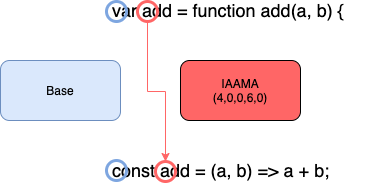

由此可知第二段代碼段對應到原始代碼中的 `add` 。

> 這裡每個值都有解釋需要由基底值往上加，因為基底值為 0 的關係，所以目前看不出效果，下一個代碼段再來解釋。

第三個代碼段為 `GAAG` 轉為數字 `3,0,0,3` ，這值代表:

- 在建置後代碼的第 8 (`0+4+3`)欄(要由基底值往上加)
- 原始代碼位於 `sources` 的第 1 個(要由基底值往上加)元素 `../src/index.js` 中
- 在原始代碼的第 1 行(要由基底值往上加)
- 在原始代碼的第 10 (`0+6+3`)欄(要由基底值往上加)

基底值為第一及第二個代碼段的 (`0,0,0,0`) 與 (`4,0,0,6,0`) 相加而成的 (`4,0,0,6,0`)，因此第三個代碼段要基於這個值再做運算。

對應如下:

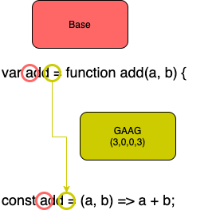

由於有基底值，因此由基底值向後加，所以第三個代碼段對應的原始代碼為 `=` 。

之後就以上面的方式類推，下面整理了部分代碼段的總覽圖供讀者參閱:

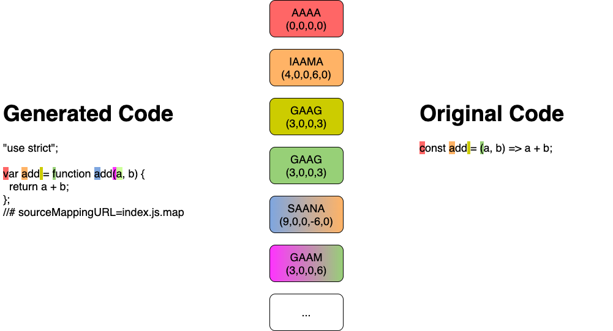

## 負數的對應值

由於會有基底值，因此對應值有可能會是負數，代表往前尋找對應的意思，例如上例中有個 `SAANA` ，轉出來的數字為 `9,0,0,-6,0` ，這代表當在找尋原始代碼的欄數時，需要與基底值做減法運算，對應如下:

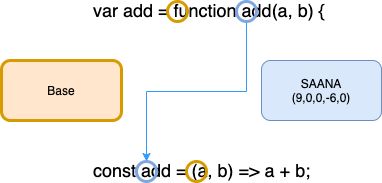

原始代碼中的代碼段位於基底值後方 6 欄，因此會尋找到 `add` 。

## VLQ 編碼

前面在 `mappings` 時所使用的 VLQ ，它可以用少量的空間表示極大的數值，因此在處理數字時，常常會使用 VLQ 作為儲存的方式。

下面講解如何做 VLQ 的編碼與解碼

### 由數字編碼為 VLQ

編碼流程如下:

1. 轉為二進位
1. 向左位移一位，原數為負數的話第一位為 1 ，正數的話為 0
1. 以 5 位為一個值切開，如不滿 5 位，前面補 0
1. 如果有多個值，做倒序處理
1. 如果有多個值，除了最後一個值最高位補 0 外，其他值的最高位補 1
1. 使用 Base64 編碼各個值

以例子說明，現在要編碼 `16` :

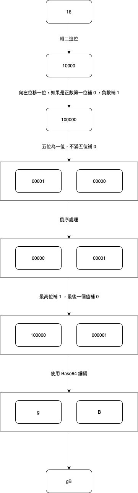

### 由 VLQ 解碼回數字

預設值: 目前數值為 0，位移值為 0 。

1. 取得第一個字元
1. Base64 解碼
1. 轉為二進位
1. 第 6 位(最高位)為 1 ，表示接著的字元屬於同個值，納入運算中
1. 依照位移值向左位移
1. 位移完成後，位移值加 5
1. 目前數值加上此值
1. 如有下個字元重複上述步驟直到第 6 位(最高位)為 0 ，此字元為最後一位
1. 全部字元所取得的目前數值的第一位元為判斷是否為負數的 bit ，取出此 bit 並 1.向右位移一位
1. 如果負數元為 1 則數值為負，反之為正

以例子說明，現在要解碼 `gB` :

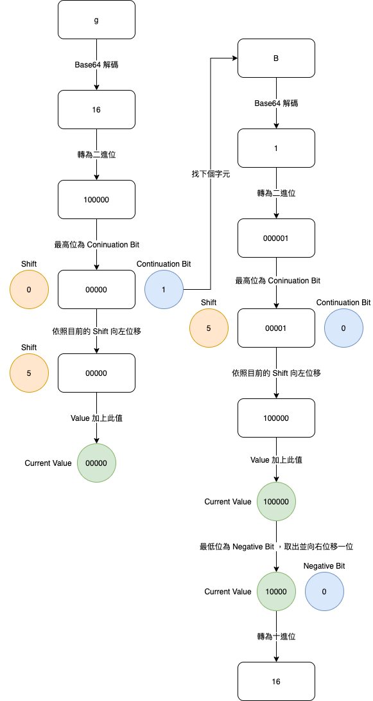

## 總結

經過建置後的代碼雖然可以增加效能，但卻有難以除錯的缺點，為了彌補此缺點，我們需要藉由 Source Map 的幫助。

Source Map 可以將建置後的內容與原始的內容做對應，瀏覽器找到對應資料後，會依照對應資料輸出原始代碼內容，讓我們可以知道原始代碼的錯誤出處，藉以增加除錯的效率。

Source Map 中的 `mappings` 資料是用 VLQ 編碼所編寫的對應資料，可以在建置代碼與原始代碼間做對應代碼段的工作。

本文講述了 Source Map 的用處與原理，下一篇我們會說到 webpack 中的 `devtool` 配置，讓 webpack 幫我們產生 Source Map 資訊。

## 參考資料

- [阮一峰的网络日志: JavaScript Source Map 详解](https://www.ruanyifeng.com/blog/2013/01/javascript_source_map.html)
- [HTML5 Rocks: Introduction to JavaScript Source Maps](https://www.html5rocks.com/en/tutorials/developertools/sourcemaps/)
- [Matt Zeunert Blog: How do source maps work?](https://www.mattzeunert.com/2016/02/14/how-do-source-maps-work.html)
- [treehouse: An Introduction to Source Maps](https://blog.teamtreehouse.com/introduction-source-maps)
- [source-map-visualization](http://sokra.github.io/source-map-visualization/)
- [Source Map Revision 3 Proposal](https://sourcemaps.info/spec.html)
- [Babel Options: sourceMaps](https://babeljs.io/docs/en/options#sourcemaps)
- [Wiki: Variable-length quantity](https://en.wikipedia.org/wiki/Variable-length_quantity)
- [Github: Rich-Harris/vlq](https://github.com/Rich-Harris/vlq)
- [Github: mozilla/source-map](https://github.com/mozilla/source-map)
