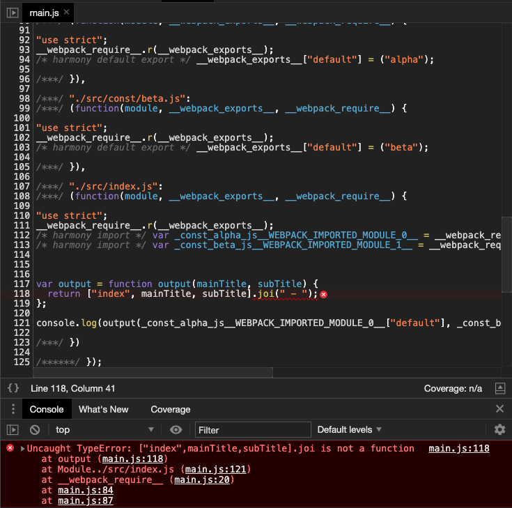
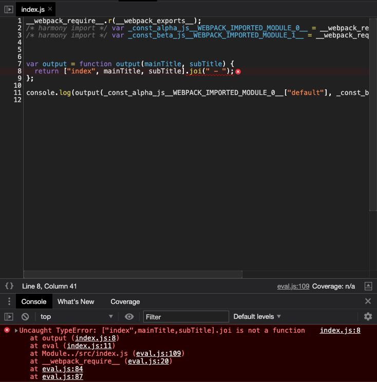
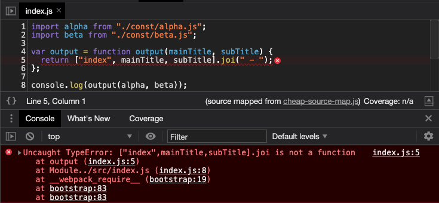
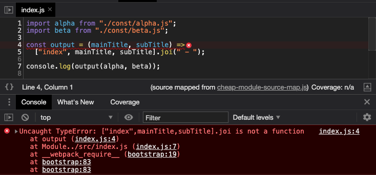
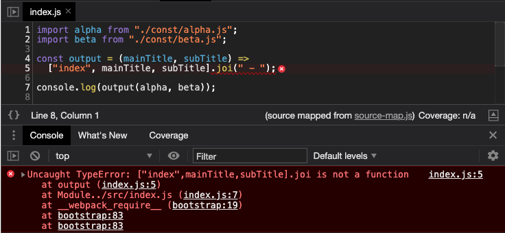
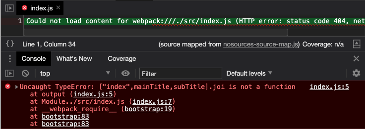
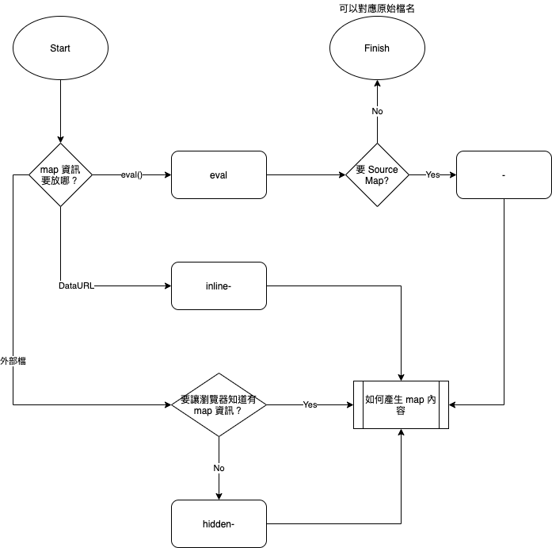
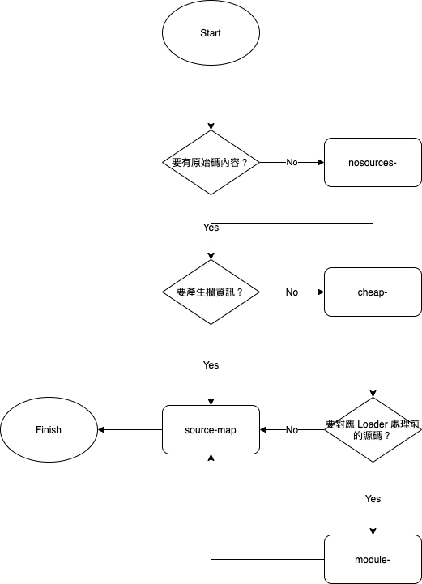

# Dev Tool

> 本文講解在 webpack 中使用 `devTools` 屬性設定 Source Map 的方式。

> 本文的範例程式放在 [peterhpchen/webpack-quest](https://github.com/peterhpchen/webpack-quest/tree/master/posts/18-devtool/demos) 中，每個程式碼區塊的第一行都會標注檔案的位置，請搭配文章作參考。

webpack 是個建置工具，他會將多個檔案或是不同語言的模組合成 bundle 檔案，在生產環境時，這樣的做法能減少傳輸容量，對於程式效能有很大的幫助。但是在開發環境中，建置過的代碼會變得難以追蹤，一但發生 Bug ，都不知道要去哪裡找到問題，幸好 webpack 有提供 Source Map 輸出的功能，接下來會講解如何使用 webpack 中的 `devtool` 設定 Source Map。

## 使用 `devtool` 屬性設定 Source Map

`devtool` 屬性是用來設定要怎麼輸出 Source Map 的資訊，預設是 `false` ，代表不產出 Source Map 資訊。

如果要讓 webpack 產出 Source Map ， `devtool` 必須要是字串值，這個字串值設定要使用什麼樣的 Source Map 方式，總共有下面這些選項:

```js
// ./demos/devtool/webpack.config.js
const devtools = [
  false,
  "source-map",
  "cheap-source-map",
  "cheap-module-source-map",
  "nosources-source-map",
  "nosources-cheap-source-map",
  "nosources-cheap-module-source-map",
  "eval",
  "eval-source-map",
  "eval-cheap-source-map",
  "eval-cheap-module-source-map",
  "eval-nosources-source-map",
  "eval-nosources-cheap-source-map",
  "eval-nosources-cheap-module-source-map",
  "hidden-source-map",
  "hidden-cheap-source-map",
  "hidden-cheap-module-source-map",
  "hidden-nosources-source-map",
  "hidden-nosources-cheap-source-map",
  "hidden-nosources-cheap-module-source-map",
  "inline-source-map",
  "inline-cheap-source-map",
  "inline-cheap-module-source-map",
  "inline-nosources-source-map",
  "inline-nosources-cheap-source-map",
  "inline-nosources-cheap-module-source-map",
];

...
```

接下來會依序講解這些設定的差別。

## Source Map 種類

此節會使用範例 **devtool** ，此範例的代碼如下:

```js
// ./demos/devtool/src/index.js
import alpha from "./const/alpha.js";
import beta from "./const/beta.js";

const output = (mainTitle, subTitle) =>
  ["index", mainTitle, subTitle].joi(" - ");

console.log(output(alpha, beta));

// ./demos/devtool/src/const/alpha.js
export default "alpha";

// ./demos/devtool/src/const/beta.js
export default "beta";
```

這個例子中埋了一個錯誤 `join` 寫成 `joi` ，以此檢視 Source Map 的效果。

配置檔如下:

```js
// ./demos/devtool/webpack.config.js
const devtools = [
    ...
];

module.exports = devtools.map((devtool) => ({
  mode: "none",
  output: {
    filename: `${devtool || "[name]"}.js`,
  },
  devtool,
  optimization: {
    moduleIds: 'named'
  },
  module: {
    rules: [
      {
        test: /\.js/,
        exclude: /node_modules/,
        use: {
          loader: "babel-loader",
        },
      },
    ],
  },
}));
```

- 為了不讓 `mode` 影響結果，因此設為 `none` 。
- `optimization.moduleIds` 讓輸出的 bundle 中使用名稱(`named`)當作模組的 ID ，讓使用者做識別
- 使用 `babel-loader` 轉譯代碼。

接著我們依序看各個設定的效果。

## `false`

這是預設值，代表不使用 Source Map 。

```js
// ./demos/devtool/dist/main.js
(function(modules) { // webpackBootstrap
    ...
})({

/***/ "./src/const/alpha.js":
/***/ (function(module, __webpack_exports__, __webpack_require__) {

"use strict";
__webpack_require__.r(__webpack_exports__);
/* harmony default export */ __webpack_exports__["default"] = ("alpha");

/***/ }),

/***/ "./src/const/beta.js":
/***/ (function(module, __webpack_exports__, __webpack_require__) {

"use strict";
__webpack_require__.r(__webpack_exports__);
/* harmony default export */ __webpack_exports__["default"] = ("beta");

/***/ }),

/***/ "./src/index.js":
/***/ (function(module, __webpack_exports__, __webpack_require__) {

"use strict";
__webpack_require__.r(__webpack_exports__);
/* harmony import */ var _const_alpha_js__WEBPACK_IMPORTED_MODULE_0__ = __webpack_require__("./src/const/alpha.js");
/* harmony import */ var _const_beta_js__WEBPACK_IMPORTED_MODULE_1__ = __webpack_require__("./src/const/beta.js");


var output = function output(mainTitle, subTitle) {
  return ["index", mainTitle, subTitle].joi(" - ");
};

console.log(output(_const_alpha_js__WEBPACK_IMPORTED_MODULE_0__["default"], _const_beta_js__WEBPACK_IMPORTED_MODULE_1__["default"]));

/***/ })

/******/ });
```

webpack 將各個檔案內容綁定至 bundle 中，可以看到經過 `babel-loader` 轉換後的 `./src/index.js` 內容。

放到瀏覽器上，在 Development Tool 中內容如下:



可以看到檔名還是 bundle 的 `main.js` ，錯誤行數指到 `main.js` 中的內容。

這樣是很難 debug 的，如果加上 `terser` 之類的最佳化工具，可讀性會變得更差。

## `eval`

`eval` 會將各個模組以 `eval()` 包起來，並在最後加上 `sourceURL` ，告訴開發者此代碼原始的檔名。

```js
// ./demos/devtool/dist/eval.js
/******/ (function(modules) { // webpackBootstrap
...
})({

/***/ "./src/const/alpha.js":
/***/ (function(module, __webpack_exports__, __webpack_require__) {

"use strict";
eval("__webpack_require__.r(__webpack_exports__);\n/* harmony default export */ __webpack_exports__[\"default\"] = (\"alpha\");\n\n//# sourceURL=webpack:///./src/const/alpha.js?");

/***/ }),

/***/ "./src/const/beta.js":
/***/ (function(module, __webpack_exports__, __webpack_require__) {

"use strict";
eval("__webpack_require__.r(__webpack_exports__);\n/* harmony default export */ __webpack_exports__[\"default\"] = (\"beta\");\n\n//# sourceURL=webpack:///./src/const/beta.js?");

/***/ }),

/***/ "./src/index.js":
/***/ (function(module, __webpack_exports__, __webpack_require__) {

"use strict";
eval("__webpack_require__.r(__webpack_exports__);\n/* harmony import */ var _const_alpha_js__WEBPACK_IMPORTED_MODULE_0__ = __webpack_require__(\"./src/const/alpha.js\");\n/* harmony import */ var _const_beta_js__WEBPACK_IMPORTED_MODULE_1__ = __webpack_require__(\"./src/const/beta.js\");\n\n\n\nvar output = function output(mainTitle, subTitle) {\n  return [\"index\", mainTitle, subTitle].joi(\" - \");\n};\n\nconsole.log(output(_const_alpha_js__WEBPACK_IMPORTED_MODULE_0__[\"default\"], _const_beta_js__WEBPACK_IMPORTED_MODULE_1__[\"default\"]));\n\n//# sourceURL=webpack:///./src/index.js?");

/***/ })

/******/ });
```

可以看到 `eval` 內的字串最後有個 `//# sourceURL=webpack:///./src/index.js?` 註解，他會提示使用者原始的檔案名稱。

結果如下:



現在我們可以知道此問題發生在 `index.js` 中，但是它的內容還是 webpack 建置後的內容，沒有參考價值。

## `cheap-source-map`

`cheap-source-map` 會提供 Source Map ，但會喪失欄的資訊。

```js
// ./demos/devtool/dist/cheap-source-map.js

...

//# sourceMappingURL=cheap-source-map.js.map
```

bundle 的內容跟 `false` 時一樣，只差在最後一行有 `//# sourceMappingURL=cheap-source-map.js.map` 這行註解，瀏覽器讀到後會去找這個檔案的獨立 `.map` 檔。

```json
// ./demos/devtool/dist/cheap-source-map.js.map
{
    ...
   "sourcesContent":[
      ...
      "import alpha from \"./const/alpha.js\";\nimport beta from \"./const/beta.js\";\n\nvar output = function output(mainTitle, subTitle) {\n  return [\"index\", mainTitle, subTitle].joi(\" - \");\n};\n\nconsole.log(output(alpha, beta));"
   ],
   "mappings":";AAAA;AACA;AACA;AACA;AACA;AACA;AACA;AACA;AACA;AACA;AACA;AACA;AACA;AACA;AACA;AACA;AACA;AACA;AACA;AACA;AACA;AACA;AACA;AACA;AACA;AACA;AACA;AACA;AACA;AACA;AACA;AACA;AACA;AACA;AACA;AACA;AACA;AACA;AACA;AACA;AACA;AACA;AACA;AACA;AACA;AACA;AACA;AACA;AACA;AACA;AACA;AACA;AACA;AACA;AACA;AACA;AACA;AACA;AACA;AACA;AACA;AACA;AACA;AACA;AACA;AACA;AACA;AACA;AACA;AACA;AACA;AACA;AACA;AACA;AACA;AACA;AACA;AACA;AACA;AACA;AACA;AACA;AACA;;;;;;;;;AClFA;AAAA;;;;;;;;ACAA;AAAA;;;;;;;;ACAA;AAAA;AAAA;AAAA;AACA;AACA;AACA;AACA;AACA;AACA;AACA;;;;A",
   ...
}
```

可以看到 `sourceContent` 中的內容已經是 Loader 處理過後的代碼，代表對應的代碼雖然是檔案中的代碼，但已經被 Loader 處理過了。

另外， `cheap-source-map` 所產生出來的 `mappings` 每行都只有一個代碼段， `cheap-source-map` 藉由將整行視為同一個代碼段以減少 Source Map 所需的容量。

結果如下:



現在可以看到是哪個檔案發生問題，也可以知道錯誤的行數了，但是代碼已經經過 Loader 轉換，並且不能確認欄數。

## `cheap-module-source-map`

`cheap-module-source-map` 與 `cheap-source-map` 相似，但他會對應到 Loader 處理前的代碼。

```json
// ./demos/devtool/dist/cheap-module-source-map.js.map
{
    ...
   "sourcesContent":[
       ...
      "import alpha from \"./const/alpha.js\";\nimport beta from \"./const/beta.js\";\n\nconst output = (mainTitle, subTitle) =>\n  [\"index\", mainTitle, subTitle].joi(\" - \");\n\nconsole.log(output(alpha, beta));\n"
   ],
   ...
}
```

可以看到 `sourceContent` 中的代碼是 `babel-loader` 處理前的 arrow function 寫法。

結果如下:



現在終於對應到原始的代碼了，只差欄數沒有對應。

## `source-map`

`source-map` 屬性提供了完整的 Source Map 。

```json
// ./demos/devtool/dist/source-map.js.map
{
    ...
   "mappings":";QAAA;QACA;;QAEA;QACA;;QAEA;QACA;QACA;QACA;QACA;QACA;QACA;QACA;QACA;QACA;;QAEA;QACA;;QAEA;QACA;;QAEA;QACA;QACA;;;QAGA;QACA;;QAEA;QACA;;QAEA;QACA;QACA;QACA,0CAA0C,gCAAgC;QAC1E;QACA;;QAEA;QACA;QACA;QACA,wDAAwD,kBAAkB;QAC1E;QACA,iDAAiD,cAAc;QAC/D;;QAEA;QACA;QACA;QACA;QACA;QACA;QACA;QACA;QACA;QACA;QACA;QACA,yCAAyC,iCAAiC;QAC1E,gHAAgH,mBAAmB,EAAE;QACrI;QACA;;QAEA;QACA;QACA;QACA,2BAA2B,0BAA0B,EAAE;QACvD,iCAAiC,eAAe;QAChD;QACA;QACA;;QAEA;QACA,sDAAsD,+DAA+D;;QAErH;QACA;;;QAGA;QACA;;;;;;;;;AClFA;AAAe,sEAAf,E;;;;;;;;ACAA;AAAe,qEAAf,E;;;;;;;;ACAA;AAAA;AAAA;AAAA;AACA;;AAEA,IAAMA,MAAM,GAAG,SAATA,MAAS,CAACC,SAAD,EAAYC,QAAZ;AAAA,SACb,CAAC,OAAD,EAAUD,SAAV,EAAqBC,QAArB,EAA+BC,GAA/B,CAAmC,KAAnC,CADa;AAAA,CAAf;;AAGAC,OAAO,CAACC,GAAR,CAAYL,MAAM,CAACM,uDAAD,EAAQC,sDAAR,CAAlB,E",
   ...
   "sourcesContent":[
       ...
      "import alpha from \"./const/alpha.js\";\nimport beta from \"./const/beta.js\";\n\nconst output = (mainTitle, subTitle) =>\n  [\"index\", mainTitle, subTitle].joi(\" - \");\n\nconsole.log(output(alpha, beta));\n"
   ],
   ...
}
```

可以看到一行不在只有一個代碼段了， `source-map` 可以產生完整的 map 資訊。

結果如下:



我們可以看到紅線不在是整行，而是清楚對應到 `.joi` 的位置。

## `nosources-source-map`

提供了完整的 Source Map ，但不產生 `sourceContent` 內容。

```json
// ./demos/devtool/dist/nosources-source-map.js.map
{
  "version": 3,
  "sources": [
    "webpack:///webpack/bootstrap",
    "webpack:///./src/const/alpha.js",
    "webpack:///./src/const/beta.js",
    "webpack:///./src/index.js"
  ],
  "names": [
    "output",
    "mainTitle",
    "subTitle",
    "joi",
    "console",
    "log",
    "alpha",
    "beta"
  ],
  "mappings": ";QAAA;QACA;;QAEA;QACA;;QAEA;QACA;QACA;QACA;QACA;QACA;QACA;QACA;QACA;QACA;;QAEA;QACA;;QAEA;QACA;;QAEA;QACA;QACA;;;QAGA;QACA;;QAEA;QACA;;QAEA;QACA;QACA;QACA,0CAA0C,gCAAgC;QAC1E;QACA;;QAEA;QACA;QACA;QACA,wDAAwD,kBAAkB;QAC1E;QACA,iDAAiD,cAAc;QAC/D;;QAEA;QACA;QACA;QACA;QACA;QACA;QACA;QACA;QACA;QACA;QACA;QACA,yCAAyC,iCAAiC;QAC1E,gHAAgH,mBAAmB,EAAE;QACrI;QACA;;QAEA;QACA;QACA;QACA,2BAA2B,0BAA0B,EAAE;QACvD,iCAAiC,eAAe;QAChD;QACA;QACA;;QAEA;QACA,sDAAsD,+DAA+D;;QAErH;QACA;;;QAGA;QACA;;;;;;;;;AClFA;AAAe,sEAAf,E;;;;;;;;ACAA;AAAe,qEAAf,E;;;;;;;;ACAA;AAAA;AAAA;AAAA;AACA;;AAEA,IAAMA,MAAM,GAAG,SAATA,MAAS,CAACC,SAAD,EAAYC,QAAZ;AAAA,SACb,CAAC,OAAD,EAAUD,SAAV,EAAqBC,QAArB,EAA+BC,GAA/B,CAAmC,KAAnC,CADa;AAAA,CAAf;;AAGAC,OAAO,CAACC,GAAR,CAAYL,MAAM,CAACM,uDAAD,EAAQC,sDAAR,CAAlB,E",
  "file": "nosources-source-map.js",
  "sourceRoot": ""
}
```

上面是 `nosources-source-map.js.map` 的**完整**內容，可以看到它並沒有 `sourceContent` 。

結果如下:



可以看到雖然可以對應到原始代碼的行及欄位，但卻沒有代碼內容供比對。這個類型通常會使用在 `production` 這類不想讓使用者看到源碼的環境上。

## `inline-source-map`

`inline-source-map` 使用 DataURL 產生完整的 Source Map 資訊。

```js
// ./demos/devtool/dist/inline-source-map.js

...

//# sourceMappingURL=data:application/json;charset=utf-8;base64,...
```

`sourceMappingURL 的內容從原本的路徑變為 DataURL 。

## `hidden-source-map`

產生完整內容的 `.map` 檔，但是在 bundle 中不產生 `sourceMappingURL` 的註解。

## 統整各 Source Map 類型特性

雖然還有很多類型沒有介紹到，但其他的類型都是由上面幾種組合而成的，用表來表示:

| 產生 bundle 的方式 | 特性                                       |
| ------------------ | ------------------------------------------ |
| inline             | 使用 DataURL 載入 map 資訊                 |
| hidden             | bundle 中不加 map 檔路徑資訊               |
| eval               | 使用 `eval()` 包住模組內容                 |
| source-map         | 產生 map 檔， bundle 中加上 map 檔路徑資訊 |

| 產生 map 的方式 | 特性                                                                   |
| --------------- | ---------------------------------------------------------------------- |
| nosources       | 不產生 `sourceContent`                                                 |
| cheap           | `mappings` 中不產生**欄**資訊， `sourceContent` 為 Loader 載入後的內容 |
| cheap-module    | `mappings` 中產生**欄**資訊， `sourceContent` 為原始代碼的內容         |

`devtool` 設定的模式如下:

`[inline-|hidden-|eval-][nosources-][cheap-[module-]]source-map` 或 `eval`

由此可知:

- 有 `source-map` 與 `eval` 兩者可選
- 選擇 `source-map` 時
  - `inline`, `hidden`, `eval` 可以擇一
  - 可以使用 `nosources`
  - 可以使用 `cheap`
  - 可以加上 `cheap-module`

整個配置流程如下:



先決定要怎麼產生 bundle ，接著在決定 map 檔的生成方式:



下面總結一下各個特性在除錯時能取得的資訊:

| devtool       | 特性                                                    |
| ------------- | ------------------------------------------------------- |
| eval          | 可以對應檔名                                            |
| source-map    | 可以對應檔名、loader 處理前的行數、欄數                 |
| cheap-        | 可以對應檔名、loader 處理後的行數，但不會對應列數       |
| cheap-module- | 可以對應檔名、loader 處理前的行數，但不會對應列數       |
| inline-       | 用 DataUrl 載入 map 檔，不產生 map 檔案                 |
| hidden-       | 不會有 `sourceMappingURL` 的註解在 bundle 中            |
| nosource-     | 不會產生 `sourceContent` 的內容，但依然可以看到錯誤堆疊 |

## 總結

`devtool` 屬性提供了高自由度的 Source Map 配置，可以依照環境及需求配置期望 Source Map 方式。

## 參考資料

- [Webpack Documentation: Guides - Development # Using source maps](https://webpack.js.org/guides/development/#using-source-maps)
- [Webpack Documentation: Configuration - Devtool](https://webpack.js.org/configuration/devtool/)
- [SurvieJS Webpack: Source Maps](https://survivejs.com/webpack/building/source-maps/)
