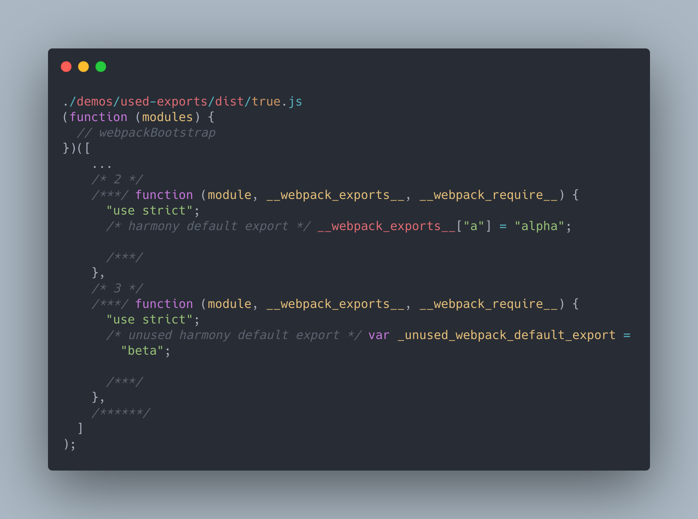
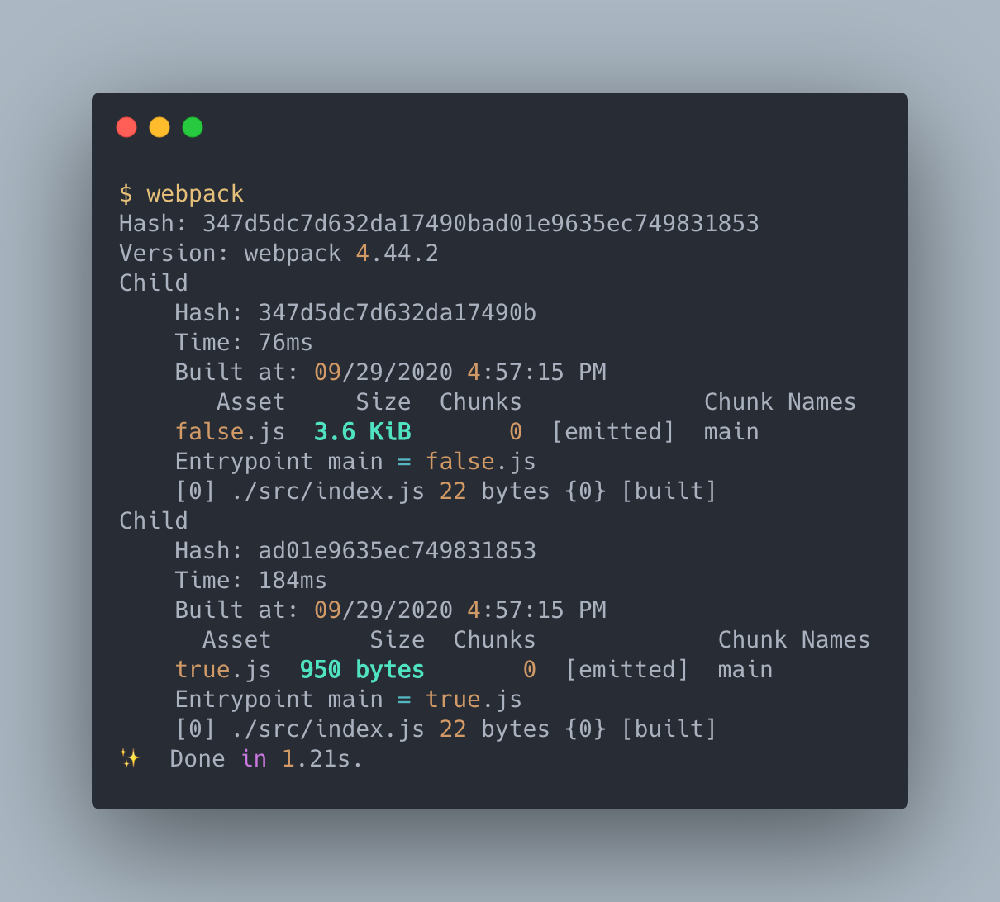

# 最佳化 Optimization

> 本文講述如何使用 webpack 的 `optimization` 配置各種輸出以配合設定最佳化。

> 本文的範例程式放在 [peterhpchen/webpack-quest](https://github.com/peterhpchen/webpack-quest/tree/master/posts/19-optimization/demos) 中，每個程式碼區塊的第一行都會標注檔案的位置，請搭配文章作參考。

在建置時，我們需要針對各個環境配置最佳的輸出方式，為此 webpack 提供了 `optimization` 屬性供使用者針對環境做配置。

## `optimization` 設定方式

`optimization` 擁有許多的屬性去設定各個關於 bundle 產出最佳化的配置。

```js
module.exports = {
  optimization: {
      ...
  },
};
```

接著我們會講解幾個重要的屬性。講解時使用的範例會配置 `none` 模式，避免模式設定影響結果，並且以各個數值作為 bundle 的檔名方便觀察。

## `optimization.namedModules`

`namedModules` 是個布林值，設定為 `true` 的時候，會將**輸出 bundle 中的模組加上名稱**。

我們使用下面的範例，個別產生出 `namedModules` 為 `true` 與 `false` 的結果。

```js
// ./demos/named-modules/webpack.config.js
module.exports = [true, false].map((namedModules) => ({
  mode: "none",
  output: {
    filename: `${namedModules}.js`,
  },
  optimization: {
    namedModules,
  },
}));
```


原本只有使用 `index` 作為識別，使用 `namedModules` 後，會改使用路徑作為識別，增加除錯的效率。

## `optimization.namedChunks`

`namedChunks` 為布林值，如果為 `true` 會將**輸出 Chunks 時的 ID 改為名稱**。

```js
// ./demos/named-chunks/webpack.config.js
module.exports = [false, true].map((namedChunks) => ({
  mode: "none",
  // entry: ['./src/index.js','./src/sub.js'],
  output: {
    filename: `${namedChunks}.js`,
  },
  optimization: {
    namedChunks,
  },
}));
```

執行結果如下：


當設定為 `false` 的時候， Chunks 欄位輸出的是 `index` ，當設為 `true` 時，會使用 Chunk Names 取代 `index` ，如此一來使用者可以清楚地知道 Chunks 對應的方式。

## `optimization.nodeEnv`

`nodeEnv` 可以設定**環境變數**。

```js
// ./demos/node-env/webpack.config.js
module.exports = ["development", "production"].map((nodeEnv) => ({
  mode: "none",
  output: {
    filename: `${nodeEnv}.js`,
  },
  optimization: {
    nodeEnv,
  },
}));
```

這個例子中產生兩個 bundle ，一個注入 `development` ，一個注入 `production` 。

`index.js` 如下所示：

```js
// ./demos/node-env/src/index.js
console.log(process.env.NODE_ENV);
```

建置出來後， bundle 的內容如下：

```js
// ./demos/node-env/dist/development.js
(function (modules) {
  // webpackBootstrap
  ...
})([function (module, exports) {
      console.log("development");
    },
  ]
);
```

可以看到 `process.env.NODE_ENV` 被置換為我們所配置的 `development` 。

## `optimization.flagIncludedChunks`

`flagIncludedChunks` 會標示出 bundle 中個別的 Chunks 。

這個例子有三個 `entry`：`index.js`, `sub.js`, `normal.js` ， `sub.js` 相依 `normal.js` ，而 `index.js` 相依 `sub.js` ，下面是配置：

```js
// ./demos/flag-included-chunks/webpack.config.js
module.exports = [false, true].map((flagIncludedChunks) => ({
  mode: "none",
  entry: {
    main: "./src/index.js",
    sub: "./src/sub.js",
    normal: "./src/normal.js",
  },
  output: {
    filename: `[name].${flagIncludedChunks}.js`,
  },
  optimization: {
    flagIncludedChunks,
  },
}));
```

建置結果如下：


在設定 `flagIncludedChunks` 前，所有的 bundle 只會顯示輸出的 Chunks ID ，開啟 `flagIncludedChunks` 後，可以看到輸出 Chunks 的資訊會跟 Module index 相同，由此可以知道 bundle 內有哪些 Chunks 。

## `optimization.sideEffects`

`sideEffects` 啟用時，會去觀察 module 的 `package.json` 的 `sideEffects` 設定，如果設定 `true` ，代表此 module 全部都只有 export 的代碼，沒有自己執行並影響全域的行為，這樣一來 webpack 可以將未引入的部分代碼排除在 bundle 中，以減少 bundle 的大小。

範例 `./demos/side-effects` 有使用 `./demos/sife-effects/modules/module` 中的模組，此模組會有兩個引入的模組：

```js
// ./demos/side-effects/modules/module/index.js
import alpha from "./alpha";
import beta from "./beta";

export { alpha, beta };
```

但在 `./src/index.js` 中只有引入 `alpha`：

```js
// ./demos/side-effects/src/index.js
import { alpha } from "../modules/module";

console.log(alpha);
```

然後配置檔內容如下：

```js
// ./demos/side-effects/webpack.config.js
module.exports = [false, true].map((sideEffects) => ({
  mode: "none",
  output: {
    filename: `${sideEffects}.js`,
  },
  optimization: {
    sideEffects,
  },
}));
```

建置後的在 `sideEffects` 啟用的狀況下， `beta` 會被刪除：


可以看到原本 `false` 的時候，有引入 `beta` ，在啟用後， webpack 發現 `beta` 沒有使用，就將其排除了。

## `optimization.usedExports`

`usedExports` 啟用後， webpack 會使用 `terser` 去識別各個模組是否有 side effects ，如果沒有的話，不將其引入。

與上面 `sideEffects` 相同的例子，我們可以改啟用 `usedExports` ，結果如下：



可以看到 `beta` 的內容雖然存在於 bundle 中，但已經沒有引入了。

## `optimization.occurrenceOrder`

`occurrenceOrder` 會將 modules **依照引用的次序產生 index** 。

配置如下：

```js
// ./demos/occurrence-order/webpack.config.js
module.exports = [false, true].map((occurrenceOrder) => ({
  mode: "none",
  entry: {
    main: "./src/index.js",
    sub: "./src/sub.js",
    normal: "./src/normal.js",
  },
  output: {
    filename: `[name].${occurrenceOrder}.js`,
  },
  optimization: {
    occurrenceOrder,
  },
}));
```

建置後順序為：

```plaintext
// ./demos/occurrence-order/dist/main.false.js
0: index.js
1: sub.js
2: normal.js

// ./demos/occurrence-order/dist/main.true.js
0: normal.js
1: sub.js
2: index.js
```

使用 `occurrenceOrder` 後會將最多引用的 `normal.js` 擺在第一個，藉以增加效能。

## `optimization.concatenateModules`

`concatenateModules` 會經由模組圖 module graph 的分析，安全地**將模組盡量做合併**，以達到較好的效能。

配置如下：

```js
// ./demos/concatenate-modules/webpack.config.js
module.exports = [false, true].map((concatenateModules) => ({
  mode: "none",
  output: {
    filename: `${concatenateModules}.js`,
  },
  optimization: {
    concatenateModules,
  },
}));
```

沒啟用時建置結果如下：


可以看到 webpack 依照每個模組拆分代碼。

啟用後的結果如下：


## `optimization.minimize`

`minimize` 屬性設定是否要壓縮 bundle ，預設使用 [TerserPlugin](https://webpack.js.org/plugins/terser-webpack-plugin/) 做壓縮的處理。

```js
// ./demos/minimize/webpack.config.js
module.exports = [false, true].map((minimize) => ({
  mode: "none",
  output: {
    filename: `${minimize}.js`,
  },
  optimization: {
    minimize,
  },
}));
```

使用後會做壓縮的動作，因此 bundle 的大小會縮小：



## 預設配置模式 `mode`

前面說了很多的最佳化設定屬性，如果要自己做調整，會變得很繁雜，為此 webpack 提供了預設的配置模式，只要使用者使用模式設定，對於目標環境的最佳預設值就會被設置，以減少自己配置的花費。

模式預設有三個 `none`, `development`, `production` 。

| 模式          | 描述                                                                                                                                                                                    |
| ------------- | --------------------------------------------------------------------------------------------------------------------------------------------------------------------------------------- |
| `development` | 依照開發環境做配置，會將 `namedModules` 與 `namedChunks` 啟用，並將 `process.env.NODE_ENV` 設為 `development` 。                                                                        |
| `production`  | 依照生產環境做配置，會將 `flagIncludedChunks`, `occurrenceOrder`, `sideEffects`, `usedExports`, `concatenateModules`, `minimize` 啟用，並將 `process.env.NODE_ENV` 設為 `production` 。 |
| `none`        | 不預設模式，所有的配置按照預設值設定。                                                                                                                                                  |

## 總結

`optimization` 設定給了使用者決定要如何輸出 bundle 的能力，可以依照不同的環境，產生期望的 bundle ，而 webpack 也提供了 `mode` 供使用者配置預設的環境設定，以減少使用者的負擔。

這裡沒有講到 `optimization` 的 `splitChunks` 配置，這是可以決定要如何切割 Chunk 的設定，在之後的篇幅中會做介紹。

## 參考資料

- [Webpack Documentation: Configuration - Optimization](https://v4.webpack.js.org/configuration/optimization/)
- [Webpack Documentation: Configuration - Mode](https://v4.webpack.js.org/configuration/mode/)
- [显微镜下的 webpack4 的新特性：mode 详解](https://juejin.im/post/6844903695033843726)
- [Webpack Documentation: Guides - Tree Shaking](https://v4.webpack.js.org/guides/tree-shaking/#clarifying-tree-shaking-and-sideeffects)
