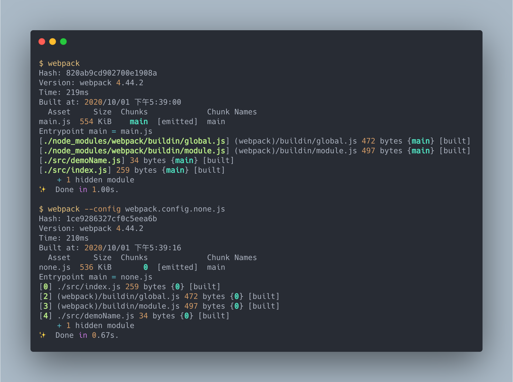
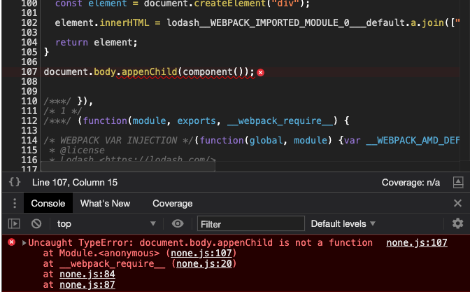
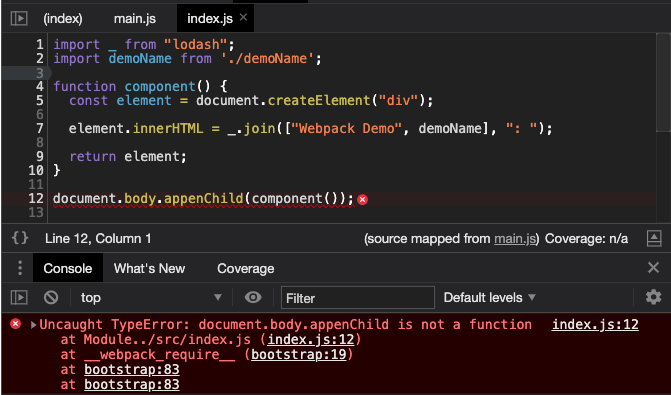
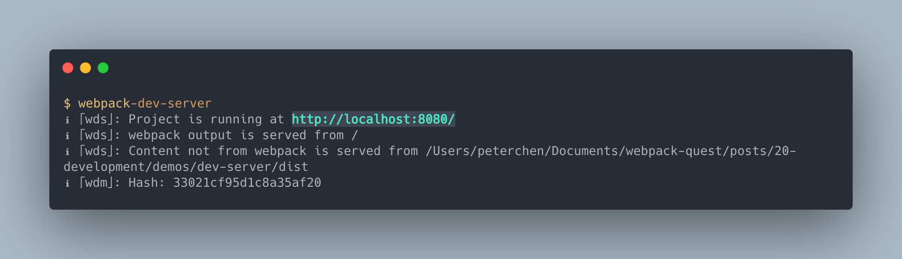
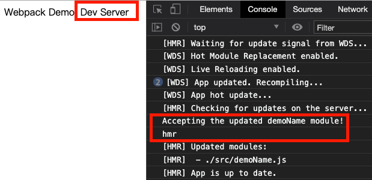
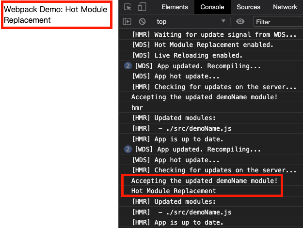

# 建立 webpack 開發環境

> 使用 webpack 建立大型專案的開發環境。

> 本文的範例程式放在 [peterhpchen/webpack-quest](https://github.com/peterhpchen/webpack-quest/tree/master/posts/20-development/demos) 中，每個程式碼區塊的第一行都會標注檔案的位置，請搭配文章作參考。

在做一件事時，第一要務就是要把環境弄得舒適，只有舒適的環境，我們才能有好的產出。開發程式的第一件事也是如此，本文會講解如何使用 webpack 創造出舒適有效率的開發環境，增加開發者的效率。

## 使用 `development` 模式

將 `mode` 設置為 `development` ，指示 webpack 開啟開發模式：

```js
// ./demos/development-mode/webpack.config.js
module.exports = {
  mode: "development",
};
```

建置結果如下：



`development` 模式下，輸出的結果中 Modules 與 Chunks 都會是人可識別的名字，而非是單純的編號，讓開發者容易辨識。

## 使用 Source Map

由於 webpack 會將多個檔案合併，因此實際在瀏覽器上執行的會與原來開發者所撰寫的代碼有所不同這時會造成 Debug 的困難。



可以看到上面沒有使用 Source Map 時瀏覽器會直接拿 bundle 的內容檔做除錯的依據，這對於除錯來說非常的困難。

現在我們在配置中加入 `devtool` 設置 Source Map：

```js
// ./demos/source-map/webpack.config.js
module.exports = {
    ...
    devtool: 'inline-source-map'
}
```

現在再看瀏覽器的 Dev Tool 中的報錯及代碼內容：



瀏覽器識別了 Source Map 的內容，將代碼對應回了開發時撰寫的內容，使除錯更加方便。

## 使用 Dev Server

到這裡，我們已經可以開發時期掌握代碼的動向了，藉由 `development` 模式輸出 Modules 與 Chunks 的名稱，我們可以看懂建置出來的 bundle 組成。也利用了 Source Map 將除錯時的對象從 bundle 檔內容轉為我們所撰寫的代碼內容，除錯已經沒有阻礙了。

但在開發時，我們常常需要觀察代碼的成果，這使我們必須啟動測試的伺服器，並反覆建置修改伺服器中檔案的內容，以此來看到結果，這麻煩的建置流程使開發效率降低。

這裡我們使用 `webpack-dev-server` 開啟伺服器並開啟監聽模式。

首先先下載 `webpack-dev-server`：

```bash
npm install webpack-dev-server -D
```

將指令換為 `webpack-dev-server` ：

```js
// ./demos/dev-server/package.json
{
    ...
  "scripts": {
    "dev": "webpack-dev-server"
  },
  ...
}
```

接著修改 `webpack.config.js` ：

```js
// ./demos/dev-server/webpack.config.js
const path = require('path')

module.exports = {
    ...
    devServer: {
        contentBase: path.resolve(__dirname, './dist')
    }
}
```

`contentBase` 設定 Dev Server 要以哪個目錄為伺服器的根目錄，由於 `index.html` 在 `./dist` 目錄中，因此修改 `contentBase` 的設定。

執行後可以看到 Dev Server 已經跑在 `http://localhost:8080` ：



試著修改代碼，可以看到瀏覽器自動的更新了。

> 這裡可以注意 Dev Server 在跑的時候，不會在實際的 `./dist` 資料夾中產生 bundle ，它會將產生的檔案存在 Memory 。

## 使用 `html-webpack-plugin` 產生 `index.html`

前面的例子中 `index.html` 是個靜態檔，這樣會有下面的問題：

- 需要我們自己知道 bundle 檔的目錄及檔名，才能在 `index.html` 中正確的載入 bundle 。
- 需要跟 Dev Server 說 `index.html` 在哪個目錄中，才能在正確位置啟動伺服器。

為了避免這些問題，我們可以用 `html-webpack-plugin` 這個插件自動建立 `index.html` 。

首先安裝:

```bash
npm install html-webpack-plugin -D
```

然後在配置檔中刪除 `contentBase` ，並且加上 `html-webpack-plugin` 設定：

```js
// ./demos/auto-create-html/webpack.config.js

...

const HtmlWebpackPlugin = require('html-webpack-plugin')

module.exports = {
   ...
    plugins: [
        new HtmlWebpackPlugin()
    ]
}
```

`html-webpack-plugin` 預設會產生 index.html 並且將引入 bundle 的 `<script>` 加到 html 檔案中。

如此一來，我們就可以刪除 `./dist/index.html` 了。刪除後啟用 Dev Server 可以看到跟預期一樣的顯示結果了。

## 配置改變時自動重新建置

由於 Dev Server 的監聽範圍僅限專案的內容，並不包括其他的檔案，因此在上節加上 `html-webpack-plugin` 的時候，我們修改了 `webpack.config.js` ，但是並不會重新建置。

這時就需要 `nodemon` 的幫助，這是一個可以偵測 node.js 程式並自動重載的工具，首先先安裝：

```bash
npm install nodemon -D
```

接著修改指令：

```json
// ./demos/reload-config/package.json
{
  "name": "development-mode",
  "version": "1.0.0",
  "main": "index.js",
  "license": "MIT",
  "scripts": {
    "dev": "nodemon --watch webpack.config.js ./node_modules/.bin/webpack-dev-server"
  },
  "devDependencies": {
    "html-webpack-plugin": "^4.5.0",
    "nodemon": "^2.0.4",
    "webpack": "^4.44.2",
    "webpack-cli": "^3.3.12",
    "webpack-dev-server": "^3.11.0"
  },
  "dependencies": {
    "lodash": "^4.17.20"
  }
}
```

我們配置 `nodemone` 去監看 `webpack.config.js` ，只要發生變化，就重新啟動 Dev Server ，如此一來，就不用在配置改變時手動重啟 Dev Server 了。

## 模組熱替換 Hot Module Replacement

前面的例子雖然在修改檔案後會更新瀏覽器，但如果只是一小部分的修改，就讓整個網頁重整，會消耗不必要的資源，因此 Dev Server 提供了模組熱替換的功能，它能在不重整整個網頁的情況下，更新一小部分的內容。

首先要開啟 `devServer.hot`:

```js
// ./demos/hmr/webpack.config.js

...

module.exports = {
    ...
    devServer: {
        hot: true
    },
    ...
}
```

接著在 `index.js` 偵測 `demoName.js` 的修改：

```js
// ./demos/hmr/src/index.js
import _ from "lodash";
import demoName from "./demoName";

function component() {
  const element = document.createElement("div");

  element.innerHTML = _.join(["Webpack Demo", demoName], ": ");

  return element;
}

let element = component();

document.body.appendChild(element);

if (module.hot) {
  module.hot.accept("./demoName", function () {
    console.log("Accepting the updated demoName module!");
    console.log(demoName);
  });
}
```

這裡偵測 `./demoName` ，只要更新了，就在 console 輸出 `demoName` 新的內容。

結果如下：



我們將原本 `demoName` 中的 `Dev Server` 改為 `hmr` ，可以看到 Console 中輸出了新的內容。

畫面內容就可以在這 callback 中做更新：

```js
// ./demos/hmr/src/index.js
import _ from "lodash";
import demoName from "./demoName";

function component() {
  const element = document.createElement("div");

  element.innerHTML = _.join(["Webpack Demo", demoName], ": ");

  return element;
}

let element = component();

document.body.appendChild(element);

if (module.hot) {
  module.hot.accept("./demoName", function () {
    console.log("Accepting the updated demoName module!");
    console.log(demoName);

    document.body.removeChild(element);

    element = component();

    document.body.appendChild(element);
  });
}
```

結果如下：



可以看到畫面產生變化了。

要處理模組熱替換是很複雜的，就像上面的例子一樣，還要自己手動處理顯示的部分，還好很多的 Loader 會幫我們處理掉熱替換的程序，像是 vue-loader 支援 `.vue` 檔的熱替換，而 `style-loader` 可以處理 Style 的部分。

## 總結

開發環境對於工程師是非常重要的，如何使用 webpack 建立舒適的開發環境是很重要的課題。

本文利用 development 模式開啟開發模式，讓 Modules 與 Chunks 輸出名稱，並使用 Source Map 讓除錯目標可以維持原本的代碼，而 Dev Server 帶給我們監聽模式與測試伺服器的配置，熱替換使用我們在整頁更新的基礎下做更微小的更新，增加開發上的效率。

## 參考資料

- [Webpack Documentation: Concepts - Hot Module Replacement](https://webpack.js.org/concepts/hot-module-replacement/)
- [Webpack Documentation: Guides - Hot Module Replacement](https://webpack.js.org/guides/hot-module-replacement/)
- [Webpack Documentation: Guides - Development](https://webpack.js.org/guides/development/)
- [nodemon](https://nodemon.io/)
- [GitHub: webpack-dev-server - Restart after config change #440](https://github.com/webpack/webpack-dev-server/issues/440#issuecomment-205757892)
