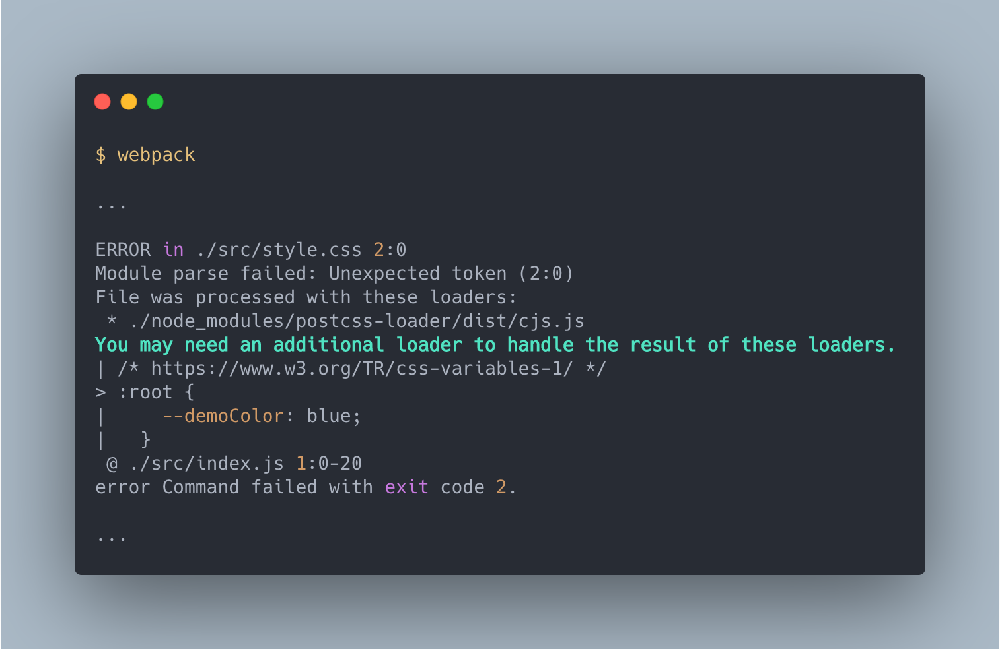

# 使用 Style

> 本文講述如何在 webpack 中處理 Style 樣式表。

> 本文的範例程式放在 [peterhpchen/webpack-quest](https://github.com/peterhpchen/webpack-quest/tree/master/posts/22-style/demos) 中，每個程式碼區塊的第一行都會標注檔案的位置，請搭配文章作參考。

Style 的語言 CSS 與 JavaScript 有著相同的問題，依照瀏覽器不同，支援程度也不相同，因此 CSS 也需要一個像是 Babel 的工具來幫助開發者將新的語法轉為舊版的語法。

## PostCSS

PostCSS 可以將 CSS 丟給不同的 Plugins 處理，最後產生擁有 Plugins 所賦予能力的 Style 。

現在我們來嘗試使用 PostCSS 將新語法的 CSS 轉為舊的語法。

### 安裝 PostCSS

首先安裝 PostCSS:

```bash
npm install postcss postcss-cli -D
```

- `postcss`: PostCSS 的核心庫，負責建置流程
- `postcss-cli`: PostCSS 的 CLI 工具，供使用者使用 CLI 執行 PostCSS

### 執行 PostCSS

接著使用 CLI 執行 PostCSS:

```bash
postcss src/style.css --dir dist
```

- `src/style.css`: 欲轉換的 `.css`
- `--dir dist`: 輸出的目錄位置

建置結果如下:


可以看到檔案內容除了加上 Source Map 外其他都與原本的相同，這是因為 PostCSS 本身只是個建置工具（就像是 Babel），它沒有任何轉換的功能，需要仰賴 Plugins 的幫助才能轉換 CSS 代碼。

### 使用 `postcss-preset-env` 轉換代碼

現在我們想要將擁有新語法的 `.css` 內容轉為舊版本相容的語法，這時就可以藉由 PostCSS 的 `postcss-preset-env` Plugin :

```bash
npm install postcss-preset-env -D
```

接著告訴 PostCSS 要使用此 Plugin 並執行 PostCSS:

```bash
postcss src/style.css --dir dist --use postcss-preset-env
```

- `--use`: 設定要使用的 Plugins

執行結果如下:


我們看到 `./src/style.css` 的內容已經變為舊版本的語法了。

### 使用配置檔設定 PostCSS

使用 CLI 設定雖然簡單，但只要配置複雜，就會變得難以維護，因此 PostCSS 提供了配置檔的方式做設定:

```js
// ./demos/postcss-config/postcss.config.js
module.exports = {
  map: true,
  plugins: [require("postcss-preset-env")()],
};
```

這裡我們開啟 Source Map (`map: true`) ，以及在 `plugins` 中引入 `postcss-preset-env` 。

建置結果會與上節相同。

### 使用 `.browserslistrc` 配置目標環境

預設 `postcss-preset-env` 會將目標對象視為 browserslist 的 [`defaults` 值](https://github.com/browserslist/browserslist#full-list)。

我們可以自己使用 `.browserslistrc` 做目標的調整:

```yaml
// ./demos/postcss-browserslist/.browserslistrc
> 5%
```

重新建置後會發現，變數沒有做轉換了，這是因為在範圍內的瀏覽器都已經支援 css 變數的語法。

## 將 CSS 載入至 Webpack 中

上面我們已經可以在開發時使用新的 Style 語法，而在編譯後變為舊語法了，現在終於要將 `.css` 引入 webpack 中了。

```bash
npm install postcss-loader -D
```

接個配置設定:

```js
// ./demos/postcss-loader/webpack.config.js
module.exports = {
  module: {
    rules: [
      {
        test: /\.css$/,
        use: [
          {
            loader: "postcss-loader",
          },
        ],
      },
    ],
  },
};
```

我們為 `.css` 配置 `post-loader` ，建置後發生下面的錯誤:



這是因為 PostCSS 只幫忙處理 CSS 的語法相關的轉換，並沒有將其轉為 webpack 理解的 JavaScrtip ，為了要載入 webpack 我們需要藉由 `css-loader` 的幫助。

### 使用 `css-loader` 載入 Style 至 JavaScript 中

先安裝 `css-loader` :

```bash
npm install css-loader -D
```

然後加進配置中:

```js
// ./demos/css-loader/webpack.config.js
module.exports = {
  mode: "none",
  module: {
    rules: [
      {
        test: /\.css$/,
        use: [
          {
            loader: "css-loader",
          },
          {
            loader: "postcss-loader",
          },
        ],
      },
    ],
  },
};
```

建置結果如下:


可以看到 `./src/style.css` 正常的引入了，可以放到瀏覽器上執行時，會發現 Style 並沒有按照預期載入至 `<style>` 中，這是因為 `css-loader` 只負責解析並載入 `.css` 內容，並不負責將其載入至 Document 中。

### 使用 `style-loader` 載入 CSS 內容至 Document 中

藉由 `style-loader` 的幫助，可以幫我們嵌入 `.css` 內容至 Document 中:

```bash
npm install style-loader -D
```

接著在配置中加上 `style-loader`:

```js
// ./demos/style-loader/webpack.config.js
module.exports = {
  mode: "none",
  module: {
    rules: [
      {
        test: /\.css$/,
        use: [
          {
            loader: "style-loader",
          },
          {
            loader: "css-loader",
          },
          {
            loader: "postcss-loader",
          },
        ],
      },
    ],
  },
};
```

建置後執行 bundle 會發現 `style.css` 內容加到 Document 中了:


## 將 CSS 拆分至獨立檔案

在開發時，使用 `style-loader` 從 `.js` 檔中直接引入 Style 是足夠的，但是在開發環境時，如果樣式有問題時，嵌入的 Style 會難以除錯，這時如果可以保持獨立的 `.css` 檔的狀況下，每個 `.js` 個別引入了哪些樣式也可以識別，對於除錯是很好的幫助。這時可以借助 `mini-css-extract-plugin` 的幫助，讓我們可以將 css 獨立出來成為單一檔案由 HTML 引入。

### 使用 `mini-css-extract-plugin`

首先安裝:

```bash
npm install mini-css-extract-plugin -D
```

接著加入配置:

```js
// ./demos/extract-css/webpack.config.js
const MiniCssExtractPlugin = require("mini-css-extract-plugin");
const HtmlWebpackPlugin = require("html-webpack-plugin");

module.exports = {
  mode: "none",
  module: {
    rules: [
      {
        test: /\.css$/,
        use: [
          {
            loader: MiniCssExtractPlugin.loader,
          },
          {
            loader: "css-loader",
          },
          {
            loader: "postcss-loader",
          },
        ],
      },
    ],
  },
  plugins: [new HtmlWebpackPlugin(), new MiniCssExtractPlugin()],
};
```

這裡有幾點要注意:

- 不需要使用 `style-loader` ，因此從中刪去
- 加入 `mini-css-extract-plugin` 的 loader 以處理 CSS
- 加入 `mini-css-extract-plugin` 產生獨立的 style 檔案
- 加入 `html-webpack-plugin` 自動引入 `.js` 與 `.css` 檔案

接著建置結果如下:


可以看到多了 `main.css` 輸出，並且 Chunk ID 與 `main.js` 相同，代表是由相同的 Chunk `./src/index.js` 所切割出來的。

另外 `html-webpack-plugin` 建立出來的 `index.html` 中也可以看到自動引入了 `main.css`:

```html
<!-- ./demos/extract-css/dist/index.html -->
<!DOCTYPE html>
<html>
  <head>
    <meta charset="utf-8" />
    <title>Webpack App</title>
    <meta name="viewport" content="width=device-width, initial-scale=1" />
    <link href="main.css" rel="stylesheet" />
  </head>
  <body>
    <script src="main.js"></script>
  </body>
</html>
```

這樣一來，我們就可以清楚地看到樣式的出處了。

## 總結

為了使用新版本的樣式語法，需要藉由 PostCSS 及其 Plugin `postcss-preset-env` 的幫助，依照 `browserslist` 的設定做對應的轉換。

webpack 中要使用 `css-loader` 將 `.css` 內容轉為 JavaScript ，並還要借助 `style-loader` 的幫助嵌入 Document 中。如果想要建立獨立的 `.css` 匯出，可以使用 `mini-css-extract-plugin` ，它會依照引用的 `.js` 分割出個別的樣式表，另外再藉由 `html-webpack-plugin` 的幫助自動引入到 HTML 中。

## 參考資料

- [GitHub: postcss / postcss](https://github.com/postcss/postcss)
- [postcss-preset-env](https://preset-env.cssdb.org/)
- [GitHub: postcss / postcss-load-config](https://github.com/postcss/postcss-load-config)
- [GitHub: browserslist / browserslist](https://github.com/browserslist/browserslist)
