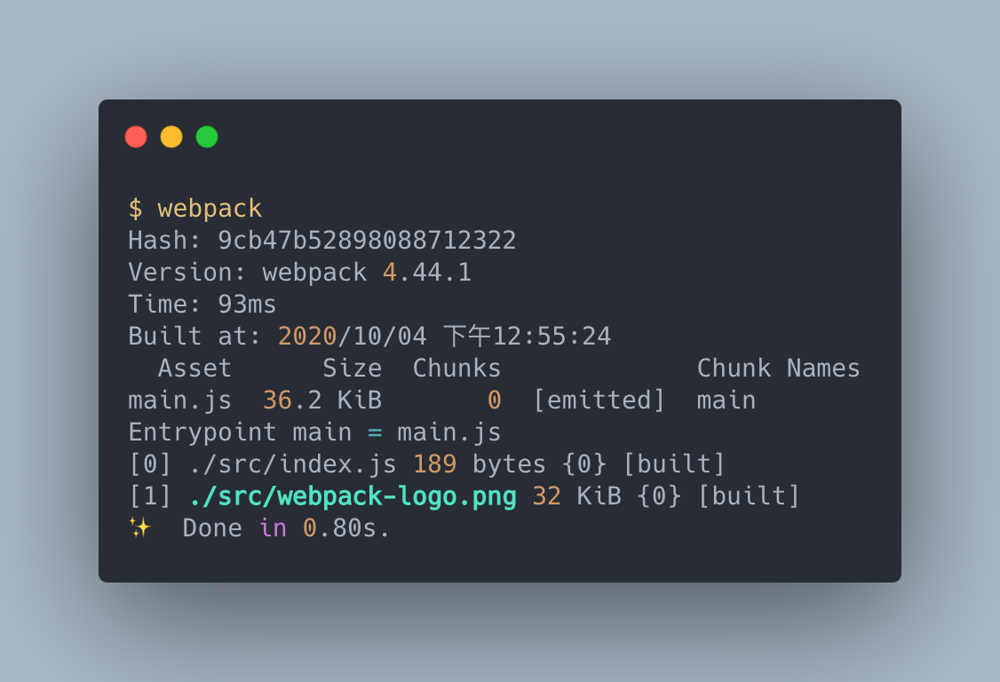

# 載入圖片資源

> 本文介紹如何使用 webpack 載入圖片資源，並對載入做最佳化處理。

> 本文的範例程式放在 [peterhpchen/webpack-quest](https://github.com/peterhpchen/webpack-quest/tree/master/posts/23-image/demos) 中，每個程式碼區塊的第一行都會標注檔案的位置，請搭配文章作參考。

網頁載入圖片的方式有很多，可以直接用路徑載入，或是轉為 data URL 載入， svg 格式甚至可以用 inline 的方式嵌入 HTML 。這些載入方式都可以藉由 webpack 來達成，甚至做最佳化的處理。接下來就來講解如何使用 webpack 載入圖片資源。

## 使用路徑載入

使用 `file-loader` 載入的圖片會被放到輸出的路徑下，並且將引入的路徑轉為輸出的路徑。

### 安裝 `file-loader`

```bash
npm install -D file-loader
```

### 配置 `file-loader`

在配置檔中加入 `file-loader`:

```js
// ./demos/load-image-by-path/webpack.config.js
const HtmlWebpackPlugin = require("html-webpack-plugin");

module.exports = {
  mode: "none",
  module: {
    rules: [
      {
        test: /\.png$/,
        loader: "file-loader",
      },
    ],
  },
  plugins: [new HtmlWebpackPlugin()],
};
```

建置結果如下：


可以看到圖片的名字被編為 hash 並存進 `./dist` 中了。

接著來看 bundle 內容：


模組的內容已經被 `file-loader` 轉為對應的檔名了，我們只要用平常引入模組的方式使用即可：

```js
// ./demos/load-image-by-url/src/index.js
import WebpackLogo from "./webpack-logo.png";

function logo(url) {
  const element = new Image();

  element.src = url;

  return element;
}

document.body.appendChild(logo(WebpackLogo));
```

## 使用 Data URL 載入圖片

圖片使用路徑載入時會需要多一次的請求以取得資源，這對於大圖片來說是可以接受的，但對於 icon 之類的小圖示，花費請求是浪費的，數量一多，會造成效能降低。

為了避免上述的問題，我們可以將圖片轉為 Data URL 直接寫在引用的位置中，如此一來就不需要再次請求了，為此我們需要引入 `url-loader`：

```bash
npm install url-loader -D
```

接著在配置檔將 `file-loader` 替換成 `url-loader`：

```js
// ./demos/load-image-by-url/webpack.config.js
module.exports = {
  mode: "none",
  module: {
    rules: [
      {
        test: /\.png$/,
        use: [
          {
            loader: "url-loader",
          },
        ],
      },
    ],
  },
};
```

建置結果如下：



發現到圖片檔不在輸出的結果內了，但是 webpack 確實有處理 `webpack-logo.png` 。

接著我們看一下 bundle 的內容：


可以看到圖片的內容已經被編譯為 Data URL 了，我們只需要做平常的引入就好。

## 適時切換路徑與 Data URL 載入的方式

前面有提到大圖片還是比較合適使用路徑的引入方式，因此 `url-loader` 讓我們可以用檔案大小決定要使用的 Loaders ，我們可以設定 `url-loader` 選項中的 `limit` ，當檔案大小超過這個數值時，預設會使用 `file-loader` 做處理：

```js
// ./demos/load-image-by-url/webpack.config.js
module.exports = {
  mode: "none",
  module: {
    rules: [
      {
        test: /\.png$/,
        use: [
          {
            loader: "url-loader",
            options: {
              limit: 10240,
            },
          },
        ],
      },
    ],
  },
};
```

`limit` 的單位是 bytes ，上面的設定在 10 KB 以上的圖片會由 `file-loader` 做處理。

> `url-loader` 不會安裝 `file-loader` ，如果要使用 `limit` 設定，請自行安裝 `file-loader` 。

## 載入 SVG

SVG 格式的檔案與一般圖片不同，他可以被視為合法的 HTML tag ，因此我們可以直接將其內容嵌入 HTML 中。

### 使用 `svg-inline-loader`

`svg-inline-loader` 可以幫助我們在 HTML 中嵌入 SVG ，首先安裝 loader：

```bash
npm install svg-inline-loader -D
```

針對 `.svg` 使用 `svg-inline-loader`：

```js
// ./demos/load-svg/webpack.config.js
module.exports = {
  mode: "none",
  module: {
    rules: [
      {
        test: /\.svg$/,
        use: [
          {
            loader: "svg-inline-loader",
          },
        ],
      },
    ],
  },
};
```

因為建置出來的模組會變為 HTML 代碼，因此要修改嵌入方式：

```js
// ./demos/load-svg/src/index.js
import WebpackLogo from "./webpack-logo.svg";

document.body.innerHTML = WebpackLogo;
```

直接將 SVG 的內容填進 `body` 中就可以了。

SVG 格式的圖片在 inline 的狀態下才可以被 CSS 做顏色及動畫的變化，當然 inline 也會造成無法 cache 與 HTML 佈局比較亂等問題，這些  就要看使用者本身的取捨了。

## 總結

下表總結三個 Loaders 的使用時機:

| Loader              | 使用時機                                 |
| ------------------- | ---------------------------------------- |
| `file-loader`       | 引入的圖片大小較大時                     |
| `url-loader`        | 引入的圖片大小較小時，像是 Icon 等小圖示 |
| `svg-inline-loader` | 載入的圖片為 SVG 格式時                  |

圖片可以使用 `file-loader` 直接引入，也可以用 `url-loader` 編譯為 Data URL 後在代碼中寫進圖片，最後 SVG 可以使用 `svg-inline-loader` 保持 inline 的方式以確保 SVG 的各個特性沒有遺失。

webpack 本身是不支援引入圖片類的檔案的，它會利用各種 Loaders 去引入圖片，雖然結果都相同，但是引入的方法可以很有彈性的依照需求做變化。這裏就看出了 Loaders 強大的能力，在其他的資源中也都可以利用這樣的處理方式帶給應用程式更大的效能。

## 參考資料

- [Webpack Documentation: Loaders - file-loader](https://webpack.js.org/loaders/file-loader/)
- [Webpack Documentation: Loaders - url-loader](https://webpack.js.org/loaders/url-loader/)
- [Webpack Documentation: Loaders - svg-inline-loader](https://webpack.js.org/loaders/svg-inline-loader/)
