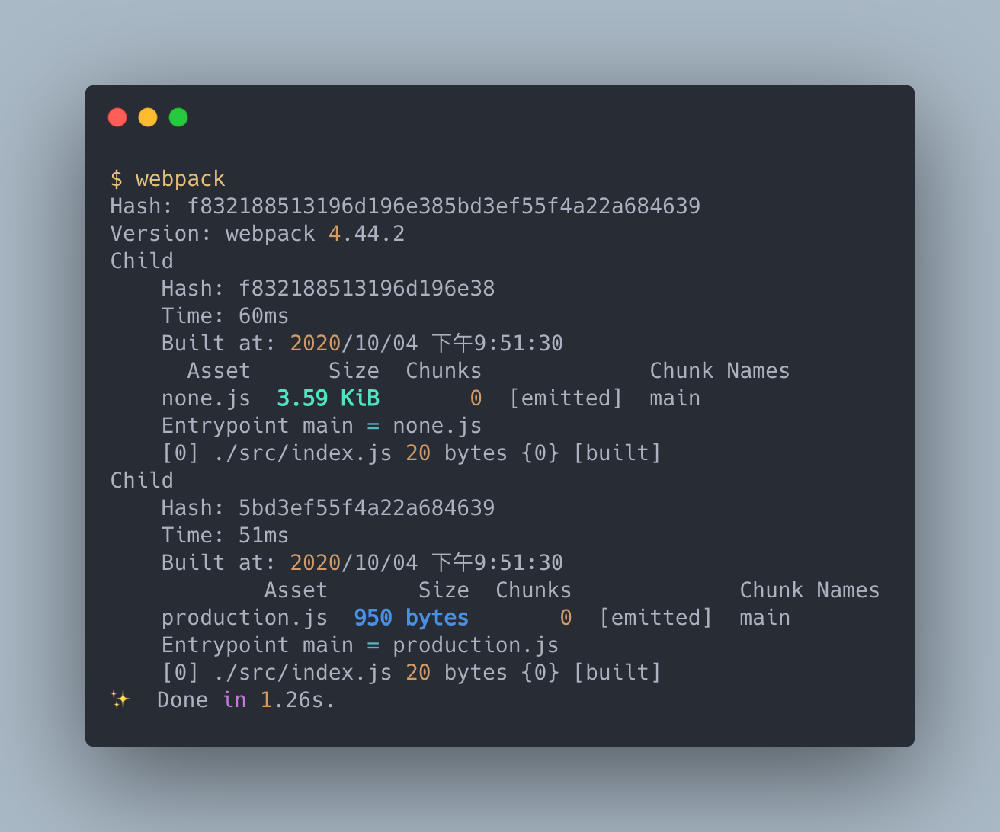
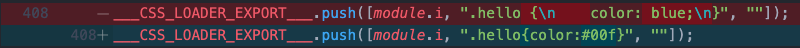
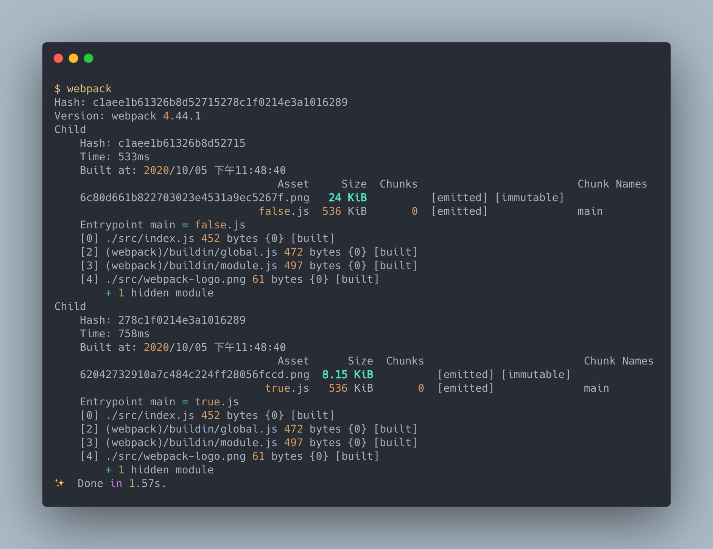
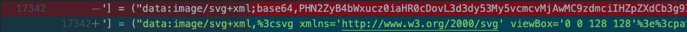

# 建立 webpack 生產環境 - 減小體積

> 本文講述使用 webpack 建立生產環境中代碼減少體積的優化方式。

> 本文的範例程式放在 [peterhpchen/webpack-quest](https://github.com/peterhpchen/webpack-quest/tree/master/posts/24-production-minimize/demos) 中，每個程式碼區塊的第一行都會標注檔案的位置，請搭配文章作參考。

在真正的產品環境時，能將代碼的容量縮小，減少請求的時間，是開發者的目標之一。 webpack 可以在依照設定對代碼做壓縮、減少等處理，以達到優化的目的。

## 開啟 `production` 模式

webpack 使用模式 `mode` 來設定預設的最佳化配置，當目標環境為生產模式時，我們可以將 `mode` 設為 `production`，下面的配置輸出 `none` 與 `production` 的 bundle 供比較:

```js
// ./demos/production-mode/webpack.config.js
module.exports = ["none", "production"].map((mode) => ({
  mode,
  output: {
    filename: `${mode}.js`,
  },
}));
```

建置結果如下:



可以看到在沒有最佳化的狀態下(`none`)的 bundle 容量大於 `production` 模式下的最佳化處理很多。

`production` 模式做了許多優化的處理:

- 使用 terser 壓縮代碼
- 設定 `process.env.NODE_ENV` 為 `production`
- Tree Shaking
- Module Concatenation

webpack 的 `production` 模式已經將大部分減少體積的優化做好了，接下來本文會討論各個減少體積的策略與方法，配合 `production` 模式可以達到事半功倍的效果。

## 縮小 JavaScript 的體積

webpack 提供了 `optimization.minimize` 與 `optimization.minimizer` 配置供使用者設定使否啟用最小化以及如何處理最小化。

預設的 `minimizer` 是使用 `terser-webpack-plugin` 做最小化的處理，而 `minimize` 在 `production` 模式下預設是開啟的，你也可以手動開啟:

```js
// ./demos/optimization-minimize/webpack.config.js
const TerserWebpackPlugin = require("terser-webpack-plugin");
const ClosureWebpackPlugin = require("closure-webpack-plugin");

module.exports = [
  { name: "terser", plugin: TerserWebpackPlugin },
  { name: "closure", plugin: ClosureWebpackPlugin },
].map((minimizer) => ({
  mode: "none",
  output: {
    filename: `${minimizer.name}.js`,
  },
  optimization: {
    minimize: true,
    minimizer: [new minimizer.plugin()],
  },
}));
```

這裡使用了 webpack 預設的 [terser](https://terser.org/) 與 Google 的 [Closure Compiler](https://developers.google.com/closure/compiler) 輸出個別的 bundle 。大家可以觀察看哪個比較合適你。

## 善用環境變數

不僅是在 webpack 的配置中，在專案的代碼中，我們也有需要判斷是在哪個環境下而做不同的處理，例如在不同模式下要顯示不同的 Log:

```js
// ./demos/optimization-node-env/src/index.js
if (process.env.NODE_ENV === "production") {
  console.log("production");
}
if (process.env.NODE_ENV === "development") {
  console.log("development");
}
```

配置如下:

```js
// ./demos/optimization-node-env/webpack.config.js
module.exports = {
  mode: "none",
  optimization: {
    nodeEnv: "production",
    minimize: true,
  },
};
```

- `nodeEnv` 設為 `production` ，因此 `process.env.NODE_ENV = 'production'`
- 開啟 `minimize`

如此一來上面的 `index.js` 會被 webpack 視為:

```js
if ("production" === "production") {
  console.log("production");
}
if ("production" === "development") {
  console.log("development");
}
```

`minimizer`(預設是 terser) 會將 dead code 刪除:

```js
console.log("production");
```

直接剩下一行 `console.log('production')`，大大減少了容量。

`optimization.nodeEnv` 在 `development` 及 `production` 模式下會被預設同為模式名稱。

## Tree Shaking

Tree Shaking 的意思是將檔案內容中不會執行到的代碼刪去的動作。這樣技巧需要依照 ES Module 的架構(`import`, `export`)，因此在建置時請將模組建置為 ES Module 使 webpack 可以做 Tree Shaking 的處理。

像是引入了一個模組，但我們只有使用到部分的物件，這時如果開啟 `optimization.usedExports` 時， webpack 會幫忙分析物件是否有使用到，如果沒有的話，雖然保留了代碼，但不將其匯出。

而 `optimization.sideEffects` 啟用時，會去判斷模組的 `package.json` 中的 `sideEffects` 是否為 `false` ，如果是 `false` 的話，則會完全將未使用的物件從 bundle 中去除。

相關的範例可以參考[最佳化 Optimization](../19-optimization/README.md) 中的介紹 `usedExports` 與 `sideEffects` 的章節。

## Module Concatenation

webpack 預設會將每個模組分塊包至 bundle 中，這樣會增加分裝的代碼，但有時其實是可以將其合併為單一的模組的。

因此在開啟 `optimization.concatenateModules` 的狀態下， webpack 會檢查是否有機會合併 Module ，以減少代碼量。

`concatenateModules` 的詳細說明在[最佳化 Optimization](../19-optimization/README.md) 中有介紹。

## 縮小 CSS 的體積

與 JavaScript 一樣， CSS 也可以縮小體積來增加效能，這裡要借助 PostCSS 與 `cssnano` 的幫助:

```bash
npm install postcss postcss-loader cssnano -D
```

接著配置如下:

```js
// ./demos/css-minimize/webpack.config.js
module.exports = [false, true].map((isProcessByPostCSS) => ({
  mode: "none",
  output: {
    filename: `${isProcessByPostCSS}.js`,
  },
  module: {
    rules: [
      {
        test: /\.css$/,
        use: ["style-loader", "css-loader", "postcss-loader"].filter((loader) =>
          loader === "postcss-loader" ? isProcessByPostCSS : true
        ),
      },
    ],
  },
}));
```

配置中也將未壓縮的配置一同輸出，讓我們做個比較。

記得要設置 `postcss.config.js`:

```js
// ./demos/css-minimize/postcss.config.js
module.exports = {
  plugins: [require("cssnano")()],
};
```

這裡配置 `cssnano` 的 Plugin ，建置後我們看一下 bundle 的內容:



可以看到加上 `cssnano` 處理過的 `.css` 內容換行及空白都沒了。

`postcss-loader` 與 `cssnano` 配合的壓縮方式也一樣適用在 extract css 上:

```js
// ./demos/extract-css-minimize/webpack.config.js

const MiniCssExtractPlugin = require("mini-css-extract-plugin");

module.exports = [false, true].map((isProcessByPostCSS) => ({
  mode: "none",
  output: {
    filename: `${isProcessByPostCSS}.js`,
  },
  module: {
    rules: [
      {
        test: /\.css$/,
        use: [
          MiniCssExtractPlugin.loader,
          "css-loader",
          "postcss-loader",
        ].filter((loader) =>
          loader === "postcss-loader" ? isProcessByPostCSS : true
        ),
      },
    ],
  },
  plugins: [
    new MiniCssExtractPlugin({
      filename: `${isProcessByPostCSS}.css`,
    }),
  ],
}));
```

所以如果本身專案就有使用 PostCSS 的，可以直接使用此法，如果沒用 PostCSS 的話可以另外考慮使用 [`optimize-css-assets-webpack-plugin`](https://github.com/NMFR/optimize-css-assets-webpack-plugin) 。

## 減少 Image 的大小

在[載入圖片資源](../23-image/README.md)一文中有提到如何使用 `file-loader` 與 `url-loader` 來載入圖片，現在我們要使用 `image-webpack-loader` 來壓縮圖片:

```js
npm install image-webpack-loader -D
```

我們在被 `url-loader` 處理前使用 `image-webpack-loader`:

```js
// ./demos/minify-image/webpack.config.js
module.exports = [false, true].map((isCompress) => ({
  mode: "none",
  output: {
    filename: `${isCompress}.js`,
  },
  module: {
    rules: [
      {
        test: /\.png$/,
        use: [
          {
            loader: "url-loader",
            options: {
              limit: 0,
              publicPath: "./dist",
            },
          },
          "image-webpack-loader",
        ].filter((entry) =>
          entry === "image-webpack-loader" ? isCompress : true
        ),
      },
    ],
  },
}));
```

`url-loader.options.limit` 因為壓縮後有可能低於 `limit` 而變為 Data URL ，為了有個明確的比較，因此設為 0 。

結果如下:



可以看到經由 `image-webpack-loader` 壓縮後的圖片比原圖小。

### 處理 SVG 時

使用 url-loader 轉為 Data URL 時會經過 Base64 的編碼，但是 SVG 並不需要 Base64 編碼，而且編碼反而會造成 SVG 變大，因此在處理 SVG 時請使用 `mini-svg-data-uri` 當作 `url-loader` 的 `generator`:

```js
// ./demos/minify-svg/webpack.config.js
const svgToMiniDataURI = require("mini-svg-data-uri");

module.exports = [false, true].map((isCompress) => ({
  mode: "none",
  output: {
    filename: `${isCompress}.js`,
  },
  module: {
    rules: [
      {
        test: /\.svg$/,
        use: () => {
          const urlLoaderEntry = {
            loader: "url-loader",
            options: {
              limit: 10240,
              publicPath: "./dist",
            },
          };
          return isCompress
            ? [
                {
                  ...urlLoaderEntry,
                  options: {
                    ...urlLoaderEntry.options,
                    generator: (content) =>
                      svgToMiniDataURI(content.toString()),
                  },
                },
                "image-webpack-loader",
              ]
            : [{ ...urlLoaderEntry }, "image-webpack-loader"];
        },
      },
    ],
  },
}));
```

看一下 bundle 的比較:



可以看到原本 `url-loader` 使用 Base64 編碼，而使用 `mini-svg-data-uri` 還是保持 SVG 原本的內容。

## 總結

webpack 在 `production` 模式下已經對 JavaScript 做了減小體積的處理，而 CSS 與 Image 可以個別使用 loaders 做優化的處理。

## 參考資料

- [Decrease Front-end Size](https://developers.google.com/web/fundamentals/performance/webpack/decrease-frontend-size)
- [SurviveJS Webpack: Minifying](https://survivejs.com/webpack/optimizing/minifying/)
- [Webpack Documentation: Configuration - Optimization](https://webpack.js.org/configuration/optimization)
- [Webpack Documentation: Plugins - TerserWebpackPlugin](https://webpack.js.org/plugins/terser-webpack-plugin/)
- [Webpack Documentation: Guides - Production](https://webpack.js.org/guides/production/)
- [Webpack Documentation: Guides - Tree Shaking](https://webpack.js.org/guides/tree-shaking/)
- [GitHub: webpack-contrib / css-loader](https://github.com/webpack-contrib/css-loader)
- [CSSNANO](https://cssnano.co/)
- [GitHub: NMFR / optimize-css-assets-webpack-plugin](https://github.com/NMFR/optimize-css-assets-webpack-plugin)
- [Webpack Documentation: Plugins - MiniCssExtractPlugin](https://webpack.js.org/plugins/mini-css-extract-plugin/)
