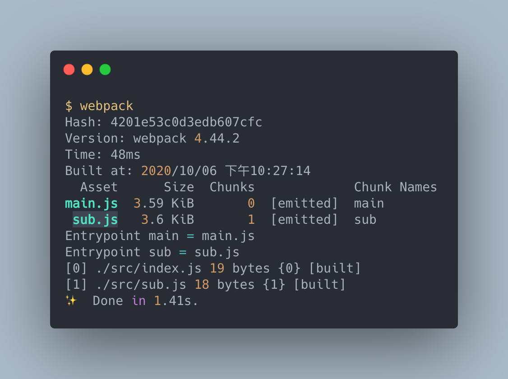
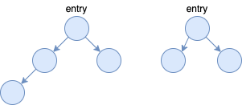
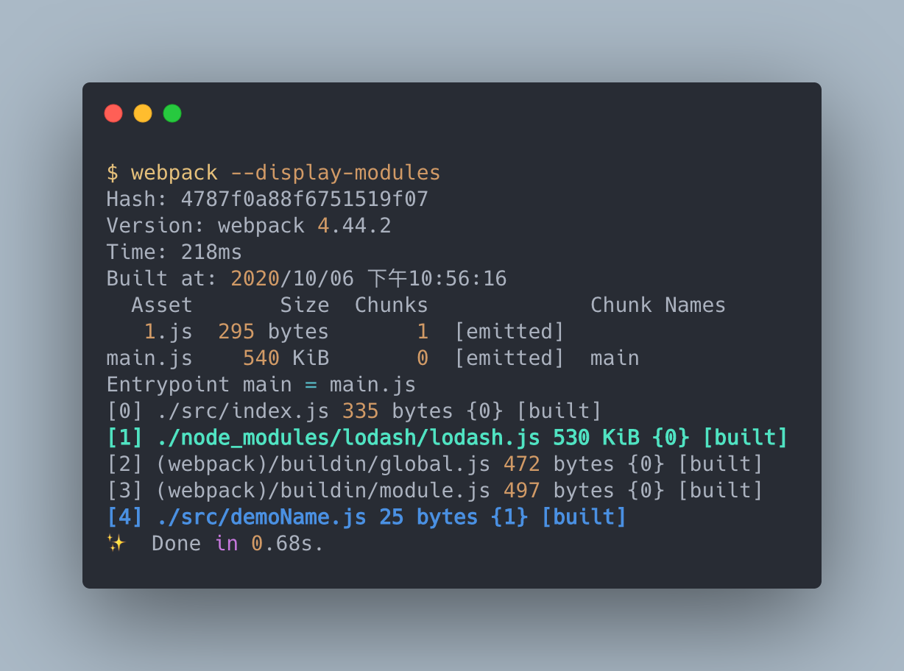
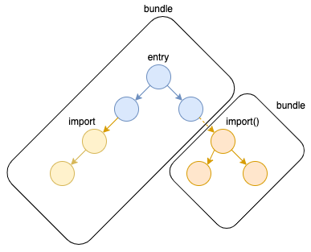
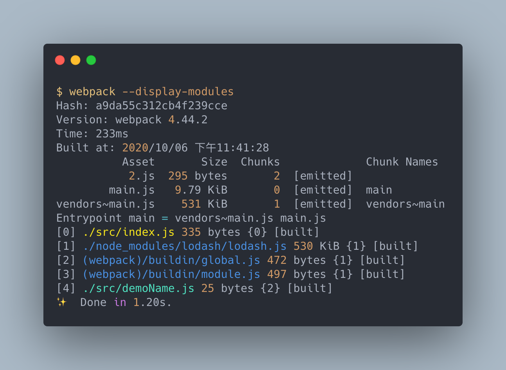
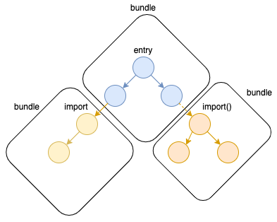

# 建立 webpack 生產環境 - 切割代碼

> 本文講述如何在生產環境中適當的切割代碼，讓應用程式提升效能。

> 本文的範例程式放在 [peterhpchen/webpack-quest](https://github.com/peterhpchen/webpack-quest/tree/master/posts/25-production-code-splitting/demos) 中，每個程式碼區塊的第一行都會標注檔案的位置，請搭配文章作參考。

webpack 會將從 `entry` 模組開始的所有相依模組都輸出到同一個 bundle 中，這樣的做法雖然可以減少瀏覽器對伺服器的請求次數，但只要應用程式一大，第一次的載入的時間會因為 bundle 的體積過大導致十分漫長，為了避免這個問題， webpack 提供強大的代碼切割能力，我們可以決定一開始只要載入部分的代碼內容，依照使用者點擊不同的功能，再分別載入各種功能的代碼。利用這樣適時的載入代碼，我們可以加速應用程式的運作，提升使用者的體驗。

##  切割方式

webpack 的代碼切割方式有下面三種：

- `entry`: 依照不同的 `entry` 切割代碼。
-  動態引入：藉由非同步引入方法自動切割代碼。
- `optimization.splitChunks`: 依照 `splitChunks` 設定切割代碼。

接著我們依序介紹這幾種切割方式。

## `entry`

`entry` 的分割方式是最常見的，只要將 entry 設定為物件，並加入多個鍵值， webpack 在建立 bundle 時會依照個鍵值拆分為不同的 bundle 。

如下例所示：

```js
// ./demos/entry/webpack.config.js
module.exports = {
  mode: "none",
  entry: {
    main: "./src/index.js",
    sub: "./src/sub.js",
  },
};
```

這裡拆分了兩個 `entry`： `main` 與 `sub` ， webpack 在輸出時就會輸出 `main` 與 `sub` 兩個 bundle：



這時我們的 module graph 會像下面這樣：



這種做法會被用在完全不相關的兩個頁面的建置，想是多頁應用程式就會使用此方式拆分 bundle ，讓每一頁只讀取它所需要的資源。

## 動態引入

webpack 會偵測是否開發者有使用 `import()` 語法載入模組，如果是以 `import()` 載入模組的話，表示此模組要非同步引入，所以 webpack 會將其拆為另一個 bundle 。

例如下面這個例子：

```js
import _ from "lodash";

async function getComponent() {
  const element = document.createElement("div");

  const { default: demoName } = await import("./demoName.js");

  element.innerHTML = _.join(["Webpack Demo", demoName], ": ");

  return element;
}

getComponent().then((component) => {
  document.body.appendChild(component);
});
```

這個例子中有兩種 `import`：

- `import _ from 'lodash'`: 同步的引入方式，不會切割代碼
- `import('./demoName')`: 非同步的引入方式， webpack 會將其切割為獨立代碼

建置結果如下：



由結果可以清楚地看到 `lodash` 依然在原本的 bundle 中，但是 `./demoName` 已經被分至另一個 bundle `1.js` 中了。

此例的 module graph 如下：



### 設定動態引入的 Chunk 名稱

上面的結果將 `demoName` 輸出為 `1` ，此為 Chunks 的編號，如果想要明確輸出名稱的話，可以使用註解 `webpackChunkName` ：

```js
// ./demos/import/src/index.js

...

async function getComponent() {
    ...
  const { default: demoName } = await import(/* webpackChunkName: 'demoName' */ "./demoName");

...
}

...
```

## 使用 `optimization.splitChunks` 切割代碼

`optimization.splitChunks` 是配置 webpack 內建的 SplitChunksPlugin ，這是個幫助使用者分割代碼的 Plugin 。

我們試著使用 `splitChunks` 將上例的 `lodash` 給切割出來：

```js
// ./demos/split-chunks/webpack.config.js
module.exports = {
  mode: "none",
  optimization: {
    splitChunks: {
      chunks: "all",
    },
  },
};
```

`chunks` 預設是 `async` ，因此上例才只有 `import('./demoName')` 被分割出來，這裡調為 `all` 可以將同步、非同步的模組都切割出來。

結果如下：



我們可以看到現在整個專案被分割為三個 bundle ，新的 `vendors~main.js` 擁有 `lodash` 的模組。

> 上圖看到的 `global.js` 與 `module.js` 屬於 webpack runtime 。

module graph 如下：



## 總結

總結一下三種方式的功用及使用場景：

| 方法                | 功用              | 場景                   |
| ------------------- | ----------------- | ---------------------- |
| `entry`             | 依照 `entry` 分割 | 多頁應用               |
| 動態引入            | 非同步引入切割    | 單頁應用的不同路由載入 |
| `SplitChunksPlugin` | 進階控制代碼分割  | 做最佳化時使用         |

`entry` 與動態引入的切割方式在應用程式中十分常見，而 `SplitChunksPlugin` 可以對切割做更近一步的操作，讓應用程式有更好的效能 。

這裡雖然只講到少部分的 `SplitChunksPlugin` 功能，但在大部分的專案中設定 `chunks: 'all'` 由 webpack 自動切割代碼，已經可以達到不錯的水平了，需要手動控制的機率比較底，這裡就先不提了。

下一篇我們會講解如何使用切割代碼及 hash 命名的方式在瀏覽器中快取以節省傳數的資源。

## 參考資料

- [SurviveJS Webpack - Code Splitting](https://survivejs.com/webpack/building/code-splitting/)
- [Webpack Documentation: Guides - Code Splitting](https://v4.webpack.js.org/guides/code-splitting/)
- [Webpack Documentation: Plugins - SplitChunksPlugin](https://webpack.js.org/plugins/split-chunks-plugin/)
