# 建立 webpack 生產環境 - 快取

> 本文講述如何使瀏覽器盡可能的保留快取，不用重新請求資源。

瀏覽器有快取機制，假設今天你瀏覽了一個網頁頁面，下次你在瀏覽此頁面的時候，瀏覽器會檢查此網頁內容是否有快取，如果有快取時，就會直接拿取快取的資源，以節省傳輸的花費。


瀏覽器取得 cache 時的請求結果如下圖所示：

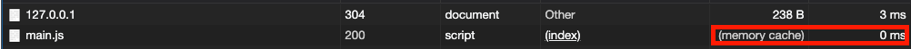

可以看到請求所取得的資料是從 cache 中取回，由於沒有由後端取回，因此花費的時間極少，大大提升了效能。

## 更新快取

瀏覽器的快取機制設定的方式有很多，最常使用的方式就是將快取有效時間設定為極大，並藉由改變引入資源的檔名，促使瀏覽器進行更新。

我們從剛剛的例子做延伸，前例中的 `index.js` 內容如下：

```js
// ./demos/update-caching/src/index.js
const component = () => {
  const result = document.createElement("div");
  result.innerHTML = "Caching";

  return result;
};

document.body.appendChild(component());
```

它會在畫面上顯示 `Caching` 字樣，現在你可以試著將 `Caching` 改為其他的字串，例如說 `Cachinging` ，建置後，重新整理瀏覽器，你會發現畫面上顯示的依然是 `Caching` ，這是因為瀏覽器並不知道 `index.js` 的內容有變，因此還是從 Cache 中取得內容。

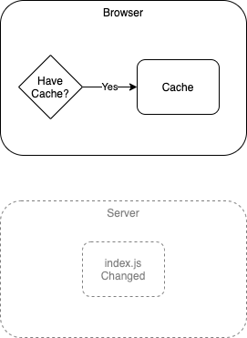

要使快取未過期的內容更新的話，可以改變其檔名來達成目標。

繼續以上例說明，我們在 webpack 的 `output.filename` 中多加個 `hash` 值，只要檔案內容發生變化，依照檔案內容所產生的 `hash` 值也會跟著改變：

```js
// ./demos/update-caching/webpack.config.js
const HtmlWebpackPlugin = require("html-webpack-plugin");

module.exports = {
  mode: "none",
  output: {
    filename: "[name].[hash].js",
  },
  plugins: [new HtmlWebpackPlugin()],
};
```

建置後結果如下：

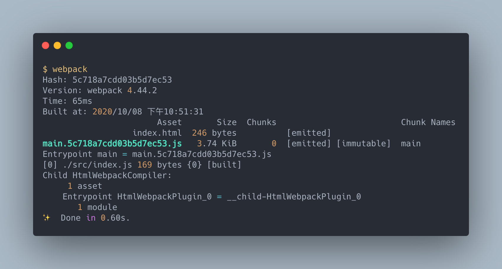

可以看到建置後的檔案多了一串 `hash` 。開啟瀏覽器後，重新整理後依然可以 cache:

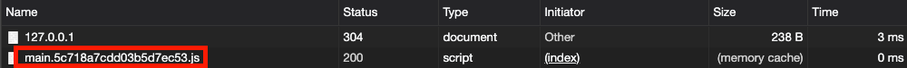

 現在將 `Caching` 改為 `Caching ing` ，建置結果如下:


現在再重新整理後，會發現畫面內容更新了：

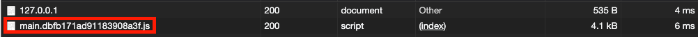

這是因為瀏覽器會將不同檔名的檔案視為不同的資源，因而重新請求：

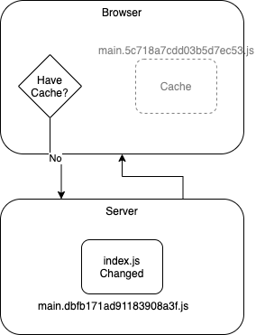

這樣可以解決快取不會更新的問題，而由於 `hash` 屬於自動產生的，因此借助 `html-webpack-plugin` 的幫助自動引入檔案會是個很好的選擇。

## 提取相依模組以減少快取失效的機率

`hash` 值只要整個 bundle 中的任何一個模組發生變化， `hash` 就會跟著改變，為了讓每個模組更有機會被瀏覽器快取，切割模組代碼是個很好的方法。

以下面的例子說明：

```js
// ./demos/extract-dependency/src/index.js
import _ from "lodash";

const component = () => {
  const result = document.createElement("div");
  result.innerHTML = _.join("Caching");

  return result;
};

document.body.appendChild(component());
```

這例子中，我們引入了 `lodash` ，接著我們直接建置：


接著做個簡單的修改，將 `Caching` 改為 `Caching ing`，建置結果如下：

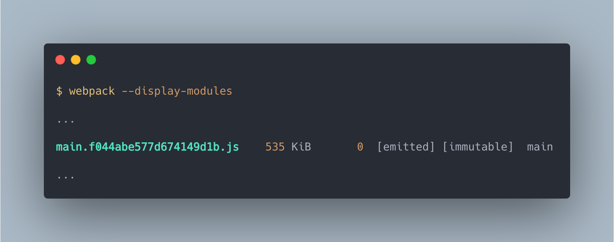

這個結果如我們所料， `hash` 值已經改變了，我們只修改了極少的內容，現在卻必須連 `lodash` 的內容一起重新請求，這樣的消耗過大，接著我們嘗試使用拆分的方式來減少重新請求的資源量：

```js
// ./demos/extract-dependency/webpack.config.js
...
module.exports = {
    ...
    optimization: {
        splitChunks: {
            chunks: 'all'
        },
        ...
    },
    ...
}
```

不管同步、非同步的模組，一律都提取出來，建置結果如下：

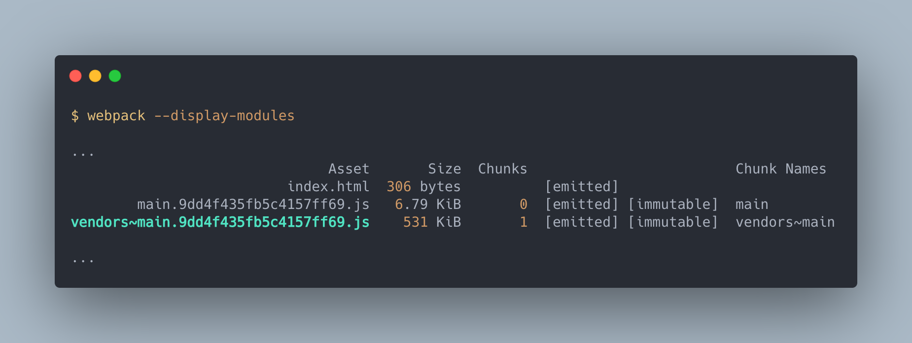

可以看到多了一個 `vendor` 的 bundle ，這是用來存放 `node_modules` 內的模組。

> webpack 提取模組的最小大小為 30 KB ，所以有時就算設定提取，沒有達到最小體積的條件依然不會提取成獨立的 bundle ，這樣的策略跟我們在[使用圖片](../23-image/README.md)中所提到的 `url-loader` 與 `file-loader` 的選擇是一樣的道理。

但是這邊有個問題，當我們變動 `index.js` 內容時，會發現 `vendor` 的 `hash` 也發生了變化：

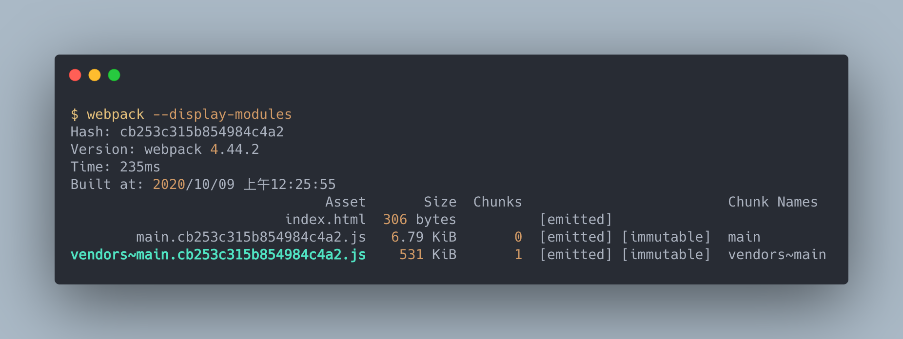

這是因為 `hash` 是經由整個 bundle 內容計算而成的，因此所有的 bundle `hash` 值都會相同，這時可以使用 `chunkhash` ，它會依照各個 Chunk 產生對應的 `hash` ：

```js
// ./demos/extract-dependency/webpack.config.js
...
module.exports = {
    ...
    output: {
        filename: '[name].[chunkhash].js'
    },
    ...
}
```

建置結果如下：

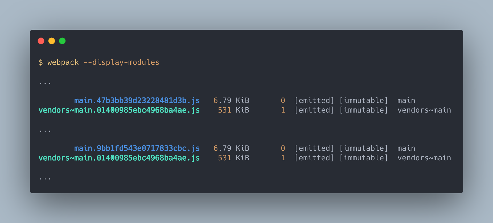

這次 `vendor` 的 `hash` 不變了，瀏覽器就不需要重新請求 `lodash` 相關的資源了。

## 提取 webpack runtime

webpack 在執行時，會有自己的執行代碼，這些代碼通常很少變化，我們可以將它提取出來，避免其他變動讓他重新請求：

```js
// ./demos/extract-runtime/webpack.config.js
...
module.exports = {
    ...
    optimization: {
        ...
        runtimeChunk: true
    },
    ...
}
```

建置結果如下：

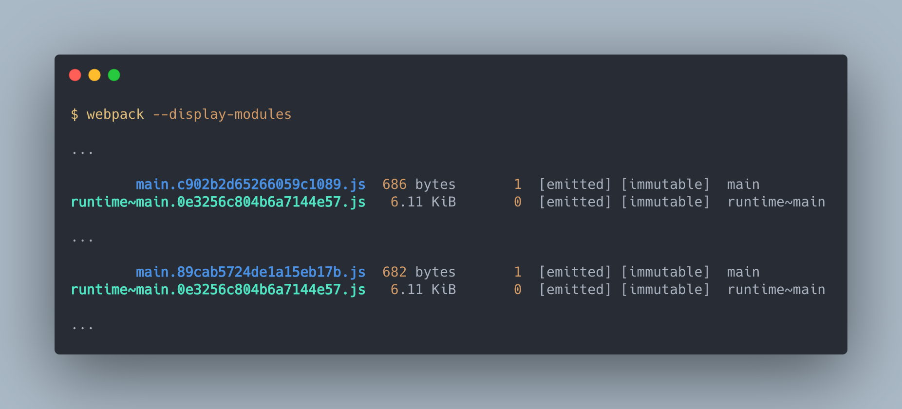

可以看到 `runtime` 被提取出來，如此一來我們更動代碼時瀏覽器需要重新請求的資源量又更小更精確了。

## 內嵌 `runtime` 代碼至 `index.html`

`runtime` 代碼並沒有大到需要提取出來（依照 webpack 標準 30 KB 以上才需要提取），因此可以讓他直接內嵌在 `index.html` 中，這樣的方式需要 `html-webpack-inline-source-plugin` 的幫忙：

```bash
npm install html-webpack-inline-source-plugin@beta -D
```

目前版本有 [bug](https://github.com/DustinJackson/html-webpack-inline-source-plugin/issues/63)，因此使用 `beta` 版本。

接著將它加進配置檔中：

```js
const HtmlWebpackPlugin = require('html-webpack-plugin');
const HtmlWebpackInlineSourcePlugin = require('html-webpack-inline-source-plugin')

module.exports = {
    ...
    plugins: [
        new HtmlWebpackPlugin({
            inlineSource: 'runtime~.+\\.js',
        }),
        new HtmlWebpackInlineSourcePlugin(HtmlWebpackPlugin)
    ]
}
```

- `html-webpack-plugin` 加上 `inlineSource` 的目標為 `runtime`
- 加上 `html-webpack-inline-source-plugin`

建置後可以看到 `index.html` 中直接包有 `runtime` 的代碼:

```html
<!DOCTYPE html>
<html>
  <head>
    <meta charset="utf-8" />
    <title>Webpack App</title>
    <meta name="viewport" content="width=device-width, initial-scale=1" />
  </head>
  <body>
    <script type="text/javascript">
      /******/ (function(modules) { // webpackBootstrap
        ...
        })([]);
    </script>
    <script src="vendors~main.e0c521035dc11755abbc.js"></script>
    <script src="main.89cab5724de1a15eb17b.js"></script>
  </body>
</html>
```

## 使用非同步方式載入不會立即使用到的資源

寫 SPA 時，我們會有很多的路由元件，這些元件都只有在對應的路由中才會作用，如果一開始就載入它們，是非常浪費資源也沒有意義的，這時可以使用[建立 webpack 生產環境 - 切割代碼](./25-production-code-splitting/README.md)一文中提到的非同步載入方式載入相關的資源來節省資源請求的量。

##  避免使用流水號當作 Module Ids

上面看了許多的建置結果，可以發現到 webpack 替每個 Module 取了一個 Id：

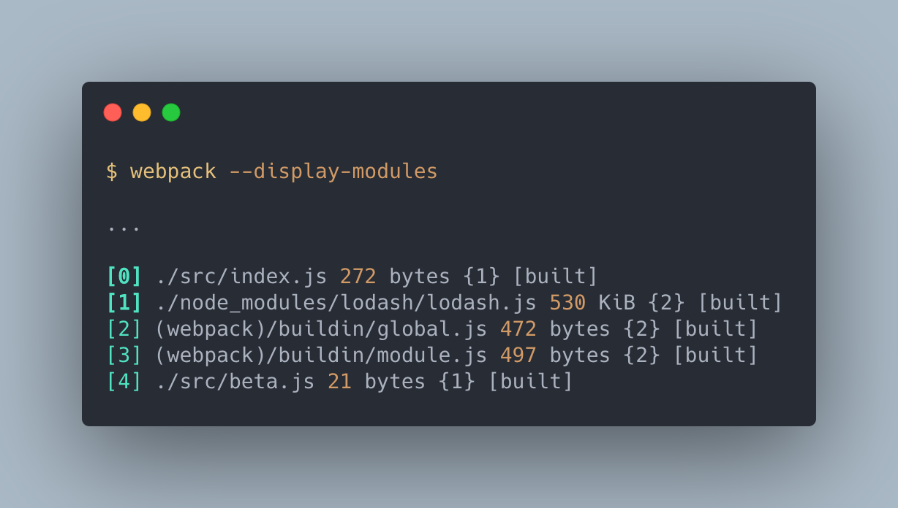

這個 Id 是依照使用的順序編碼的，而 Module Id 會影響 Chunk 建置的內容，如果我們增加了一個模組，而這模組剛好被編號在中間的 Module Id ，那這個模組之後的所有模組雖然內容不變，但 `chunkhash` 還是會變化，而影響快取。

為避免此問題，我們可以利用 `hashed` 作為 module ids 的編號，這個 `hashed` 不會因為順序而發生變動。

要使用 `hashed` 直接做下面設定:

```js
// ./demos/stable-module-id/webpack.config.js
...
module.exports = {
    ...
    optimization: {
        ...
        moduleIds: 'hashed'
    },
    ...
}
```

結果如下：

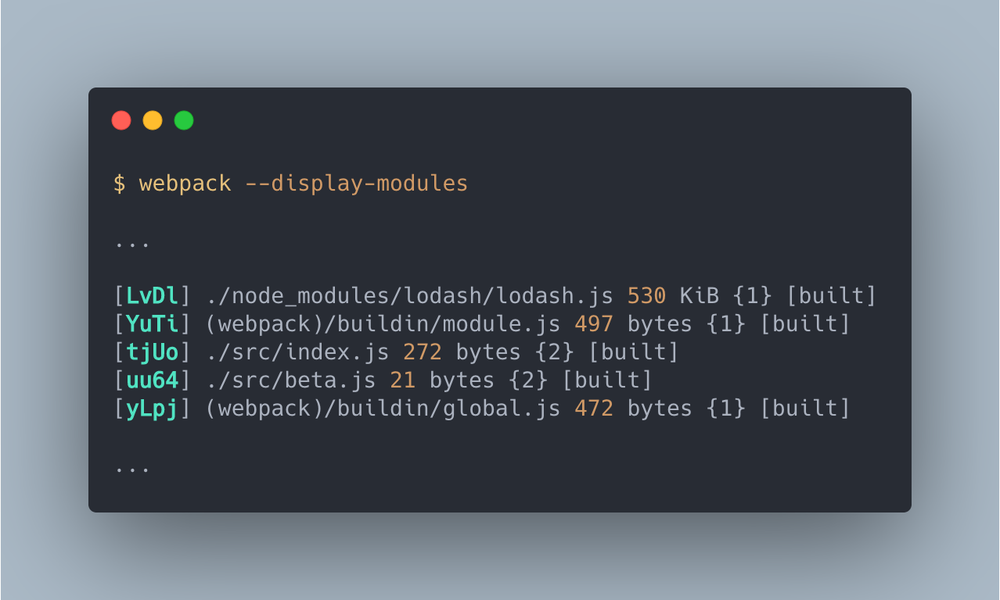

## 總結

瀏覽器的快取更新仰賴檔名的變換， webpack 利用 `hash` 值使產出的 bundle 在內容更新時得以改變檔名，以促使瀏覽器更新內容。

為了使快取盡可能地保留較長的時間，我們需要將 bundle 切割，將不同類型且沒關聯的模組分開快取，這樣在瀏覽器端就可以只更新縮需更新的檔案，不用更新一小部分，就整個 bundle 都需要重拿。

## 參考資料

- [Make use of long-term caching](https://developers.google.com/web/fundamentals/performance/webpack/use-long-term-caching#)
- [循序漸進理解 HTTP Cache 機制](https://blog.techbridge.cc/2017/06/17/cache-introduction/)
- [HTTP 快取](https://developers.google.com/web/fundamentals/performance/optimizing-content-efficiency/http-caching?hl=zh-tw)
- [Webpack Documentation: Configuration - Output](https://v4.webpack.js.org/configuration/output/)
- [Hash vs chunkhash vs ContentHash](https://medium.com/@sahilkkrazy/hash-vs-chunkhash-vs-contenthash-e94d38a32208)
- [GitHub: DustinJackson/html-webpack-inline-source-plugin](https://github.com/DustinJackson/html-webpack-inline-source-plugin)
