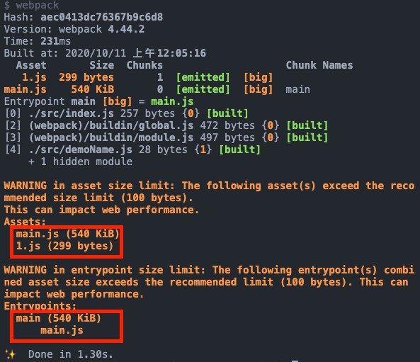
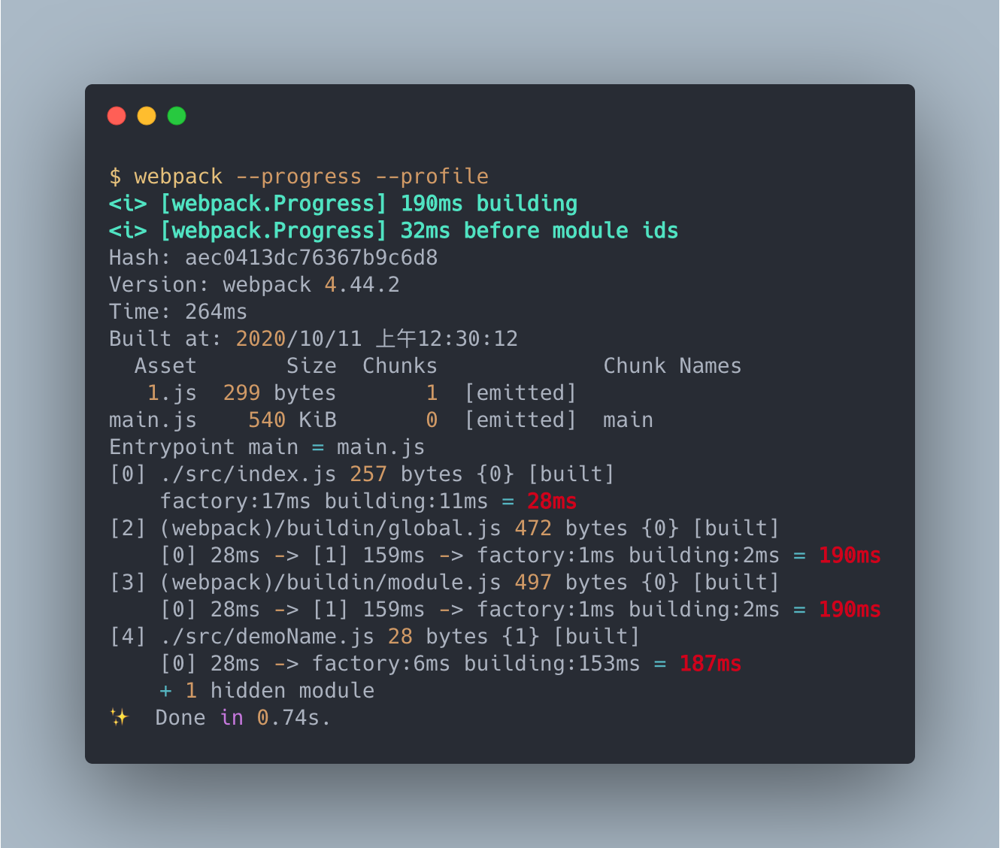
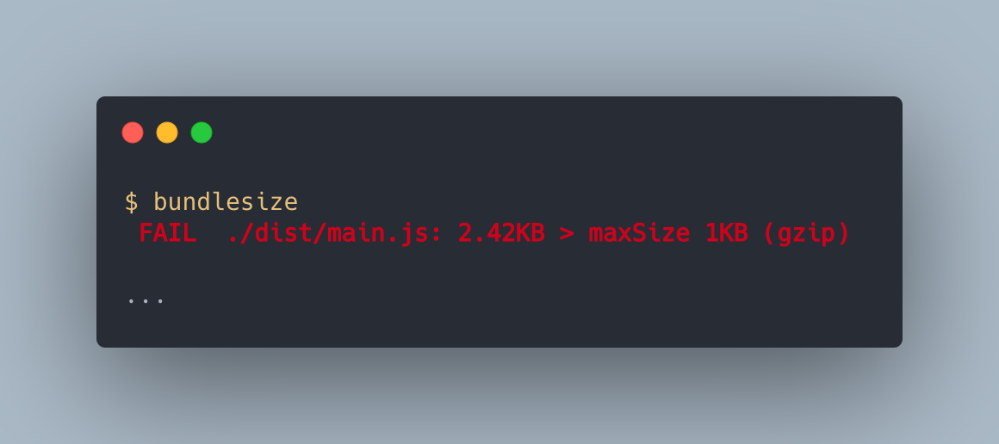

# 建立 webpack 生產環境 - 追蹤建置

> 本文講述如何使用分析工具解析 bundle 內模組的組合。

> 本文的範例程式放在 [peterhpchen/webpack-quest](https://github.com/peterhpchen/webpack-quest/tree/master/posts/27-production-analyze/demos) 中，每個程式碼區塊的第一行都會標注檔案的位置，請搭配文章作參考。

開發者在完成 webpack 的配置並且可以執行後，通常就不會再去注意 webpack 每此打包出來的 bundle 了，但其實比較好的做法是持續的追蹤 webpack 所產生出來的 bundle ，隨著應用程式開發時程，整體體積會跟著提高，這時就需要跟著變化去改變 webpack 配置，以確保應用程式的效能處於高檔的狀態。

## 使用 `performance` 配置提示 bundle 狀態

webpack 提供 `performance` 配置讓使用者可以設定輸出狀態的限制，如果輸出的 bundle 超過 `performance` 所設定的臨界值，則會輸出資訊供開發者調整 bundle 的組成。

下面的例子配置 `performance`:

```js
// ./demos/performance/webpack.config.js
module.exports = {
  mode: "none",
  performance: {
    hints: "warning",
    maxEntrypointSize: 100,
    maxAssetSize: 100,
  },
};
```

`performance` 是個物件型態的配置，屬性說明如下:

- `hints`: 設定輸出的強弱程度
  - `false`: 不顯示資訊
  - `'warning'`: 以 `warning` 程度顯示資訊
  - `'error'`: 以 `error` 程度顯示資訊
- `maxEntrypointSize`: 入口點型態的 bundle 最大體積限制值，單位為 Byte
- `maxAssetSize`: 所有輸出 bundle 的最大體積限制值，單位為 Byte

使用 `./demos/performance` 建置資訊如下圖:



從這裡可以看出 `maxEntrypointSize` 與 `maxAssetSize` 的差別， `maxEntrypointSize` 所設定的對象僅限於 `entry` bundle `main.js` ，而 `maxAssetSize` 包含了其他的 bundle (例如非同步的 bundle)。

### `performance` 的預設值

`performance` 在各模式下的預設值如下:

| 模式          | `hints`     | `maxEntrypointSize` | `maxAssetSize` |
| ------------- | ----------- | ------------------- | -------------- |
| `development` | `false`     | `250000`            | `250000`       |
| `production`  | `'warning'` | `250000`            | `250000`       |
| `none`        | `false`     | `250000`            | `250000`       |

## 輸出資訊

webpack 提供了各種的輸出供使用者參考，以調整最佳的建置方式， CLI 工具中可以使用各種參數做不同的輸出:

`--profile`: 顯示各模組的建置時間
`--progress`: 顯示各個編譯過程資訊及花費時間



如此一來可以掌握建置時花費時間的模組或是過程，從而針對問題做解決。

除了上述的兩個以外，還有 `--json` 參數，它會以 `.json` 格式輸出建置的結果細節，由於資訊較多，因此需要避免直接在 terminal 中開啟，改為寫入檔案中。

```bash
webpack --json > stats.json
```

上面的例子將建置的資訊 stats 寫入 `states.json` 中，我們看一下它的內容:

```json
// ./demos/cli-args-json/stats.json
{
  "errors": [],
  "warnings": [],
  "version": "4.44.2",
  "hash": "dc8fccd110b852a7e550",
  "time": 59,
  "builtAt": 1602384822101,
  "publicPath": "",
  "outputPath": "/Users/peterchen/Documents/webpack-quest/posts/27-production-analyze/demos/cli-args-json/dist",
  "assets": [...], // 輸出的資源資訊
  "entrypoints": {...}, // 入口模組資訊
  "chunks": [...], // webpack 內組成的 chunks 資訊
  "modules": [...], // 各模組資訊
  "logging": {...},
  "children": [] // 多組建置時上述內容會在 children 陣列中
}
```

`stats` 資訊擁有完整的建置資訊，在[使用 Node.js API 操作 webpack](../08-use-node-api/README.md) 一文中所提到的 `stats.toJson()` 與此資訊相同，不管是 CLI 的輸出資訊還是 Node.js API 的 `stats` 都是仰賴這些資訊輸出有用的訊息。

## 監控 bundle 的體積

bundle 的體積雖然在 `performance` 設定的幫忙下可以提出警示，但依然只是在有超過臨界點時才會輸出資訊 ，並不能看到整個 bundle 後的全貌，這時我們可以使用 `webpack-dashboard` 來觀察 bundle 的情況。

首先安裝 `webpack-dashboard`:

```bash
npm install webpack-dashboard -D
```

接著將 `WebpackDashboardPlugin` 加入配置:

```js
// ./demos/dashboard-demo/webpack.config.js
const WebpackDashboardPlugin = require("webpack-dashboard/plugin");

module.exports = {
  mode: "none",
  entry: {
    main: ["./src/index.js", "./src/index2.js"],
    sub: "./src/sub.js",
  },
  plugins: [new WebpackDashboardPlugin()],
};
```

另外要修改建置的指令，改以 `webpack-dashboard` 觸發建置指令:

```json
{
    ...
  "scripts": {
    "build": "webpack-dashboard -- webpack"
  },
  ...
}
```

建置結果如下:


我們可以很清楚的看到各個模組的組成，這樣一來大大增加了我們對 bundle 的理解及給予我們更多的資訊。

## 警示 bundle 過大

`performance` 所警示的對象細粒度只有到 `assets` ，有時候我們會需要在監控不同的檔案時使用的限制也要有所不同，這是 `performance` 做不到的。接下來介紹一個 `bundle-size` 的工具，他可以以模組為對象做警示。

首先來安裝:

```bash
npm install bundlesize -D
```

並且加入 `bundlesize` 指令:

```json
{
    ...
  "scripts": {
      ...
    "check": "bundlesize"
  },
  ...
}
```

`bundlesize` 是個通用工具，並不綁定 webpack ，因此我們要給予 `bundlesize` 輸出目錄的資訊，讓它可以藉由此資訊找尋所需的 bundle :

```json
// ./demos/bundlesize-demo/bundlesize.config.json
{
  "files": [
    {
      "path": "./dist/main.js",
      "maxSize": "1 KB"
    }
  ]
}
```

這裏設定要檢查 `./dist/main.js` 的大小是否超過 `1 KB` ，執行 `bundlesize` 後，可以看到錯誤提示:



## 總結

webpack 可以自己利用 `performance` 的能力警示建置後的 bundle 是否有超過限制，也可以使用 `bundlesize` 做更精確對象的判斷。

而 CLI 另外還提供 `--profile` 、 `--progress` 可以讓使用者知道建置時的花費如何，也可以利用 `--json` 輸出完整的 `stats`。

另外仰賴 `webpack-dashboard` 可以清楚地了解各個模組的資訊，以此讓使用者可以觀察並作相關的優化。

## 參考資料

- [Webpack Documentation: Configuration - Performance](https://v4.webpack.js.org/configuration/performance/)
- [Webpack Documentation: Configuration - Mode](https://v4.webpack.js.org/configuration/mode/)
- [SurviveJS Webpack: Build Analysis](https://survivejs.com/webpack/optimizing/build-analysis/)
- [Webpack Documentation: API - CLI](https://v4.webpack.js.org/api/cli/)
- [https://developers.google.com/web/fundamentals/performance/webpack/monitor-and-analyze](https://developers.google.com/web/fundamentals/performance/webpack/monitor-and-analyze)
- [GitHub: FormidableLabs / webpack-dashboard](https://github.com/FormidableLabs/webpack-dashboard/)
- [GitHub: siddharthkp / bundlesize](https://github.com/siddharthkp/bundlesize)
