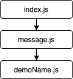
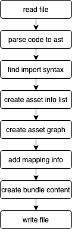
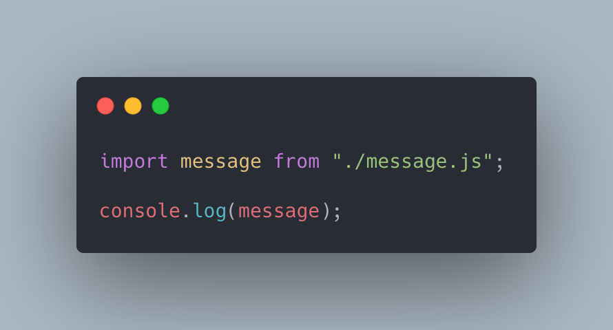
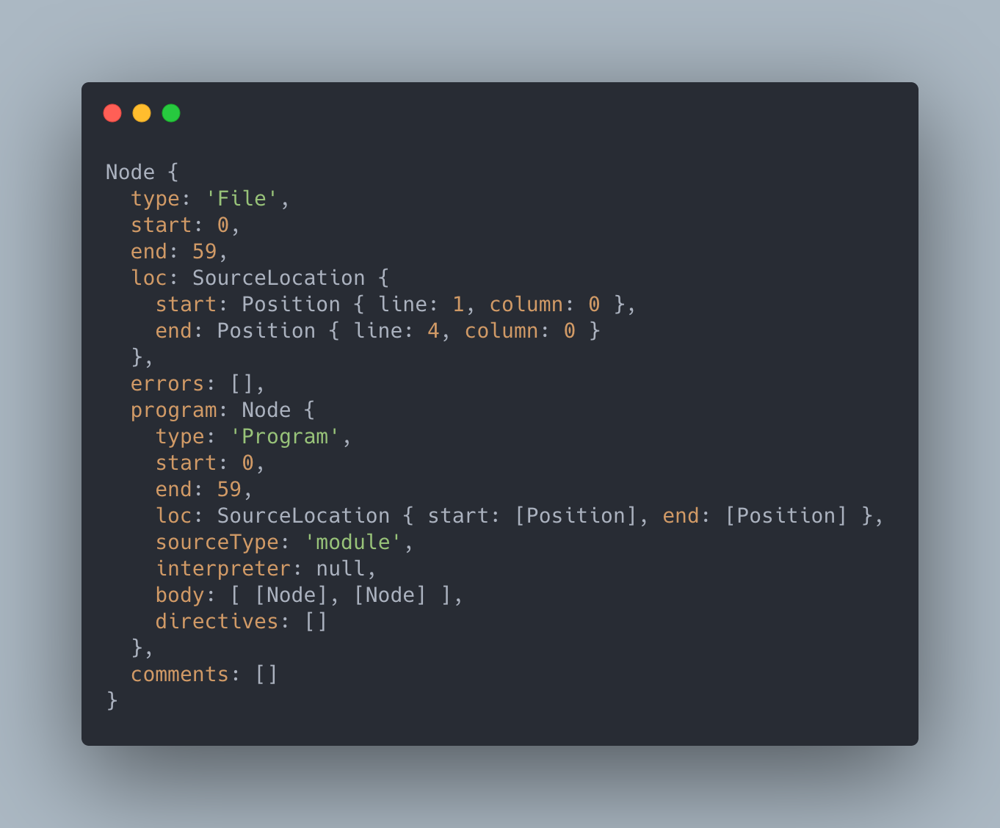
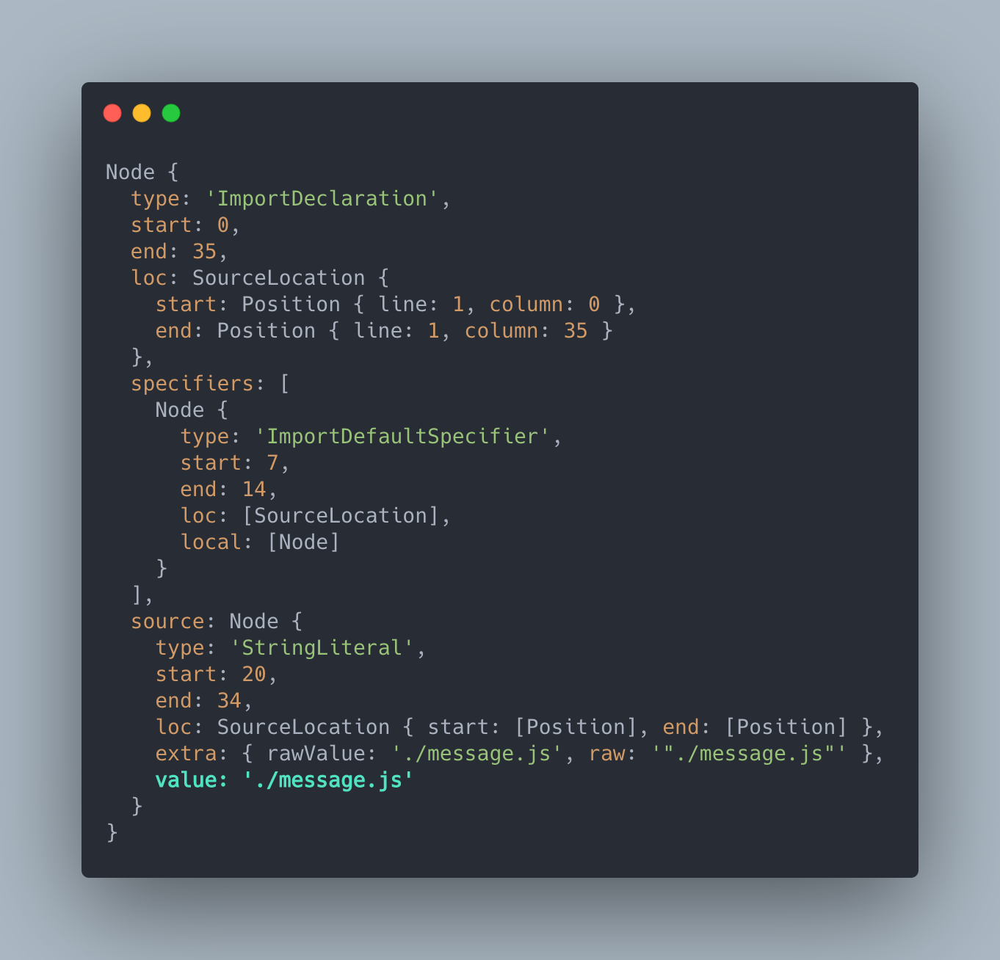
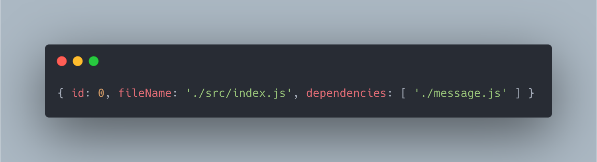
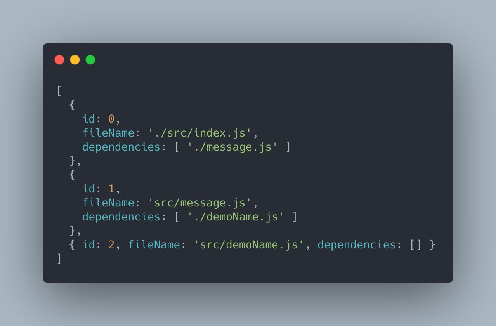
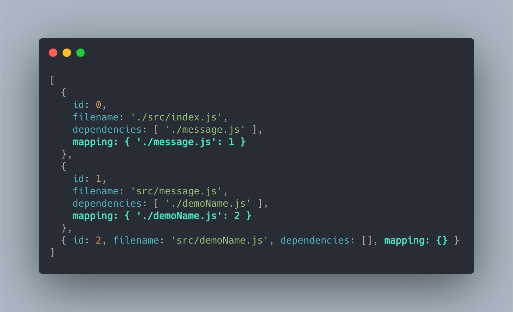

# 自己動手寫 webpack

> 本文目標在於實作一個簡易的打包工具。

> 本文的範例程式放在 [peterhpchen/webpack-quest](https://github.com/peterhpchen/webpack-quest/tree/master/posts/29-write-your-webpack/demos) 中，每個程式碼區塊的第一行都會標注檔案的位置，請搭配文章作參考。

webpack 是個擁有強大功能的工具，本文將嘗試自己實作 webpack 的核心功能：**打包**，接著跟著我一起試試寫個簡易版的打包器吧。

本文 Ronen Amiel 的 [Build Your Own Webpack](https://youtu.be/Gc9-7PBqOC8) 啟發，因此實作方式會以 Ronen Amiel 的 [`minipack`](https://github.com/ronami/minipack) 方式做展示，與 webpack 的打包方式比起來， `minipack` 化繁為簡，對於初學打包技巧的開發者會是比較好入門的方式。

## 打包的範例

我們使用下面這個例子做打包的示範：

```js
// ./src/index.js
import message from "./message.js";

console.log(message);

// ./src/message.js
import { demoName } from "./demoName.js";

export default `hello ${demoName}`;

// ./src/demoName.js
export const demoName = "simple";
```

這個範例的模組相依圖(Module Graph)如下圖：



之後下面所有的展示都以上面的代碼作為打包對象。

## webpack 的 bundle

在自己動手前，先來觀察 webpack 是如何打包的，現在執行建置後， webpack 會產出 `./dist/main.js` ，內容如下：

```js
// ./demos/simple/dist/main.js
(function (modules) {
  // webpackBootstrap
  // The require function
  function __webpack_require__(moduleId) {
    // Create a new module
    var module = {
      i: moduleId,
      exports: {},
    };

    // Execute the module function
    modules[moduleId].call(
      module.exports,
      module,
      module.exports,
      __webpack_require__
    );

    // Return the exports of the module
    return module.exports;
  }

  // define getter function for harmony exports
  __webpack_require__.d = function (exports, name, getter) {
    if (!__webpack_require__.o(exports, name)) {
      Object.defineProperty(exports, name, {
        enumerable: true,
        get: getter,
      });
    }
  };

  // define __esModule on exports
  __webpack_require__.r = function (exports) {
    Object.defineProperty(exports, "__esModule", {
      value: true,
    });
  };

  // Object.prototype.hasOwnProperty.call
  __webpack_require__.o = function (object, property) {
    return Object.prototype.hasOwnProperty.call(object, property);
  };

  // Load entry module and return exports
  return __webpack_require__(0);
})([
  /* 0 */
  function (module, __webpack_exports__, __webpack_require__) {
    "use strict";
    __webpack_require__.r(__webpack_exports__);
    var _message_js__WEBPACK_IMPORTED_MODULE_0__ = __webpack_require__(1);

    console.log(_message_js__WEBPACK_IMPORTED_MODULE_0__["default"]);
  },
  /* 1 */
  function (module, __webpack_exports__, __webpack_require__) {
    "use strict";
    __webpack_require__.r(__webpack_exports__);
    var _demoName_js__WEBPACK_IMPORTED_MODULE_0__ = __webpack_require__(2);

    __webpack_exports__[
      "default"
    ] = `hello ${_demoName_js__WEBPACK_IMPORTED_MODULE_0__["demoName"]}`;
  },
  /* 2 */
  function (module, __webpack_exports__, __webpack_require__) {
    "use strict";
    __webpack_require__.r(__webpack_exports__);
    __webpack_require__.d(__webpack_exports__, "demoName", function () {
      return demoName;
    });
    const demoName = "simple";
  },
]);
```

上述的代碼已經將不是非必要的代碼刪去，讓我們集中精神在打包的部分，這段代碼有下面幾個看點:

### 產出了一個 IIFE

webpack 的 bundle 產生了一個 IIFE ，傳入模組當作其參數。

```js
(function(modules) {...})([...]);
```

### 模組內容被函式包覆

每個模組內容都被 `function` 包覆，這個函式傳入了 `module`, `__webpack_exports__` 及 `__webpack_require__`

```js
(function(modules) {...})
([
  /* 0 */
  (function(module, __webpack_exports__, __webpack_require__) {
      ...
  }),
  /* 1 */
  (function(module, __webpack_exports__, __webpack_require__) {
      ...
  }),
  /* 2 */
  (function(module, __webpack_exports__, __webpack_require__) {
      ...
  })
]);
```

- `module`: 模組資訊
- `__webpack_exports__`: 模組匯出的資源
- `__webpack_require__`: 引入資源的方法

### 模組執行方式

webpack 在 IIFE 中直接引入入口資源，開始執行代碼。

```js
(function (modules) {
  // webpackBootstrap
  // The require function
  function __webpack_require__(moduleId) {
    // Create a new module
    var module = {
      i: moduleId,
      exports: {},
    };

    // Execute the module function
    modules[moduleId].call(
      module.exports,
      module,
      module.exports,
      __webpack_require__
    );

    // Return the exports of the module
    return module.exports;
  }

  // Load entry module and return exports
  return __webpack_require__(0);
})([
  /* 0 */
  function (module, __webpack_exports__, __webpack_require__) {},
  /* 1 */
  function (module, __webpack_exports__, __webpack_require__) {},
  /* 2 */
  function (module, __webpack_exports__, __webpack_require__) {},
]);
```

執行 `__webpack_require__(0)` 時實際上利用 `modules[moduleId].call(...)` 叫 `/* 0 */` 函式執行，這時開發者所撰寫的內容才真正的執行起來。

### 引入其他模組

引入其他模組時，使用 `__webpack_require__` 執行模組並將會出內容加至 `__webpack_exports__`。

```js
(function (modules) {
  // webpackBootstrap
  // The require function
  function __webpack_require__(moduleId) {
    // Create a new module
    var module = {
      i: moduleId,
      exports: {},
    };

    // Execute the module function
    modules[moduleId].call(
      module.exports,
      module,
      module.exports,
      __webpack_require__
    );

    // Return the exports of the module
    return module.exports;
  }
})([
  /* 0 */
  function (module, __webpack_exports__, __webpack_require__) {
    var _message_js__WEBPACK_IMPORTED_MODULE_0__ = __webpack_require__(1);

    console.log(_message_js__WEBPACK_IMPORTED_MODULE_0__["default"]);
  },
  /* 1 */
  function (module, __webpack_exports__, __webpack_require__) {},
  /* 2 */
  function (module, __webpack_exports__, __webpack_require__) {},
]);
```

webpack 會將模組內的引入語法改為 `__webpack_require__` ，這裡我們可以發現 webpack 將外部的 `__webpack_require__` 方法帶入的原因是內部代碼要做引用時也可以使用此方法處理。

在 `/* 0 */` 這個入口模組中使用 `__webpack_require__(1)` 執行並引用 `/* 1 */` 的資源。

### 匯出資源

在匯出資源的時候會將資源帶進 `__webpack_exports__` ，而 `__webpack_require__` 會幫忙 `return` 出去。

```js
(function (modules) {
  // webpackBootstrap
  // The require function
  function __webpack_require__(moduleId) {
    // Create a new module
    var module = {
      i: moduleId,
      exports: {},
    };

    // Execute the module function
    modules[moduleId].call(
      module.exports,
      module,
      module.exports,
      __webpack_require__
    );

    // Return the exports of the module
    return module.exports;
  }
})([
  /* 0 */
  function (module, __webpack_exports__, __webpack_require__) {},
  /* 1 */
  function (module, __webpack_exports__, __webpack_require__) {
    var _demoName_js__WEBPACK_IMPORTED_MODULE_0__ = __webpack_require__(2);

    __webpack_exports__[
      "default"
    ] = `hello ${_demoName_js__WEBPACK_IMPORTED_MODULE_0__["demoName"]}`;
  },
  /* 2 */
  function (module, __webpack_exports__, __webpack_require__) {},
]);
```

可以看到 `/* 1 */` 中匯出的資源被加入 `__webpack_exports__["default"]` ，如此一來 `__webpack_require__` 在最後 `return module.exports` 的時候就可以使外部模組取得期望的資源。

### 標示為 ES Module

你會發現到三個模組的都有個 `__webpack_require__.r(__webpack_exports__)` ，這會將此模組標示為 ES Module ，告知此模組為 ES Module 。

```js
(function (modules) {
  // define __esModule on exports
  __webpack_require__.r = function (exports) {
    Object.defineProperty(exports, "__esModule", {
      value: true,
    });
  };
})([
  /* 0 */
  function (module, __webpack_exports__, __webpack_require__) {
    __webpack_require__.r(__webpack_exports__);
  },
  /* 1 */
  function (module, __webpack_exports__, __webpack_require__) {
    __webpack_require__.r(__webpack_exports__);
  },
  /* 2 */
  function (module, __webpack_exports__, __webpack_require__) {
    __webpack_require__.r(__webpack_exports__);
  },
]);
```

`__webpack_require__.r` 會將 `exports` 加上 `__esModule` 的值，以表示此為 ES Module 。

### 匯出非預設資源

webpack 對於非 `default` 的匯出資源處理如下：

```js
(function (modules) {
  // define getter function for harmony exports
  __webpack_require__.d = function (exports, name, getter) {
    if (!__webpack_require__.o(exports, name)) {
      Object.defineProperty(exports, name, {
        enumerable: true,
        get: getter,
      });
    }
  };

  // Object.prototype.hasOwnProperty.call
  __webpack_require__.o = function (object, property) {
    return Object.prototype.hasOwnProperty.call(object, property);
  };
})([
  /* 0 */
  function (module, __webpack_exports__, __webpack_require__) {},
  /* 1 */
  function (module, __webpack_exports__, __webpack_require__) {},
  /* 2 */
  function (module, __webpack_exports__, __webpack_require__) {
    __webpack_require__.d(__webpack_exports__, "demoName", function () {
      return demoName;
    });
    const demoName = "simple";
  },
]);
```

這個例子中 `demoName.js` 傳回的是 `export const demoName = "simple"` ， webpack 利用 `Object.defineProperty` 的方式將 `__webpack_exports__.demoName` 的 `getter` 設為 `return demoName` 如此一來其他模組便能取得此資源值。

### webpack 的 bundle 一覽總結

webpack 所產出的 bundle 乍看之下很複雜，其實也就只有 `require` 與 `export` 兩個重點，只要搞懂了這兩個概念，看懂 bunlde 就再也不是問題了。

## 自己動手做打包器

終於要開始寫打包器了，下面是整個打包所需的步驟：



簡單順過一遍流程後，細節會在之後講解，現在我們先建立專案：

```json
// ./demos/read-file/package.json
{
  "scripts": {
    "build": "node boundler.js"
  }
}
```

在指令中加上 `node boundler.js` ，我們將會把打包器內容寫於 `bundler.js` ，並使用 `node` 執行。

接著我們就一步一步來建構我們的打包器吧。

### 讀入入口模組

第一步，我們需要將入口模組 `./src/index.js` 的內容讀入：

```js
// ./demos/read-file/boundler.js
const fs = require("fs");

const content = fs.readFileSync("./src/index.js", "utf-8");

console.log(content);
```

使用 `node.js` 的 `fs` 模組讀入檔案。

> 本文所有的範例都採用同步方式，讓讀者可以容易進入狀況。

結果如下：



可以看到 `./src/index.js` 的內容順利讀入了。

### 將代碼內容轉為 AST

AST 抽象語法術，他可以以樹狀結構表示各個代碼的內容，使用 AST 就可以去控制或查找目標資料，而不需要直接分析字串。

現在我們使用 `@babel/parser` 將代碼內容轉為 AST:

```js
// ./demos/ast-parser/boundler.js
const fs = require("fs");
const { parse } = require("@babel/parser");

const content = fs.readFileSync("./src/index.js", "utf-8");
const ast = parse(content, {
  sourceType: "module",
});

console.log(ast);
```

需要跟 Parser 說明此代碼內容為 ES Module ，因此 `sourceType` 要設為 `module`。

輸出結果如下：



可以看到代碼的內容被轉為物件的形式，這樣我們就可以用代碼的方式去控制語法了。

為了更加方便的使用 AST ，我們可以使用 [AST Explorer](https://astexplorer.net/) 來觀察 AST 。

> webpack 使用的 Parser 為 `acorn` ， `@babel/parser` 也是以此為基礎做開發的。

### 找出引入的語法

有了 AST 的幫助，我們可以用 `ImportDeclaration` 搜索 AST 找出 `import` 的內容。

為了方便的搜索 AST ，可以使用 `@babel/traverse`：

```js
// ./demos/tree-walker/boundler.js
const fs = require("fs");
const { parse } = require("@babel/parser");
const traverse = require("@babel/traverse").default;

const content = fs.readFileSync("./src/index.js", "utf-8");
const ast = parse(content, {
  sourceType: "module",
});

traverse(ast, {
  ImportDeclaration: ({ node }) => {
    console.log(node);
  },
});
```

結果如下：



我們發現 `node.source.value` 中有引入的檔案路徑資訊。

### 建立資源資訊

利用上節找出的 `import` 資訊，我們可以將入口資源的資訊記起來：

```js
// ./demos/create-asset/boundler.js
const fs = require("fs");
const { parse } = require("@babel/parser");
const traverse = require("@babel/traverse").default;

let ID = 0;

function createAsset(fileName) {
  const content = fs.readFileSync(fileName, "utf-8");
  const ast = parse(content, {
    sourceType: "module",
  });

  const dependencies = [];

  traverse(ast, {
    ImportDeclaration: ({ node }) => {
      dependencies.push(node.source.value);
    },
  });

  const id = ID++;

  return {
    id,
    fileName,
    dependencies,
  };
}

console.log(createAsset("./src/index.js"));
```

我們用 `createAsset` 包住之前的程序，為之後要建立相依圖做準備，並將相依的路徑加入 `dependencies` 中。

結果如下：



### 建立相依圖

有了相依資訊，我們可以來建立相依圖了。

```js
// ./demos/create-graph/boundler.js
const fs = require("fs");
const path = require("path");
const { parse } = require("@babel/parser");
const traverse = require('@babel/traverse').default

let ID = 0

function createAsset(fileName) {
  ...
}

function createGraph(entry) {
  const graph = [createAsset(entry)];

  for (const asset of graph) {
    const dirname = path.dirname(asset.fileName);

    asset.dependencies.forEach((dependencyRelativePath) => {
      const dependencyAbsolutePath = path.join(dirname, dependencyRelativePath);
      const dependencyAsset = createAsset(dependencyAbsolutePath);
      graph.push(dependencyAsset);
    });
  }

  return graph;
}

console.log(createGraph("./src/index.js"));
```

巡覽每個模組的每個相依，將各個模組輸出來 Asset 資訊，結果如下：



利用相依圖，我們可以清楚地了解各個模組的相依情形，藉此來建立 bundle 。

## 建立模組對應表

有了相依的資訊後，接著需要將資訊對應至各個模組的 ID 上，因此要在巡覽完當前模組的全部相依後，建立對應表。

```js
// ./demos/mapping/boundler.js
const fs = require("fs");
const path = require("path");
const { parse } = require("@babel/parser");
const traverse = require("@babel/traverse").default;

function createAsset(filename, id) {
  ...
}

function createGraph(entry) {
  let id = 0;
  const graph = [createAsset(entry, id++)];

  for (const asset of graph) {
    asset.mapping = {}; // 初始對應物件

    const dirname = path.dirname(asset.filename);

    asset.dependencies.forEach((dependencyRelativePath) => {
      const dependencyAbsolutePath = path.join(dirname, dependencyRelativePath);

      const dependencyAsset = createAsset(dependencyAbsolutePath, id++);

      asset.mapping[dependencyRelativePath] = dependencyAsset.id; // 將相依模組與模組的 ID 做對應

      graph.push(dependencyAsset);
    });
  }

  return graph;
}

console.log(createGraph("./src/index.js"));
```

建置結果如下：



現在我們擁有了所有的資訊了，接著就來建立 bundle 的執行代碼吧。

## 建立 bundle 執行代碼

執行代碼的建立有下面幾個要點：

- 模組代碼的轉換
- 利用 IIFE 執行代碼
- 模組包覆函式
- `require` 方法的實作

### 模組代碼的轉換

範例中的代碼為 ES Module 的類型，使用 `import` 的方式引入模組，在建立 bundle 時需要修改引入的方式讓其符合 bundle 內的執行使用。

這裡我們使用 `babel` 將代碼做轉換，以 `./src/index.js` 為例：

```js
import message from "./message.js";

console.log(message);
```

會被轉為：

```js
"use strict";

var _message = _interopRequireDefault(require("./message.js"));

function _interopRequireDefault(obj) {
  return obj && obj.__esModule ? obj : { default: obj };
}

console.log(_message.default);
```

`babel` 會改為使用 `require` 引入模組，先記住這點，這讓我們有機會客製屬於我們自己打包器的引入方式。

### 利用 IIFE 執行代碼

我們使用與 webpack 相仿的方式，藉由 IIFE 引入模組，並在執行代碼中實作 `require` ，最後執行入口模組。

```js
(function(modules) {
  function require(id) {
    ...
  }
  require(0);
})({...})
```

### 模組包覆函式

模組作為參數時包裹為一個函式，此函式傳入 `module`, `exports`, `require` 三個與 webpack 相仿的物件、方法。

```js
(function(modules) {
  function require(id) {
    ...
  }
  require(0);
})({
  0: [
    function (module, exports, require) {},
    { "./message.js": 1 },
  ],
  1: [
    function (module, exports, require) {},
    { "./demoName.js": 2 },
  ],
  2: [
    function (module, exports, require) {},
    {},
  ],})
```

這裡與 webpack 不同的地方在於我們不只有引入模組，還有引入模組的相依模組對應表，這是因為我們再轉至代碼時使用的是 `babel` 這樣常規的轉譯器，它並不能向 webpack 自製的轉譯器那般可以直接將引入的路徑替換成 bundle 時的模組 `index`，因此我們在這樣要多帶個對應的資訊，以利後續引入關聯模組。

### `require` 方法的實作

```js
(function(modules) {
  function require(id) {
    const [fn, mapping] = modules[id];
    function localRequire(name) {
      return require(mapping[name]);
    }
    const module = { exports : {} };
    fn(module, module.exports, localRequire);
    return module.exports;
  }
  require(0);
})({...})
```

1. `require` 是帶入 `id` 資訊
2. `localRequire` 用來在模組中引入相依模組，須將相依模組的路徑轉為 bundle 中的 `index`
3. 接著執行模組，帶入 `module`, `exports`, `require`
4. 傳回 `module.exports`，使外部模組使用匯出資源

詳細的 bundle 產生方式比較繁雜，想要了解的可以參考 `./demos/bundle` 範例。

### 寫入檔案

最後需要將完成的 bundle 寫入輸出檔案中。

```js
// ./demos/write-file/boundler.js
function output(code, outputPath) {
  const dirname = path.dirname(outputPath);
  fs.mkdirSync(dirname, { recursive: true });
  const prettierCode = prettier.format(code, { parser: "babel" });
  fs.writeFileSync(outputPath, prettierCode);
}
```

- 使用 `fs.mkdirSync` 建立資料夾
- 使用 `prettier` 排版代碼
- 使用 `fs.writeFileSync` 寫入檔案

產生的代碼如下所示：

```js
// ./demos/write-file/dist/main.js
(function (modules) {
  function require(id) {
    const [fn, mapping] = modules[id];
    function localRequire(name) {
      return require(mapping[name]);
    }
    const module = { exports: {} };
    fn(module, module.exports, localRequire);
    return module.exports;
  }
  require(0);
})({
  0: [
    function (module, exports, require) {
      "use strict";

      var _message = _interopRequireDefault(require("./message.js"));

      function _interopRequireDefault(obj) {
        return obj && obj.__esModule ? obj : { default: obj };
      }

      console.log(_message["default"]);
    },
    { "./message.js": 1 },
  ],
  1: [
    function (module, exports, require) {
      "use strict";

      Object.defineProperty(exports, "__esModule", {
        value: true,
      });
      exports["default"] = void 0;

      var _demoName = require("./demoName.js");

      var _default = "hello ".concat(_demoName.demoName);

      exports["default"] = _default;
    },
    { "./demoName.js": 2 },
  ],
  2: [
    function (module, exports, require) {
      "use strict";

      Object.defineProperty(exports, "__esModule", {
        value: true,
      });
      exports.demoName = void 0;
      var demoName = "simple";
      exports.demoName = demoName;
    },
    {},
  ],
});
```

可以直接將其貼在 dev tool 中的 `console` 就可以看到結果了。

## 總結

本文分為兩段，第一段講解如何理解 webpack 所產生的 bundle ，第二階段實際帶大家一步一步寫出簡易的打包器。

理解了整個打包過程，之後對於 webpack 的掌握上會更加了得心應手。

## 參考資料

- [Youtube: Ronen Amiel - Build Your Own Webpack](https://youtu.be/Gc9-7PBqOC8)
- [GitHub: ronami / minipack](https://github.com/ronami/minipack)
- [GitHub: webpack / webpack](https://github.com/webpack/webpack)
- [AST Explorer](https://astexplorer.net/)
- [Node.js Documentation: File System](https://nodejs.org/api/fs.html)
- [GitHub: acornjs / acorn](https://github.com/acornjs/acorn)
- [Babel: @babel/traverse](https://babeljs.io/docs/en/babel-traverse)
- [Babel: @babel/parser](https://babeljs.io/docs/en/babel-parser)
- [Babel: @babel/core](https://babeljs.io/docs/en/babel-core)
