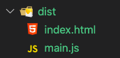
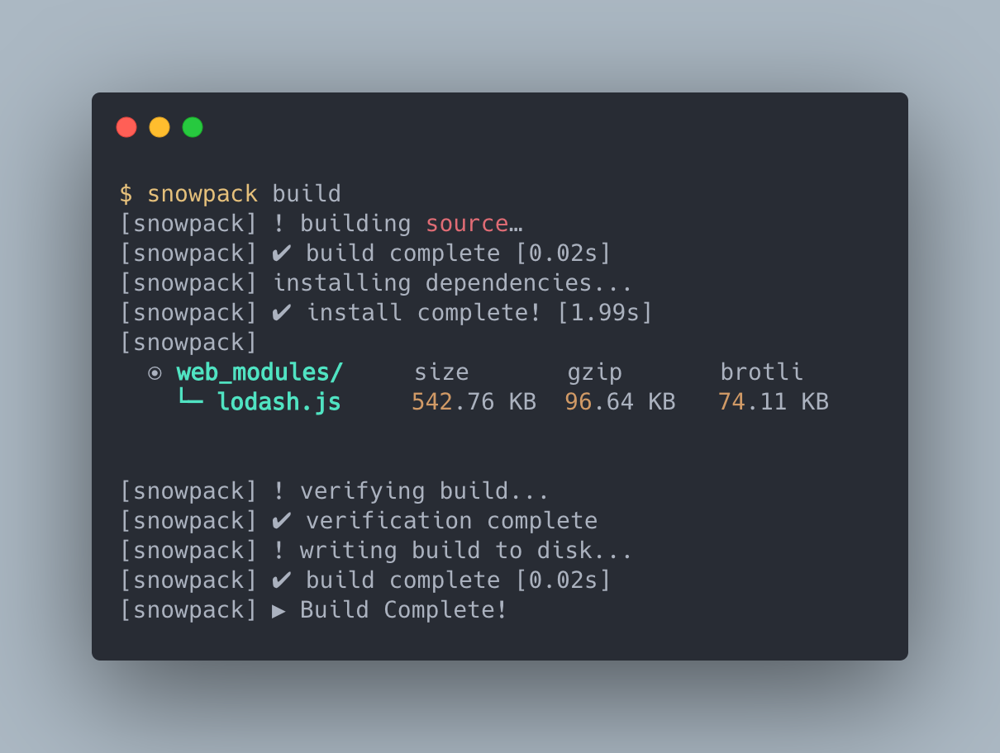
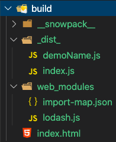

# 使用 Snowpack 以原生模組系統建置專案

> 本文講述如何使用 Snowpack 以原生模組系統建置專案

> 本文的範例程式放在 [peterhpchen/webpack-quest](https://github.com/peterhpchen/webpack-quest/tree/master/posts/31-snowpack/demos) 中，每個程式碼區塊的第一行都會標注檔案的位置，請搭配文章作參考。

Snowpack 是個以 ESM 原生的模組系統編譯專案的工具，與 webpack 將所有的模組合併為一個 bundle 的方式不同，在現代主流瀏覽器的支援下，它將開發者所撰寫的模組直接放到瀏覽器上運行，這樣的演進對於前端開發會有什麼樣的變革，我們接著看下去。

## 當時 webpack 所要解決的問題現在還存在嗎？

webpack 將模組合併為一個 bundle ，並用此 bundle 在瀏覽器上運行。這樣的設計最主要的目的就是在解決：

- [JavaScript 的模組化問題](../02-history-of-js-module/README.md): 瀏覽器對於原生模組系統 ESM 的支援度不足
- [HTTP 1.1 的多併發限制](https://stackoverflow.com/a/985704/9265131): HTTP 1.1 會限制同時請求的最大數量，使用單一檔案載入可以優化效能。

如今這兩個問題很有**可能**你已經不用理會了。

### JavaScript 的模組化問題

現代的主流瀏覽器都已經[支援 ESM](https://caniuse.com/es6-module) ，如果你所開發的目標並不需要支援舊式的瀏覽器(Ex: IE)，那 **JavaScript 的模組化**這點你就不在需要擔心了。

### HTTP 1.1 的多併發限制

在 Client Server 的框架下，請求次數本身所佔效能比重非常高，在開發狀態下，由於所有的資源都存於本機，因此請求所耗的時間極短，基本上可以不用在意，但到了生產環境，請求的問題會被放大。

在過去 HTTP 1.1 的時代中，由於請求的多併發會有限制的數量，因此就算瀏覽器本身支援原生的模組系統，我們還是需要將多個模組合併以減少請求的次數。

現在 HTTP/2 在[瀏覽器](https://caniuse.com/http2)及[伺服器](https://nodejs.org/api/http2.html)支援的情況下，可以使用[多併發請求/回應](https://developers.google.com/web/fundamentals/performance/http2/#request_and_response_multiplexing)，減少了請求所造成的時間流失，如此一來 bundle 的重要性就會降低。

> 重要性降低，不代表沒有用處，依照專案的規模及架構，在大多數的情況下，生產環境使用 bundler 來優化系統的效能依然是現今前端開發所必須的。

## 原生模組建置工具 Snowpack

如果你的目標環境已不再支援舊時代的瀏覽器的話，現在你有另一種選擇，使用原生模組的建置工具。

Snowpack 就是這樣的工具，它會將你所寫的模組（當然必須是使用 ESM 語法(`import`, `export`)撰寫的）以它們原本樣子拋給瀏覽器，讓瀏覽器使用自己的方式載入模組。

而對於 `node_modules` 內的庫，為避免其中依然有使用其他非原生的模組語法（像是 CJS 、 AMD）的模組，同時也避免相依模組過多造成的效能問題，會將其中的模組做 bundle ，並以 ESM 匯出給予我們的模組使用。

文字敘述的有點模糊，且感覺不出 Snowpack 的威力，接著以範例帶大家認識這個走在最前面的建置工具。

## 來個例子

我們使用下面這個例子：

```js
// ./demos/webpack-demo/src/index.js
import _ from "lodash";
import demoName from "./demoName.js";

console.log(_.join(["Hi", demoName], " "));

// ./demos/webpack-demo/src/demoName.js
export default "Webpack Demo";
```

這個例子有一個外部工具庫: `lodash` ，一個內部模組: `demoName.js` 。

### 使用 webpack

首先我們先使用 webpack 來做建置：

```js
// ./demos/webpack-demo/webpack.config.js
const HtmlWebpackPlugin = require("html-webpack-plugin");

module.exports = {
  plugins: [
    new HtmlWebpackPlugin({
      template: "./public/index.html",
    }),
  ],
};
```

```html
<!-- ./demos/webpack-demo/public/index.html -->
<!DOCTYPE html>
<html>
  <head>
    <title>Webpack Quest: Webpack Demo</title>
  </head>
  <body>
    <!-- Auto inject bundle -->
  </body>
</html>
```

為了與等下的 Snowpack 相似，我們這裡使用 `HtmlWebpackPlugin` 並且帶入模板產生出 `index.html`。

建置後的檔案結構如下圖：



這是我們都熟悉的結果，所有的模組都被包進了 `main.js` 中。

接著來看看 Snowpack 。

### 使用 Snowpack

首先我們先做安裝的動作：

```bash
npm install snowpack -D
```

當然 `lodash` 也請使用 `npm` 安裝。

安裝完成後，我們將 `/public/index.html` 做修改：

```html
<!-- ./demos/snowpack-demo/public/index.html -->
<!DOCTYPE html>
<html>
  <head>
    <title>Webpack Quest: Snowpack Demo</title>
  </head>
  <body>
    <script type="module" src="./_dist_/index.js"></script>
  </body>
</html>
```

注意到 `<script>` 的地方，改為使用 `type="module"` 以 `module` 的方式載入。

另外需設定 `snowpack.config.js` ，這是 Snowpack 的配置檔：

```js
// ./demos/snowpack-demo/snowpack.config.js
module.exports = {
  mount: {
    public: "/",
    src: "/_dist_",
  },
};
```

這裡配置了 snowpack 的目標資料夾，上面的配置會產生下面的效果：

- `public: '/'`: 目前的 `public` 資料夾內的檔案會在輸出目錄的 root 下
- `src: '/_dist_`: 目前的 `src` 資料夾內的檔案會在輸出目錄中的 `/_dist_` 中

這代表 `/public/index.html` 會被輸出到 `build` 目錄中的 root 中，而 `/src/index.js` 及 `/src/demoName.js` 兩個模組會被輸出到 `_dist_` 資料夾中，這也是 `index.html` 中引入 `index.js` 時的路徑要是 `./_dist_/index.js` 的原因。

> Snowpack 的配置檔設定方式可以參考[官方文件](https://www.snowpack.dev/#api-reference)。

接著下指令做建置：

```bash
snowpack build
```

建置結果如下：



可以看到 lodash 被處理為一個 `.js` 檔案，這個檔案會在輸出目錄中的 `web_module/` 下。

我們看一下輸出目錄:



可以看到原本 `src` 目錄中的檔案都保留在輸出的 `build` 目錄中，改為我們所設定的 `_dist_` 目錄中。

觀察 `dist/index.js`：

```js
// ./demos/snowpack-demo/build/_dist_/index.js
import _ from "../web_modules/lodash.js";
import demoName from "./demoName.js";

console.log(_.join(["Hi", demoName], " "));
```

可以看到除了 `lodash` 的引入行外，其他都沒有變化，而原本 `lodash` 的引入也只是改變路徑變為 `../web_modules/lodash.js` ，指到 Snowpack 幫我們打包好的路徑下。

## 使用原生模組建置工具的好處

使用原生模組的好處在於**快**，你不需要額外的時間做打包的工作，今天你修改了一個檔案，只需替換此檔案即可看到結果，不用像是 webpack 只改了其中一個模組，整個 bundle 就要重新建置。

## 引入其他資源

snowpack 在引入 `.css` 或是**圖片**時提供了開箱即用的功能：

```js
// ./demos/snowpack-css/src/index.js
import "./style.css";
```

使用與 webpack 相同的語法，直接 `import` Style ， Snowpack 會將其輸出為 `style.proxy.js` ， Snowpack 內部利用 `.proxy.js` 引入非 JavaScript 的檔案，我們可以看一下他的實作：

```js
// ./demos/snowpack-css/build/_dist_/style.css.proxy.js
// [snowpack] add styles to the page (skip if no document exists)
if (typeof document !== "undefined") {
  const code = ".demo {\n    background-color: green;\n}";

  const styleEl = document.createElement("style");
  const codeEl = document.createTextNode(code);
  styleEl.type = "text/css";

  styleEl.appendChild(codeEl);
  document.head.appendChild(styleEl);
}
```

Snowpack 只是單純將其用 `appendChild` 加入至 Document 中，非常的簡單。

## 引入新的技術

在[新技術的崛起](../03-new-tech/README.md)一文中提到前端擁有多種不同的技術供使用者在開發時有更好的效率及更低的出錯率，但由於瀏覽器看不懂這些技術所提供的語法，因此我們需要使用建置工具在建置時轉為原生的代碼。

我們在 webpack 中使用 [loaders](../12-loaders/README.md) 解決此類的問題，而在 Snowpack 中可以使用 Plugin。

## 使用 Snowpack 的 Plugin

以 Babel 為例，我們可以安裝 `@snowpack/plugin-babel`:

```bash
npm install @snowpack/plugin-babel -D
```

接著在 `snowpack.config.js` 中引入 Plugin:

```js
// ./demos/snowpack-babel/snowpack.config.js
module.exports = {
  mount: {
    public: "/",
    src: "/_dist_",
  },
  plugins: ["@snowpack/plugin-babel"],
};
```

如此一來 `.js` 的檔案都會被 `@snowpack/plugin-babel` 轉換。

> 詳細的配置可以參考範例 [`snowpack-babel`](./demos/snowpack-babel) 。

## 結語

在現代的前端環境下，原本 webpack 這類的 bundler 所能提供的優勢慢慢地減弱，變成不是必須的工具。

如今有像是 `snowpack` 或是 [`vite`](https://github.com/vitejs/vite)這類的原生模組建置工具也是選項之一，但這類的工具在這個時間點(2020)還是不能像是 webpack 在生產環境中擁有同等的效能（主要還是因為請求數量的問題），因此 `snowpack` 在生產環境輸出時也是有提供 webpack 的 Plugin 供使用者選擇，而 `vite` 則是直接將 Rollup 作為建制生產環境的預設選擇。

雖然在生產環境一時間還無法使用這類的工具，但是在開發環境，它們則是非常的強大（請求數量的問題在本機環境下可以忽略，詳情可以看上面的介紹）。

藉由原生模組不需 bundle 的特性，大幅減少建置的時間，並且 snowpack 可以啟動自己的 dev server 做到 HMR 熱模組替換，而各種新技術在 snowpack 中也可以使用 Plugin 支援載入，這使得它不僅跟 bundler 的開發環境相似，甚至因為分散式的模組形式，讓修改後載入可以不必重新建置所有的模組而更加的迅速，大大地增加了開發者的效率。

在 Snowpack 的作者所發表的 [A Future Without Webpack](https://dev.to/pika/a-future-without-webpack-ago) 一文中，有一句話貫穿了整篇文章： **Bundle because you want to, not because you need to.** 。

就現階段來說，在生產狀態下， webpack 、 Rollup 之類的 bundler 工具依然存在了不可取代的特性，但是在開發階段，我們可以嘗試使用 snowpack 、 vite 等原生的模組建置工具來加速開發的效率。

## 參考資料

- [A Future Without Webpack](https://dev.to/pika/a-future-without-webpack-ago)
- [Snowpack](https://www.snowpack.dev/)
- [不需要打包的构建工具比较 snowpack 和 vite](https://www.topcoder.club/2020/05/bundleless-build-tool-compare-snowpack-vs-vite)
- [GitHub: snowpackjs / snowpack](https://github.com/snowpackjs/snowpack)
- [@babel/preset-env](https://babeljs.io/docs/en/babel-preset-env)
- [替代 webpack？带你了解 snowpack 原理，你还学得动么](https://zhuanlan.zhihu.com/p/149351900)
- [Introduction to HTTP/2](https://developers.google.com/web/fundamentals/performance/http2/)
